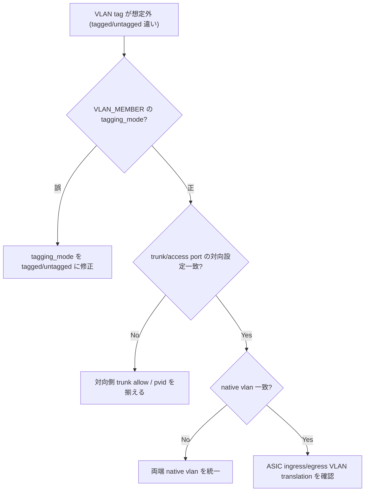

# Runbook: VLAN メンバーを追加してもタグが付かない

!!! danger "実行前提"
    `systemctl restart swss` は L2 全 forwarding を 5～30 秒中断する（FDB / port / vlan / lag テーブルが orchagent 再生成される間）。実行前に `sudo cp /etc/sonic/config_db.json /etc/sonic/config_db.json.bak.$(date +%s)` で backup、可能なら redundant ToR 側に traffic を寄せてから実施する。誤設定が原因の場合は backup を戻して `config reload -y` でロールバック。

## 症状

- `config vlan member add` 実行後、通信は流れるがフレームのタグが期待と異なる
- `show vlan brief` には正しく見えるのに、対向側 capture でタグなし（untagged）
- 想定: tagged で追加したのに untagged になっている、あるいは逆

## 想定原因

1. **`add` 時に `-u` (untagged) フラグの付け忘れ / 余計**: デフォルトは tagged 動作
2. **既存の Untagged [VLAN](../../reference/glossary.md#term-vlan) 多重設定**: ポートが既に別 [VLAN](../../reference/glossary.md#term-vlan) の untagged member であるため新規 untagged 追加に失敗（silently fallback）
3. **VLAN_MEMBER の `tagging_mode` が `priority_tagged` になっている**: 0 priority tag 付与で意図と違う動作
4. **対向側がトランクではなく access ポート**: 自機側が tagged 送出しても対向で drop / strip
5. **[PortChannel](../../reference/glossary.md#term-portchannel) メンバーに対する add 操作**: 物理ポートではなく [LAG](../../reference/glossary.md#term-lag) 名で追加する必要がある

## 切り分け手順




## 確認コマンド

### 1. CONFIG_DB の確認

```bash
sonic-db-cli CONFIG_DB hgetall "VLAN_MEMBER|Vlan100|Ethernet8"
```

- 期待値: `{"tagging_mode": "tagged"}` または `"untagged"`
- 異常: `tagging_mode` が存在しない → [vlanmgrd](../../reference/glossary.md#term-vlanmgrd) が member を取り込んでいない

### 2. APPL_DB / ASIC_DB への伝搬確認

```bash
sonic-db-cli APPL_DB hgetall "VLAN_MEMBER_TABLE:Vlan100:Ethernet8"
sonic-db-cli ASIC_DB keys "ASIC_STATE:SAI_OBJECT_TYPE_VLAN_MEMBER:*" | head
```

- 期待: [APPL_DB](../../reference/glossary.md#term-appl_db) / [ASIC_DB](../../reference/glossary.md#term-asic_db) の双方に対応する key が存在
- 異常: [CONFIG_DB](../../reference/glossary.md#term-config_db) のみ → `docker logs swss 2>&1 | grep -i vlanmgr` で例外を確認

### 3. 同一ポートの他 VLAN untagged member 検索

```bash
sonic-db-cli CONFIG_DB keys "VLAN_MEMBER|*|Ethernet8"
for k in $(sonic-db-cli CONFIG_DB keys "VLAN_MEMBER|*|Ethernet8"); do
  echo "$k"; sonic-db-cli CONFIG_DB hgetall "$k"
done
```

- 期待: untagged は最大 1 個
- 異常: 複数 untagged → 後勝ち / 先勝ちは保証されないため整理する

### 4. Kernel 側 bridge / linux interface の状態

```bash
bridge vlan show
ip -d link show Ethernet8
```

- 期待: `Vlan100` master、`PVID Egress Untagged` がセットされる
- 異常: PVID 設定がない → [vlanmgrd](../../reference/glossary.md#term-vlanmgrd) の反映漏れ。`config save` → swss コンテナ restart

### 5. キャプチャで実フレーム確認

```bash
sudo tcpdump -i Ethernet8 -nn -e -c 20 vlan
```

- 0x8100 タグの有無を直接確認する

## 対処方法

- tagged で再登録する場合:

```bash
config vlan member del 100 Ethernet8
config vlan member add 100 Ethernet8     # default = tagged
```

- untagged にする場合は `-u`:

```bash
config vlan member add -u 100 Ethernet8
```

- swss / [syncd](../../reference/glossary.md#term-syncd) の整合が崩れた疑いがあれば: `sudo config save -y && sudo systemctl restart swss`

## 関連ページ

- [L2 VLAN/LAG 運用](../../topics/06-l2-vlan-lag/operations.md)
- [L2 VLAN/LAG 概念](../../topics/06-l2-vlan-lag/concept.md)
- [config vlan](../cli/config-vlan.md)
- [show vlan](../cli/show-vlan.md)
- [VLAN_MEMBER](../config-db/vlan-member.md)

## 引用元

本ページの根拠は引用元 [^1][^2] を参照。

[^1]: sonic-net/[sonic-swss](../../reference/glossary.md#term-sonic-swss) @ 4305596 — [vlanmgrd](../../reference/glossary.md#term-vlanmgrd)
[^2]: sonic-net/[sonic-utilities](../../reference/glossary.md#term-sonic-utilities) @ 39732bceb — config vlan member

<!-- glossary-links-injected: f57fec79b708 -->
