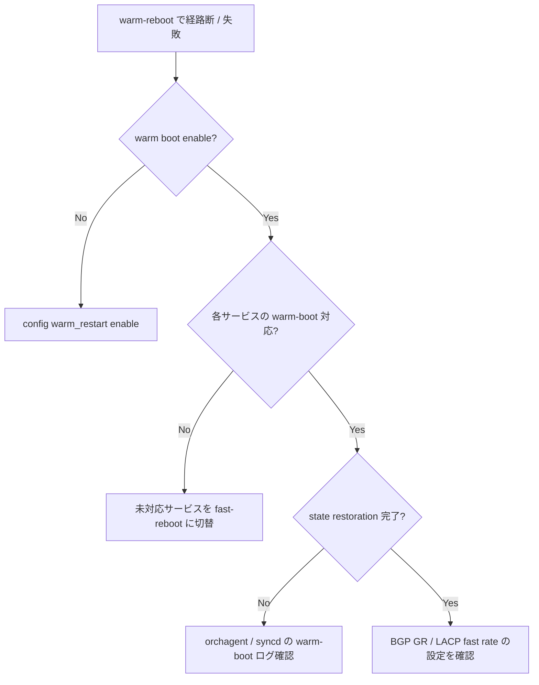

# Runbook: Warm Reboot が失敗 / 通信断が長引く

!!! danger "実行前提"
    `warm-reboot` 自体が失敗すると cold reboot にフォールバックし、data plane が数十秒～数分中断する（ASIC 再初期化 + neighbor relearn）。実行前に: (1) `sudo show warm_restart config` で warm_restart enable を確認、(2) `sudo cp /etc/sonic/config_db.json /etc/sonic/config_db.json.bak.warmreboot.$(date +%s)` で backup、(3) `bgp` neighbor 側 で graceful-restart helper が有効か対向と合意、(4) ECMP redundancy がある状態で 1 ToR ずつ実施。失敗時は `fast-reboot` / 通常 `reboot` での復旧、または backup 戻し + `config reload -y`。

## 症状

- `warm-reboot` 実行後に Data plane の通信が想定（< 1s）を超えて 30s 〜 数分断する
- `warm-reboot` 自体が途中で abort して通常の `reboot` にフォールバックする
- 再起動後に [SAI](../../reference/glossary.md#term-sai) object が再生成され、[FDB](../../reference/glossary.md#term-fdb) / [ARP](../../reference/glossary.md#term-arp) / Route が全部 relearn になっている

## 確認コマンド

```bash
# Warm Restart enable / state
show warm_restart config
show warm_restart state
sonic-db-cli CONFIG_DB hgetall "WARM_RESTART|swss"
sonic-db-cli CONFIG_DB hgetall "WARM_RESTART|bgp"
sonic-db-cli STATE_DB hgetall "WARM_RESTART_TABLE|orchagent"

# warm boot 前のチェック (pending op)
sudo /usr/local/bin/check_warmboot_progress.sh 2>/dev/null || true
docker logs swss 2>&1 | grep -iE "warm.*restore|reconcil" | tail -50

# BGP graceful-restart capability
docker exec bgp vtysh -c "show bgp neighbor" | grep -A3 "Graceful Restart"
```

## 想定原因

1. **`WARM_RESTART` テーブルで該当機能が enable されていない** (bgp / [teamd](../../reference/glossary.md#term-teamd-teamsyncd-teammgrd) / swss / [syncd](../../reference/glossary.md#term-syncd) / nat 等)
2. **[BGP](../../reference/glossary.md#term-bgp) graceful restart の対向側未対応 / capability 未交換**: GR helper として動作するために対向 peer も GR 対応が必要
3. **dataplane object 量が大きすぎて reconciliation が間に合わない** (Route 数十万件 + [ACL](../../reference/glossary.md#term-acl) 大量) → restore_count に至らずタイムアウト
4. **`pre-shutdown` のチェックで pending operation あり** (`COUNTERS_DB` の queue / port が busy)
5. **platform / [SAI](../../reference/glossary.md#term-sai) が warm boot 非対応** (Mellanox/Broadcom SDK バージョン依存)

## 切り分け手順




### 1. Warm Restart の enable 状態

```bash
show warm_restart config
sonic-db-cli CONFIG_DB hgetall "WARM_RESTART|swss"
sonic-db-cli CONFIG_DB hgetall "WARM_RESTART|bgp"
sonic-db-cli CONFIG_DB hgetall "WARM_RESTART|teamd"
```

- 期待: 該当 module が `enable: true`
- 異常: 設定漏れ → `config warm_restart enable <module>` で投入

### 2. Warm Restart 状態の前後比較

```bash
show warm_restart state
sonic-db-cli STATE_DB hgetall "WARM_RESTART_TABLE|orchagent"
sonic-db-cli STATE_DB hgetall "WARM_RESTART_TABLE|bgp"
```

- 期待: `state: reconciled` まで到達
- 異常: `restored` で stuck / `disabled` → reconciliation のロジック失敗

### 3. BGP GR capability 確認

```bash
docker exec bgp vtysh -c "show bgp neighbor <peer> | include Graceful"
```

- 期待: `Graceful restart: advertised and received`
- 異常: `received only` などで非対称 → 対向が helper 動作できない

### 4. 失敗ログ

```bash
sudo grep -iE "warm|reconcil" /var/log/syslog | tail -200
docker logs swss 2>&1 | grep -iE "warm|reconcil"
docker logs bgp 2>&1 | grep -iE "warm|graceful"
```

### 5. プラットフォーム対応の確認

```bash
sudo cat /usr/share/sonic/device/*/*/platform_asic | head
sudo grep -i SAI_KEY_WARM_BOOT /usr/share/sonic/hwsku/*/sai.profile 2>/dev/null
```

## 対処方法

- 不足 module の enable: `config warm_restart enable swss`, `bgp`, `teamd`, `nat`, `dhcp_relay` を順に
- 大量経路で reconciliation がタイムアウトする場合: `WARM_RESTART|<module>` の `bgp_timer` / `neighsyncd_timer` / `fpmsyncd_timer` 等を拡張
- [BGP](../../reference/glossary.md#term-bgp) 側で `bgp graceful-restart` を双方で有効化
- それでも warm boot が断続する場合: `fast-reboot` （control plane reset / data plane preserved）にフォールバックする運用へ変更

## 関連ページ

- [Reboot 運用](../../topics/11-reboot/operations.md)
- [Reboot 概念](../../topics/11-reboot/concept.md)
- [reboot / fast-reboot / warm-reboot CLI](../cli/reboot-fast-warm.md)

## 引用元

本ページの根拠は引用元 [^1][^2] を参照。

[^1]: sonic-net/[sonic-utilities](../../reference/glossary.md#term-sonic-utilities) @ 39732bceb — `scripts/warm-reboot`
[^2]: sonic-net/[sonic-swss](../../reference/glossary.md#term-sonic-swss) @ 4305596 — warm_restart helper

<!-- glossary-links-injected: da64d9ca9c4c -->
