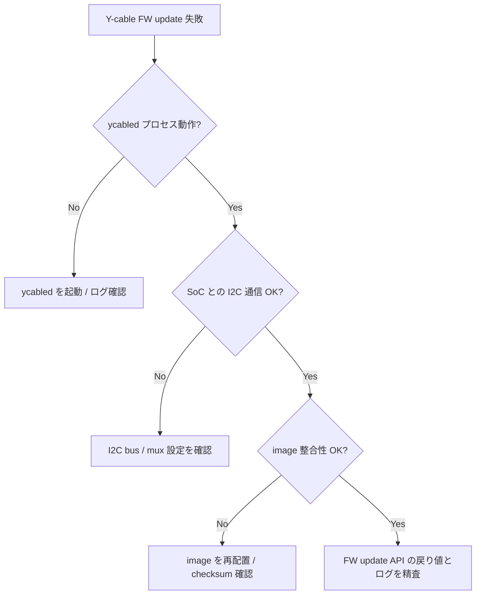

# Runbook: Y-cable firmware download / activate が失敗

!!! danger "実行前提"
    Y-cable firmware の activate は対象ポートのトラフィックを 30〜120 秒中断する。activate 中は dualtor ペアの片系で実行し、対向 ToR は `manual` で active に固定すること。失敗時のロールバックは `config muxcable firmware rollback <port>` で旧 image に戻す。**両系同時 activate 禁止**。

## 症状

- `config muxcable firmware download <port> <file>` が `Failed` / `Timeout`
- `show muxcable firmware version <port>` で Bank A/B のバージョンが揃わない
- activate 後にリンクが UP しない / mux state が `unknown`

## 想定原因（優先度順）

1. **firmware image 不一致**: ベンダ / model に合わない image
2. **I2C bus 競合**: 同時に複数ポートで download 実行 / pmon が同 I2C を占有
3. **mux state が `standby` でない**: 一部ベンダは standby 側でのみ activate 可
4. **電源 / power budget 不足**: download 中の追加電流で reset
5. **`ycabled` daemon 異常**: [STATE_DB](../../reference/glossary.md#term-state_db) `MUX_CABLE_INFO` が更新されない

## 切り分け手順




## 確認コマンド

### 1. 現状把握

```bash
show muxcable status
show muxcable firmware version <port>
show muxcable hwmode state <port>
```

### 2. STATE_DB

```bash
sonic-db-cli STATE_DB hgetall "MUX_CABLE_INFO|<port>"
sonic-db-cli STATE_DB hgetall "MUX_CABLE_TABLE|<port>"
sonic-db-cli STATE_DB hgetall "TRANSCEIVER_INFO|<port>" | grep -iE "vendor|model"
```

### 3. daemon ログ

```bash
docker logs pmon 2>&1 | grep -iE "ycable|firmware" | tail -100
sudo cat /var/log/syslog | grep -iE "ycable|y_cable" | tail -100
```

### 4. image 検証

```bash
md5sum /tmp/<firmware.bin>
# ベンダ提供のチェックサムと一致するか確認
```

### 5. I2C bus 確認

```bash
docker exec pmon i2cdetect -y <bus>
```

## 対処方法

- ベンダ image 不一致: 正しい model 用 image を入手
- mux state が active: 片側を `config muxcable mode standby <port>` に切替 → download → activate
- I2C 競合: 同時実行ポートを 1 つに絞り、`config muxcable firmware download` を逐次化
- 失敗後のロールバック: `config muxcable firmware rollback <port>` （`y_cable_base.py` の `rollback_firmware`）
- daemon hang: `docker exec pmon supervisorctl restart ycable` （**注意**: dualtor では先に対向 ToR を active に固定）

## 関連ページ

- [Dual ToR MUX ケーブル Runbook](./dualtor-mux.md)
- [Dual ToR 運用](../../topics/05-dual-tor/operations.md)

## 引用元

本ページの根拠は引用元 [^1][^2] を参照。

[^1]: sonic-net/sonic-platform-common @ master — y_cable_base.py
[^2]: sonic-net/sonic-platform-daemons @ master — ycable.py

<!-- glossary-links-injected: 6981be1a469d -->
