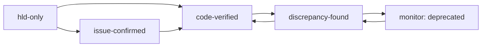

# 裏取り運用方針

本プロジェクトのドキュメントは、[SONiC](../../reference/glossary.md#term-sonic) コミュニティ master の [HLD](../../reference/glossary.md#term-hld) と実コードの両方を引用しながら再構成している。HLD は分散・古い・実装と乖離している前提で書かれているため、各ページには **裏取りステータス**（`verification`）と **乖離区分**（`monitor`）の 2 段メタデータが付く。本ページはその運用方針サマリを示す。

詳細な運用手順は `meta/discrepancy-operations.md`、ロール定義は `meta/prompts/verifier.md` を参照（リポジトリ内）。

## verification ステータス

| 値 | 意味 | バッジ |
|----|------|--------|
| `hld-only` | 公式 HLD のみを根拠に記述。コード未確認 | 📘 HLD-only |
| `issue-confirmed` | issue / PR コメントで補強済み | 🔍 Issue-confirmed |
| `code-verified` | 該当実装を読んで一致確認済み | ✅ code-verified |
| `discrepancy-found` | HLD と実装に差分あり。本文に注記 | ⚠️ Discrepancy-found |
| `stub` / `meta` | プレースホルダ / 仕様外ページ | （非表示） |

## monitor タグ（`discrepancy-found` 専用）

`verification: discrepancy-found` のページは差分の **性質** を `monitor` で分類する。

| 値 | 意味 |
|----|------|
| `not_implemented` | HLD は提案段階で、master に対応コードが一切無い |
| `partially_implemented` | HLD のうち一部だけ取り込まれ、残りは欠落 |
| `evolved_beyond_hld` | 実装は HLD から進化し、名前 / 構造 / 経路が異なる |
| `deprecated` | HLD の方針自体が廃止され、後発別機能に置き換えられた |

判定優先度: `deprecated` > `not_implemented` > `partially_implemented` > `evolved_beyond_hld`。

## 定期見直しサイクル

`discrepancy-found` ページは静的なものではなく、SONiC master の進化に応じて状態が変わる。本プロジェクトでは次のサイクルで再裏取りする。

| 周期 | 対象 | アクション |
|------|------|-----------|
| 四半期（quarterly） | `not_implemented` / `partially_implemented` / `evolved_beyond_hld` ページ全件 | 再裏取り → 必要なら昇格 / monitor 変更 |
| 半年（biannual） | `monitor: deprecated` のページ | 置換先リンクと廃止状態の維持確認 |
| 随時 | 該当 HLD に新規 PR / issue を観測した場合 | per-page queue へ投入 → Verifier 再走 |

`last_verified` から 90 日以上経過したページは自動的に四半期サイクルに乗る。

## 昇格・降格の流れ

- HLD と実装の差分が解消されれば `discrepancy-found` → `code-verified`（monitor 削除、`last_verified` 更新）
- 後発別機能で完全に置換されれば `monitor: deprecated`（廃止情報を本文先頭に明記、削除はしない）
- 再採用検討が始まれば `monitor: deprecated` → `not_implemented` / `partially_implemented` に戻す

## 廃止ページの保持方針

`monitor: deprecated` のページは **削除しない**。SONiC の設計判断の歴史を辿る読み手や、古い記事から流入したユーザが「なぜこの機能が無いのか」を理解できるようにするため。本文先頭に必ず置換先機能へのリンクを置く。

## GitHub Issue / PR 紐づけ

`discrepancy-found` ページが本文中で参照する issue / PR は、frontmatter `sources` には載せず（commit SHA で固定できないため）、本文中に **状態（open / closed / merged）と引用時の日付**、および **リポ名込みの参照**（例: `sonic-net/SONiC#1234`）で書く。四半期サイクルの裏取り時に状態を確認し、merged された PR があれば本文の「未実装」記述を見直す。

## 関連ページ

- [HLD と実装の乖離 一覧（discrepancy-index）](discrepancy-index.md): 現時点で `discrepancy-found` が付いている全ページのリスト
- [sources-freshness](sources-freshness.md): pinned SHA と upstream の差分
- [stale-verified](stale-verified.md): `last_verified` が 90 日以上経過したページ一覧
- [low-impact 残課題スナップショット](residual-tasks.md): backlog 残数・lint 検出数・分割候補の手動スナップショット
- [カバレッジ](../../_meta/coverage.md): verification ステータス集計
- [Discrepancy report](../../_meta/discrepancies.md): 乖離ページ一覧
- [Changelog](../../_meta/changelog.md): 変更履歴

<!-- glossary-links-injected: 8ba32e5aa69d -->
