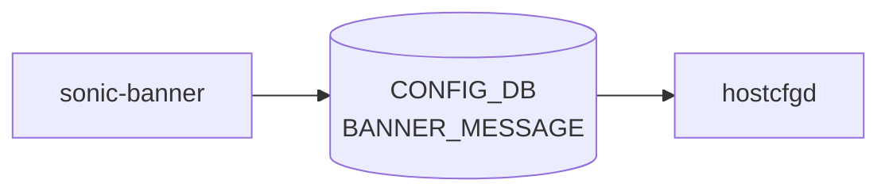

# sonic-banner YANG

## 概要

- module: `sonic-banner`
- namespace: `http://github.com/sonic-net/sonic-banner`
- revision: `2023-05-18`
- import: `sonic-types`
- top container: `sonic-banner`

Login, MOTD, and logout banner message [YANG](../../reference/glossary.md#term-yang) module for [SONiC](../../reference/glossary.md#term-sonic) OS.[^1]

<!-- yang-mermaid -->
### データフロー (自動生成)



!!! note "凡例"
    YANG モジュールから CONFIG_DB テーブル経由で subscribe する daemon/orch までを `docs/reference/config-db-orch-map.md` から機械生成したミニ図。詳細・例外は本ページ本文を参照。
<!-- /yang-mermaid -->

## 関連ページ

<!-- yang-xref -->

本 YANG モジュールに対応する CONFIG_DB / CLI / HLD / Topics への相互リンク。`inject_yang_xref.py` により自動生成されます。

### 対応 CONFIG_DB

- [`BANNER_MESSAGE`](../config-db/banner-message.md)

### 関連 CLI

- [`config banner`](../cli/config-banner.md)

### 関連 HLD

- [sonic-ssh-server YANG](../../reference/yang/sonic-ssh-server.md)

<!-- /yang-xref -->

## ツリー

```text
module: sonic-banner
  +--rw sonic-banner
     +--rw BANNER_MESSAGE
        +--rw global
           +--rw state?    stypes:admin_mode
           +--rw login?    string
           +--rw motd?     string
           +--rw logout?   string
```

## leaf 一覧

| leaf | パス | 型 | 必須 | デフォルト | enum / 範囲 / leafref | 説明 |
|------|------|----|------|-----------|----------------------|------|
| `state` | `sonic-banner/BANNER_MESSAGE/global/state` | `stypes:admin_mode` |  | `disabled` |  | Enable or disable the banner feature. |
| `login` | `sonic-banner/BANNER_MESSAGE/global/login` | `string` |  | `Debian GNU/Linux 11` |  | Banner message displayed to user before login prompt. |
| `motd` | `sonic-banner/BANNER_MESSAGE/global/motd` | `string` |  | [SONiC](../../reference/glossary.md#term-sonic) ASCII art and welcome message |  | Banner message displayed to user after login prompt. |
| `logout` | `sonic-banner/BANNER_MESSAGE/global/logout` | `string` |  | `""` |  | Banner message displayed to users on logout. |

## leafref / 依存

- なし

## augment / deviation

- なし

## 関連 CONFIG_DB / CLI

- [CONFIG_DB](../../reference/glossary.md#term-config_db): `BANNER_MESSAGE|global`
- CLI: `config banner`

<!-- yang-sibling -->
### 関連 YANG モジュール

意味的に関連する SONiC YANG モジュール (slug prefix / curated group / frontmatter `related.yang` から自動抽出):

- [`sonic-ssh-server`](sonic-ssh-server.md)
- [`sonic-system-aaa`](sonic-system-aaa.md)
- [`sonic-device_metadata`](sonic-device_metadata.md)
- [`sonic-feature`](sonic-feature.md)
- [`sonic-fips`](sonic-fips.md)
<!-- /yang-sibling -->

<!-- ref-triangle:start -->

## 関連リファレンス

- [CONFIG_DB](../../reference/glossary.md#term-config_db): [`BANNER_MESSAGE`](../config-db/banner-message.md)
- CLI: [`config banner`](../cli/config-banner.md)

<!-- ref-triangle:end -->

<!-- ops-hint -->
## 運用ヒント

### 典型的なデプロイ位置

- ログインバナー / MOTD 設定。`BANNER_MESSAGE|global` の `state` が `enabled` のとき、`banner-config.sh` が `login` を `/etc/issue.net` (SSH バナー) と `/etc/issue` (コンソール) に、`motd` を `/etc/motd` に、`logout` を `/etc/logout_message` に `echo -e` で書き出す。[^2]

### よくある落とし穴

- `login` / `motd` / `logout` の各 leaf は [YANG](../../reference/glossary.md#term-yang) 上 `type string` のみで **長さ制約 (length statement) は定義されていない**。[^1] [hostcfgd](../../reference/glossary.md#term-hostcfgd) 側も `sonic-db-cli HGET` の結果をそのまま `echo -e` でファイルに流すだけで、独自のサイズ上限を設けていない。[^2] [CONFIG_DB](../../reference/glossary.md#term-config_db) ([Redis](../../reference/glossary.md#term-redis)) の値長制約に従う形となるため、極端に長い値を投入する場合はバナー文言が安全に表示されるか個別に検証すること。
- `banner-config.sh` は `echo -e` を使うため、`\n` などのバックスラッシュエスケープが解釈される。リテラルなバックスラッシュを表示したい場合は二重エスケープが必要。[^2]
- `state` が `disabled` の間は `banner-config.sh` が出力ファイルを更新しない。バナーを無効化した直後でも、過去に書き込まれた `/etc/issue` 等の内容が残り続ける点に注意。[^2]

### 関連する config / show コマンド

```bash
sonic-db-cli CONFIG_DB hgetall 'BANNER_MESSAGE|global'
show banner
```
<!-- /ops-hint -->

## 引用元

[^1]: `sonic-net/sonic-buildimage` `src/sonic-yang-models/yang-models/sonic-banner.yang` L1-L52 @ `9ea932ec2e18f35e58268ec2e4456b1d4afd65cd` — module 定義、`login` / `motd` / `logout` は `type string` のみで `length` 制約なし。
[^2]: `sonic-net/sonic-buildimage` `files/image_config/bannerconfig/banner-config.sh` L1-L17 @ `9ea932ec2e18f35e58268ec2e4456b1d4afd65cd` — `state == enabled` のとき `sonic-db-cli HGET` で各 leaf を取得し `echo -e` で 4 ファイル (`/etc/issue.net`、`/etc/issue`、`/etc/motd`、`/etc/logout_message`) に書き出す。長さチェックなし。

<!-- glossary-links-injected: c6ea86570098 -->
