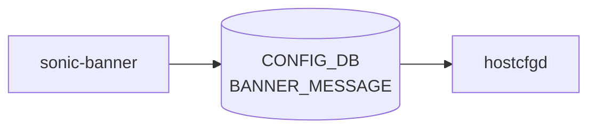

# sonic-banner YANG

## 概要

- module: `sonic-banner`
- namespace: `http://github.com/sonic-net/sonic-banner`
- revision: `2023-05-18`
- import: `sonic-types`
- top container: `sonic-banner`

Login, MOTD, and logout banner message YANG module for SONiC OS.[^1]

<!-- yang-mermaid -->
### データフロー (自動生成)



!!! note "凡例"
    YANG モジュールから CONFIG_DB テーブル経由で subscribe する daemon/orch までを `docs/reference/config-db-orch-map.md` から機械生成したミニ図。詳細・例外は本ページ本文を参照。
<!-- /yang-mermaid -->

## ツリー

```
module: sonic-banner
  +--rw sonic-banner
     +--rw BANNER_MESSAGE
        +--rw global
           +--rw state?    stypes:admin_mode
           +--rw login?    string
           +--rw motd?     string
           +--rw logout?   string
```

## leaf 一覧

| leaf | パス | 型 | 必須 | デフォルト | enum / 範囲 / leafref | 説明 |
|------|------|----|------|-----------|----------------------|------|
| `state` | `sonic-banner/BANNER_MESSAGE/global/state` | `stypes:admin_mode` |  | `disabled` |  | Enable or disable the banner feature. |
| `login` | `sonic-banner/BANNER_MESSAGE/global/login` | `string` |  | `Debian GNU/Linux 11` |  | Banner message displayed to user before login prompt. |
| `motd` | `sonic-banner/BANNER_MESSAGE/global/motd` | `string` |  | SONiC ASCII art and welcome message |  | Banner message displayed to user after login prompt. |
| `logout` | `sonic-banner/BANNER_MESSAGE/global/logout` | `string` |  | `""` |  | Banner message displayed to users on logout. |

## leafref / 依存

- なし

## augment / deviation

- なし

## 関連 CONFIG_DB / CLI

- CONFIG_DB: `BANNER_MESSAGE|global`
- CLI: `config banner`

<!-- ref-triangle:start -->

## 関連リファレンス

- CONFIG_DB: [`BANNER_MESSAGE`](../config-db/banner-message.md)
- CLI: [`config banner`](../cli/config-banner.md)

<!-- ref-triangle:end -->

<!-- ops-hint -->
## 運用ヒント

### 典型的なデプロイ位置

- ログインバナー / MOTD 設定。`BANNER_MESSAGE|global` を hostcfgd が `/etc/issue` `/etc/motd` に書き出す。

### よくある落とし穴

- `motd` は複数行文字列。改行を含む値を CLI から渡す場合の YANG 側 string 制約 (1024 文字) に注意。

### 関連する config / show コマンド

```bash
sonic-db-cli CONFIG_DB hgetall 'BANNER_MESSAGE|global'
show banner
```
<!-- /ops-hint -->

## 引用元

[^1]: `sonic-net/sonic-buildimage` `src/sonic-yang-models/yang-models/sonic-banner.yang` @ `9ea932ec2e18f35e58268ec2e4456b1d4afd65cd`
