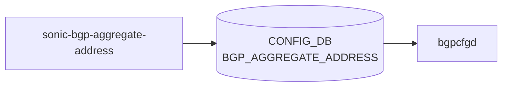

# sonic-bgp-aggregate-address YANG

## 概要

- module: `sonic-bgp-aggregate-address`
- namespace: `http://github.com/sonic-net/sonic-bgp-aggregate-address`
- revision: `2024-07-10`
- import: `ietf-inet-types`
- top container: `sonic-bgp-aggregate-address`

SONIC [BGP](../../reference/glossary.md#term-bgp) aggregate address configuration module.[^1]

<!-- yang-mermaid -->
### データフロー (自動生成)



!!! note "凡例"
    YANG モジュールから CONFIG_DB テーブル経由で subscribe する daemon/orch までを `docs/reference/config-db-orch-map.md` から機械生成したミニ図。詳細・例外は本ページ本文を参照。
<!-- /yang-mermaid -->

## 関連ページ

<!-- yang-xref -->

本 YANG モジュールに対応する CONFIG_DB / CLI / HLD / Topics への相互リンク。`inject_yang_xref.py` により自動生成されます。

### 対応 CONFIG_DB

- [`BGP_AGGREGATE_ADDRESS`](../config-db/bgp-aggregate-address.md)

### 関連 CLI

- [`config bgp`](../cli/config-bgp.md)

<!-- /yang-xref -->

## ツリー

```text
module: sonic-bgp-aggregate-address
  +--rw sonic-bgp-aggregate-address
     +--rw BGP_AGGREGATE_ADDRESS
        +--rw BGP_AGGREGATE_ADDRESS_LIST* [aggregate-address]
           +--rw aggregate-address                   inet:ip-prefix
           +--rw bbr-required?                       boolean
           +--rw summary-only?                       boolean
           +--rw as-set?                             boolean
           +--rw aggregate-address-prefix-list?      string
           +--rw contributing-address-prefix-list?   string
```

## container / list 一覧

| 種別 | パス | key | 説明 |
|------|------|-----|------|
| `container` | `sonic-bgp-aggregate-address` |  |  |
| `container` | `sonic-bgp-aggregate-address/BGP_AGGREGATE_ADDRESS` |  | [BGP](../../reference/glossary.md#term-bgp) aggregate address configuration for summarizing prefixes. |
| `list` | `sonic-bgp-aggregate-address/BGP_AGGREGATE_ADDRESS/BGP_AGGREGATE_ADDRESS_LIST` | `aggregate-address` | Each entry defines a [BGP](../../reference/glossary.md#term-bgp) aggregate address and its advertisement options. |

## leaf 一覧

| leaf | パス | 型 | 必須 | デフォルト | enum / 範囲 / leafref | 説明 |
|------|------|----|------|-----------|----------------------|------|
| `aggregate-address` | `sonic-bgp-aggregate-address/BGP_AGGREGATE_ADDRESS/BGP_AGGREGATE_ADDRESS_LIST/aggregate-address` | `inet:ip-prefix` | yes |  |  | Aggregate address to be advertised |
| `bbr-required` | `sonic-bgp-aggregate-address/BGP_AGGREGATE_ADDRESS/BGP_AGGREGATE_ADDRESS_LIST/bbr-required` | `boolean` |  | false |  | Require a Border Gateway Protocol Best Route (BBR) entry before generating the aggregate. |
| `summary-only` | `sonic-bgp-aggregate-address/BGP_AGGREGATE_ADDRESS/BGP_AGGREGATE_ADDRESS_LIST/summary-only` | `boolean` |  | false |  | Suppress more-specific routes and only advertise the aggregate summary. |
| `as-set` | `sonic-bgp-aggregate-address/BGP_AGGREGATE_ADDRESS/BGP_AGGREGATE_ADDRESS_LIST/as-set` | `boolean` |  | false |  | Include AS_SET path information in the aggregate to preserve origin AS data. |
| `aggregate-address-prefix-list` | `sonic-bgp-aggregate-address/BGP_AGGREGATE_ADDRESS/BGP_AGGREGATE_ADDRESS_LIST/aggregate-address-prefix-list` | `string` |  |  | length `0..128`; pattern `[0-9a-zA-Z_-]*` | Prefix list used to filter which prefixes are included in the aggregate advertisement. |
| `contributing-address-prefix-list` | `sonic-bgp-aggregate-address/BGP_AGGREGATE_ADDRESS/BGP_AGGREGATE_ADDRESS_LIST/contributing-address-prefix-list` | `string` |  |  | length `0..128`; pattern `[0-9a-zA-Z_-]*` | Prefix list used to filter which contributing routes are considered for the aggregate. |

## leafref / 依存

- なし

## augment / deviation

- なし

## 関連 CONFIG_DB / CLI

- [CONFIG_DB](../../reference/glossary.md#term-config_db): `BGP_AGGREGATE_ADDRESS`
- CLI: `config bgp`

<!-- yang-sibling -->
### 関連 YANG モジュール

意味的に関連する SONiC YANG モジュール (slug prefix / curated group / frontmatter `related.yang` から自動抽出):

- [`sonic-bgp-global`](sonic-bgp-global.md)
- [`sonic-bgp-neighbor`](sonic-bgp-neighbor.md)
- [`sonic-route-map`](sonic-route-map.md)
- [`sonic-bgp-bbr`](sonic-bgp-bbr.md)
- [`sonic-bgp-device-global`](sonic-bgp-device-global.md)
<!-- /yang-sibling -->

<!-- ref-triangle:start -->

## 関連リファレンス

- [CONFIG_DB](../../reference/glossary.md#term-config_db): [`BGP_AGGREGATE_ADDRESS`](../config-db/bgp-aggregate-address.md)
- CLI: [`config bgp`](../cli/config-bgp.md)

<!-- ref-triangle:end -->

<!-- ops-hint -->
## 運用ヒント

### 典型的なデプロイ位置

- BGP の aggregate-address (経路集約) 設定。`BGP_AGGREGATE_ADDRESS` テーブル経由で [FRR](../../reference/glossary.md#term-frr) の `aggregate-address` コマンドへ展開（bgpcfgd 経路）。`BGP_GLOBALS_AF_AGGREGATE_ADDR` は frr-mgmt-framework が扱う別テーブルで本モジュールの対象外。

### よくある落とし穴

- `ip_prefix` のキー型 (string vs ip-prefix typedef) に注意。CLI 由来で zero-padded prefix を入れると重複キー扱いされる例あり。

### 関連する config / show コマンド

```bash
sonic-db-cli CONFIG_DB keys 'BGP_AGGREGATE_ADDRESS|*'
vtysh -c 'show ip bgp summary'
```
<!-- /ops-hint -->

## 引用元

[^1]: `sonic-net/sonic-buildimage` `src/sonic-yang-models/yang-models/sonic-bgp-aggregate-address.yang` @ `9ea932ec2e18f35e58268ec2e4456b1d4afd65cd`

<!-- glossary-links-injected: 20dbc11976b6 -->
