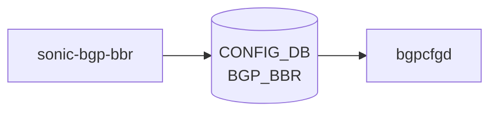

# sonic-bgp-bbr YANG

## 概要

- module: `sonic-bgp-bbr`
- namespace: `http://github.com/sonic-net/sonic-bgp-bbr`
- revision: `2023-12-25`
- import: `sonic-types`
- top container: `sonic-bgp-bbr`

[SONiC](../../reference/glossary.md#term-sonic) の [BGP](../../reference/glossary.md#term-bgp) Border Router (BBR) を有効化/無効化する小さなグローバル設定モジュール[^1]。`all` 単一インスタンスのコンテナ配下に `status` リーフを持つ。

<!-- yang-mermaid -->
### データフロー (自動生成)



!!! note "凡例"
    YANG モジュールから CONFIG_DB テーブル経由で subscribe する daemon/orch までを `docs/reference/config-db-orch-map.md` から機械生成したミニ図。詳細・例外は本ページ本文を参照。
<!-- /yang-mermaid -->

## ツリー

```text
module: sonic-bgp-bbr
  +--rw sonic-bgp-bbr
     +--rw BGP_BBR
        +--rw all
           +--rw status?   stypes:admin_mode
```

## leaf 一覧

| leaf | パス | 型 | 必須 | デフォルト | enum / 範囲 / leafref | 説明 |
|------|------|----|------|-----------|----------------------|------|
| `status` | `sonic-bgp-bbr/BGP_BBR/all/status` | `stypes:admin_mode` |  | `enabled` | enabled / disabled | デバイス上で [BGP](../../reference/glossary.md#term-bgp) BBR 機能を有効/無効にする |

## leafref / 依存

- なし

## augment / deviation

- なし

## 関連 CONFIG_DB / CLI

- [CONFIG_DB](../../reference/glossary.md#term-config_db): `BGP_BBR|all`
- CLI: `config bgp bbr`

## redis-cli での観測

[YANG](../../reference/glossary.md#term-yang) の `enum`（`enabled` / `disabled`）と `default` の挙動は、実機では [CONFIG_DB](../../reference/glossary.md#term-config_db) の `BGP_BBR` キーを直接覗くと素早く突き合わせできる。設定値・[FRR](../../reference/glossary.md#term-frr) への反映状況を 1 セッションで確認する定型は以下。

```bash
# 1. 現在の CONFIG_DB 値（YANG leaf "status" に相当）
sonic-db-cli CONFIG_DB hgetall 'BGP_BBR|all'
# 期待: 1) "status"
#       2) "enabled"   (または "disabled")

# 2. キーが未作成のときは default(enabled) 扱い
sonic-db-cli CONFIG_DB keys 'BGP_BBR|*'

# 3. 設定変更と即時反映確認
sonic-db-cli CONFIG_DB hset 'BGP_BBR|all' status enabled
sonic-db-cli CONFIG_DB hget  'BGP_BBR|all' status

# 4. bgpcfgd が FRR へ反映した結果（aggregate-address の suppress-map / advertise-map）
docker exec -it bgp vtysh -c 'show running-config bgpd' | grep -E 'aggregate-address|bbr'
```

`status=enabled` のとき、`BGP_AGGREGATE_ADDRESS` の BBR 連動ロジック（`suppress-map` の動的切替）が `bgpcfgd` の Jinja テンプレートで生成される。`disabled` に切り替えても `aggregate-address` 設定自体は残るため、[FRR](../../reference/glossary.md#term-frr) 側の `running-config` 差分で「BBR 機能のみが OFF」を確認するのがポイント。

<!-- yang-sibling -->
### 関連 YANG モジュール

意味的に関連する SONiC YANG モジュール (slug prefix / curated group / frontmatter `related.yang` から自動抽出):

- [`sonic-bgp-global`](sonic-bgp-global.md)
- [`sonic-bgp-aggregate-address`](sonic-bgp-aggregate-address.md)
- [`sonic-bgp-device-global`](sonic-bgp-device-global.md)
- [`sonic-bgp-monitor`](sonic-bgp-monitor.md)
- [`sonic-bgp-neighbor`](sonic-bgp-neighbor.md)
<!-- /yang-sibling -->

<!-- ref-triangle:start -->

## 関連リファレンス

- [CONFIG_DB](../../reference/glossary.md#term-config_db): `BGP_BBR`
- CLI: [`config bgp bbr`](../cli/config-bgp.md)

<!-- ref-triangle:end -->

<!-- ops-hint -->
## 運用ヒント

### 典型的なデプロイ位置

- [FRR](../../reference/glossary.md#term-frr) の [BGP](../../reference/glossary.md#term-bgp) BBR (Best-path Backup Routing) 機能。[sonic-mgmt](../../reference/glossary.md#term-sonic-mgmt)-framework 経由で `BGP_BBR` テーブルに書かれ、FRR `bgpd` の [vtysh](../../reference/glossary.md#term-vtysh) コマンドへ変換される。

### よくある落とし穴

- `status` は string enum (`enabled`/`disabled`)。typedef ではなく直書きされているため、CLI から不正値を渡してもバリデーション漏れする例がある。

### 関連する config / show コマンド

```bash
sonic-db-cli CONFIG_DB hgetall 'BGP_BBR|all'
show runningconfiguration bgp
```
<!-- /ops-hint -->

## 引用元

[^1]: `sonic-net/sonic-buildimage` `src/sonic-yang-models/yang-models/sonic-bgp-bbr.yang` @ `9ea932ec2e18f35e58268ec2e4456b1d4afd65cd`

<!-- glossary-links-injected: 7ac8e66e1af3 -->
