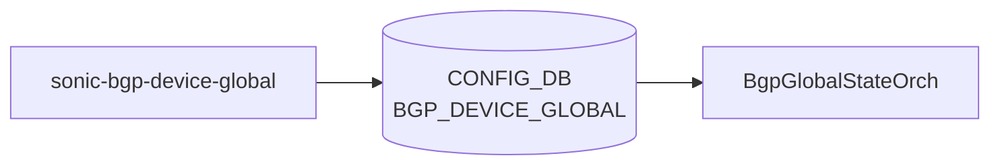

# sonic-bgp-device-global YANG

## 概要

- module: `sonic-bgp-device-global`
- namespace: `http://github.com/sonic-net/sonic-bgp-device-global`
- revision: `2024-01-28` (Weighted ECMP using BGP link bandwidth), `2022-06-26` (initial)
- import: なし
- top container: `sonic-bgp-device-global`

デバイスレベル BGP のグローバル設定。TSA (Traffic Shift Away)、 WCMP (Weighted ECMP)、 IDF isolation 状態、および BGP confederation 設定を保持する[^1]。

<!-- yang-mermaid -->
### データフロー (自動生成)



!!! note "凡例"
    YANG モジュールから CONFIG_DB テーブル経由で subscribe する daemon/orch までを `docs/reference/config-db-orch-map.md` から機械生成したミニ図。詳細・例外は本ページ本文を参照。
<!-- /yang-mermaid -->

## ツリー

```
module: sonic-bgp-device-global
  +--rw sonic-bgp-device-global
     +--rw BGP_DEVICE_GLOBAL
        +--rw STATE
        |  +--rw tsa_enabled?           boolean
        |  +--rw wcmp_enabled?          boolean
        |  +--rw idf_isolation_state?   enumeration
        +--rw CONFED
           +--rw asn?     uint32
           +--rw peers?   string
```

## leaf 一覧

| leaf | パス | 型 | 必須 | デフォルト | enum / 範囲 / leafref | 説明 |
|------|------|----|------|-----------|----------------------|------|
| `tsa_enabled` | `sonic-bgp-device-global/BGP_DEVICE_GLOBAL/STATE/tsa_enabled` | `boolean` |  | false |  | When true, traffic is shifted away (TSA); BGP routes are not advertised to neighbors |
| `wcmp_enabled` | `sonic-bgp-device-global/BGP_DEVICE_GLOBAL/STATE/wcmp_enabled` | `boolean` |  | false |  | Enable Weighted ECMP using BGP link bandwidth |
| `idf_isolation_state` | `sonic-bgp-device-global/BGP_DEVICE_GLOBAL/STATE/idf_isolation_state` | `enumeration` |  |  | isolated_no_export, isolated_withdraw_all, unisolated | IDF (Internet-Facing Datacenter Fabric) isolation state |
| `asn` | `sonic-bgp-device-global/BGP_DEVICE_GLOBAL/CONFED/asn` | `uint32` |  |  | range 1..4294967295 | Autonomous System Number for BGP confederation |
| `peers` | `sonic-bgp-device-global/BGP_DEVICE_GLOBAL/CONFED/peers` | `string` |  |  |  | List of sub-ASNs in the confederation separated by semi-colon |

## leafref / 依存

- なし

## augment / deviation

- なし

## 関連 CONFIG_DB / CLI

- CONFIG_DB: `BGP_DEVICE_GLOBAL`
- CLI: `config bgp` (`tsa`/`wcmp`/`idf`), `show bgp`

<!-- ref-triangle:start -->

## 関連リファレンス

- CONFIG_DB: [`BGP_DEVICE_GLOBAL`](../config-db/bgp-device-global.md)
- CLI: [`config bgp`](../cli/config-bgp.md) / [`show bgp`](../cli/show-bgp.md)

<!-- ref-triangle:end -->

<!-- ops-hint -->
## 運用ヒント

### 典型的なデプロイ位置

- BGP のデバイス全体パラメータ。`BGP_DEVICE_GLOBAL|STATE` を介して FRR の `bgp` グローバル設定 (TCP-AO 等) を制御する。

### よくある落とし穴

- `tcp_ao_enabled` を true にする場合は対向ルータ側との鍵設定整合を要する。leafref で keychain 名を参照する派生実装あり。

### 関連する config / show コマンド

```bash
sonic-db-cli CONFIG_DB hgetall 'BGP_DEVICE_GLOBAL|STATE'
vtysh -c 'show bgp summary'
```
<!-- /ops-hint -->

## 引用元

[^1]: `sonic-net/sonic-buildimage` `src/sonic-yang-models/yang-models/sonic-bgp-device-global.yang` @ `9ea932ec2e18f35e58268ec2e4456b1d4afd65cd`
