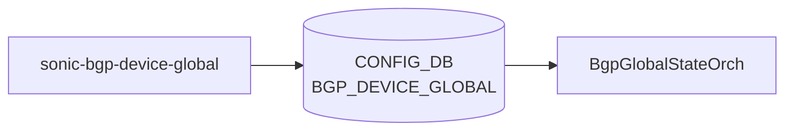

# sonic-bgp-device-global YANG

## 概要

- module: `sonic-bgp-device-global`
- namespace: `http://github.com/sonic-net/sonic-bgp-device-global`
- revision: `2024-01-28` (Weighted [ECMP](../../reference/glossary.md#term-ecmp) using [BGP](../../reference/glossary.md#term-bgp) link bandwidth), `2022-06-26` (initial)
- import: なし
- top container: `sonic-bgp-device-global`

デバイスレベル [BGP](../../reference/glossary.md#term-bgp) のグローバル設定。TSA (Traffic Shift Away)、 WCMP (Weighted [ECMP](../../reference/glossary.md#term-ecmp))、 IDF isolation 状態、および [BGP](../../reference/glossary.md#term-bgp) confederation 設定を保持する[^1]。

<!-- yang-mermaid -->
### データフロー (自動生成)



!!! note "凡例"
    YANG モジュールから CONFIG_DB テーブル経由で subscribe する daemon/orch までを `docs/reference/config-db-orch-map.md` から機械生成したミニ図。詳細・例外は本ページ本文を参照。
<!-- /yang-mermaid -->

## 関連ページ

<!-- yang-xref -->

本 YANG モジュールに対応する CONFIG_DB / CLI / HLD / Topics への相互リンク。`inject_yang_xref.py` により自動生成されます。

### 対応 CONFIG_DB

- [`BGP_DEVICE_GLOBAL`](../config-db/bgp-device-global.md)

### 関連 CLI

- [`config bgp`](../cli/config-bgp.md)
- [`show bgp`](../cli/show-bgp.md)

<!-- /yang-xref -->

## ツリー

```text
module: sonic-bgp-device-global
  +--rw sonic-bgp-device-global
     +--rw BGP_DEVICE_GLOBAL
        +--rw STATE
        |  +--rw tsa_enabled?           boolean
        |  +--rw wcmp_enabled?          boolean
        |  +--rw idf_isolation_state?   enumeration
        +--rw CONFED
           +--rw asn?     uint32
           +--rw peers?   string
```

## leaf 一覧

| leaf | パス | 型 | 必須 | デフォルト | enum / 範囲 / leafref | 説明 |
|------|------|----|------|-----------|----------------------|------|
| `tsa_enabled` | `sonic-bgp-device-global/BGP_DEVICE_GLOBAL/STATE/tsa_enabled` | `boolean` |  | false |  | When true, traffic is shifted away (TSA); BGP routes are not advertised to neighbors |
| `wcmp_enabled` | `sonic-bgp-device-global/BGP_DEVICE_GLOBAL/STATE/wcmp_enabled` | `boolean` |  | false |  | Enable Weighted [ECMP](../../reference/glossary.md#term-ecmp) using BGP link bandwidth |
| `idf_isolation_state` | `sonic-bgp-device-global/BGP_DEVICE_GLOBAL/STATE/idf_isolation_state` | `enumeration` |  |  | isolated_no_export, isolated_withdraw_all, unisolated | IDF (Internet-Facing Datacenter Fabric) isolation state |
| `asn` | `sonic-bgp-device-global/BGP_DEVICE_GLOBAL/CONFED/asn` | `uint32` |  |  | range 1..4294967295 | Autonomous System Number for BGP confederation |
| `peers` | `sonic-bgp-device-global/BGP_DEVICE_GLOBAL/CONFED/peers` | `string` |  |  |  | List of sub-ASNs in the confederation separated by semi-colon |

## leafref / 依存

- なし

## augment / deviation

- なし

## 関連 CONFIG_DB / CLI

- [CONFIG_DB](../../reference/glossary.md#term-config_db): `BGP_DEVICE_GLOBAL`
- CLI: `config bgp` (`tsa`/`wcmp`/`idf`), `show bgp`

<!-- yang-sibling -->
### 関連 YANG モジュール

意味的に関連する SONiC YANG モジュール (slug prefix / curated group / frontmatter `related.yang` から自動抽出):

- [`sonic-bgp-global`](sonic-bgp-global.md)
- [`sonic-bgp-aggregate-address`](sonic-bgp-aggregate-address.md)
- [`sonic-bgp-bbr`](sonic-bgp-bbr.md)
- [`sonic-bgp-monitor`](sonic-bgp-monitor.md)
- [`sonic-bgp-neighbor`](sonic-bgp-neighbor.md)
<!-- /yang-sibling -->

<!-- ref-triangle:start -->

## 関連リファレンス

- [CONFIG_DB](../../reference/glossary.md#term-config_db): [`BGP_DEVICE_GLOBAL`](../config-db/bgp-device-global.md)
- CLI: [`config bgp`](../cli/config-bgp.md) / [`show bgp`](../cli/show-bgp.md)

<!-- ref-triangle:end -->

<!-- ops-hint -->
## 運用ヒント

### 典型的なデプロイ位置

- BGP のデバイス全体パラメータ。`BGP_DEVICE_GLOBAL|STATE` を介して TSA (Traffic Shift Away) / WCMP (Weighted ECMP) / IDF isolation 状態を制御し、`BGP_DEVICE_GLOBAL|CONFED` で confederation ASN・peers を設定する。変更は [bgpcfgd](../../reference/glossary.md#term-bgpcfgd) / BgpGlobalStateOrch が [FRR](../../reference/glossary.md#term-frr) へ反映する。

### よくある落とし穴

- `idf_isolation_state` の enum 値 (`isolated_no_export` / `isolated_withdraw_all` / `unisolated`) はスペルが厳密。CLI 経由では検証されるが `sonic-db-cli` で直書きすると YANG バリデーションが効かないため任意文字列が混入しうる。

### 関連する config / show コマンド

```bash
sonic-db-cli CONFIG_DB hgetall 'BGP_DEVICE_GLOBAL|STATE'
vtysh -c 'show bgp summary'
```
<!-- /ops-hint -->

## 引用元

[^1]: `sonic-net/sonic-buildimage` `src/sonic-yang-models/yang-models/sonic-bgp-device-global.yang` @ `9ea932ec2e18f35e58268ec2e4456b1d4afd65cd`

<!-- glossary-links-injected: 20dbc11976b6 -->
