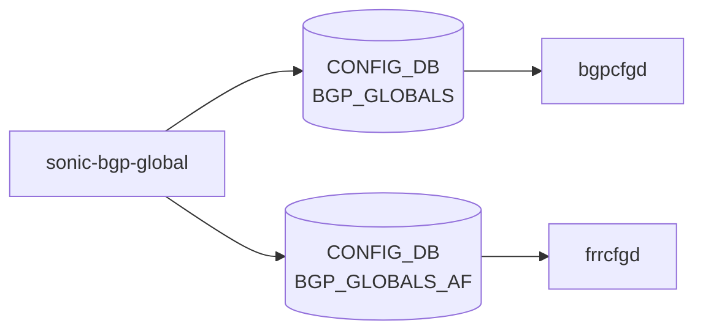

# sonic-bgp-global YANG

## 概要

- module: `sonic-bgp-global`
- namespace: `http://github.com/sonic-net/sonic-bgp-global`
- revision: `2021-02-26`
- import: `sonic-vrf`, `ietf-inet-types`, `sonic-route-map`, `sonic-extension`
- top container: `sonic-bgp-global`

SONIC [BGP](../../reference/glossary.md#term-bgp) Global [YANG](../../reference/glossary.md#term-yang)[^1]

<!-- yang-mermaid -->
### データフロー (自動生成)



!!! note "凡例"
    YANG モジュールから CONFIG_DB テーブル経由で subscribe する daemon/orch までを `docs/reference/config-db-orch-map.md` から機械生成したミニ図。詳細・例外は本ページ本文を参照。
<!-- /yang-mermaid -->

## 関連ページ

<!-- yang-xref -->

本 YANG モジュールに対応する CONFIG_DB / CLI / HLD / Topics への相互リンク。`inject_yang_xref.py` により自動生成されます。

### 対応 CONFIG_DB

- [`BGP_GLOBALS`](../config-db/bgp-globals.md)
- [`BGP_GLOBALS_AF`](../config-db/bgp-globals-af.md)

### 関連 CLI

- [`config bgp`](../cli/config-bgp.md)

### 関連 HLD

- [sonic-bgp-aggregate-address YANG](../../reference/yang/sonic-bgp-aggregate-address.md)

<!-- /yang-xref -->

## ツリー

```text
module: sonic-bgp-global
  +--rw sonic-bgp-global
     +--rw BGP_GLOBALS
     |  +--rw BGP_GLOBALS_LIST* [vrf_name]
     |     +--rw vrf_name                           union
     |     +--rw router_id?                         inet:ipv4-address
     |     +--rw local_asn?                         uint32
     |     +--rw always_compare_med?                boolean
     |     +--rw load_balance_mp_relax?             boolean
     |     +--rw graceful_restart_enable?           boolean
     |     +--rw gr_preserve_fw_state?              boolean
     |     +--rw gr_restart_time?                   uint16
     |     +--rw gr_stale_routes_time?              uint16
     |     +--rw external_compare_router_id?        boolean
     |     +--rw ignore_as_path_length?             boolean
     |     +--rw log_nbr_state_changes?             boolean
     |     +--rw rr_cluster_id?                     string
     |     +--rw rr_allow_out_policy?               boolean
     |     +--rw disable_ebgp_connected_rt_check?   boolean
     |     +--rw fast_external_failover?            boolean
     |     +--rw network_import_check?              boolean
     |     +--rw graceful_shutdown?                 boolean
     |     +--rw rr_clnt_to_clnt_reflection?        boolean
     |     +--rw max_dynamic_neighbors?             uint16
     |     +--rw read_quanta?                       uint8
     |     +--rw write_quanta?                      uint8
     |     +--rw coalesce_time?                     uint32
     |     +--rw route_map_process_delay?           uint16
     |     +--rw deterministic_med?                 boolean
     |     +--rw med_confed?                        boolean
     |     +--rw med_missing_as_worst?              boolean
     |     +--rw compare_confed_as_path?            boolean
     |     +--rw as_path_mp_as_set?                 boolean
     |     +--rw default_ipv4_unicast?              boolean
     |     +--rw default_local_preference?          uint32
     |     +--rw default_show_hostname?             boolean
     |     +--rw default_shutdown?                  boolean
     |     +--rw default_subgroup_pkt_queue_max?    uint8
     |     +--rw max_med_time?                      uint32
     |     +--rw max_med_val?                       uint32
     |     +--rw max_med_admin?                     boolean
     |     +--rw max_med_admin_val?                 uint32
     |     +--rw max_delay?                         uint16
     |     +--rw establish_wait?                    uint16
     |     +--rw confed_id?                         uint32
     |     +--rw confed_peers*                      uint32
     |     +--rw keepalive?                         uint16
     |     +--rw holdtime?                          uint16
     +--rw BGP_GLOBALS_AF
     |  +--rw BGP_GLOBALS_AF_LIST* [vrf_name afi_safi]
     |     +--rw vrf_name                                -> ../../../BGP_GLOBALS/BGP_GLOBALS_LIST/vrf_name
     |     +--rw afi_safi                                string
     |     +--rw max_ebgp_paths?                         uint16
     |     +--rw max_ibgp_paths?                         uint16
     |     +--rw import_vrf?                             union
     |     +--rw import_vrf_route_map?                   -> /rmap:sonic-route-map/ROUTE_MAP_SET/ROUTE_MAP_SET_LIST/name
     |     +--rw route_download_filter?                  -> /rmap:sonic-route-map/ROUTE_MAP_SET/ROUTE_MAP_SET_LIST/name
     |     +--rw ebgp_route_distance?                    uint8
     |     +--rw ibgp_route_distance?                    uint8
     |     +--rw local_route_distance?                   uint8
     |     +--rw ibgp_equal_cluster_length?              boolean
     |     +--rw route_flap_dampen?                      boolean
     |     +--rw route_flap_dampen_half_life?            uint8
     |     +--rw route_flap_dampen_reuse_threshold?      uint16
     |     +--rw route_flap_dampen_suppress_threshold?   uint16
     |     +--rw route_flap_dampen_max_suppress?         uint8
     |     +--rw autort?                                 enumeration
     |     +--rw advertise-all-vni?                      boolean
     |     +--rw advertise-svi-ip?                       boolean
     +--rw BGP_GLOBALS_AF_AGGREGATE_ADDR
     |  +--rw BGP_GLOBALS_AF_AGGREGATE_ADDR_LIST* [vrf_name afi_safi ip_prefix]
     |     +--rw vrf_name        -> ../../../BGP_GLOBALS/BGP_GLOBALS_LIST/vrf_name
     |     +--rw afi_safi        string
     |     +--rw ip_prefix       inet:ip-prefix
     |     +--rw as_set?         boolean
     |     +--rw summary_only?   boolean
     |     +--rw policy?         -> /rmap:sonic-route-map/ROUTE_MAP_SET/ROUTE_MAP_SET_LIST/name
     +--rw BGP_GLOBALS_AF_NETWORK
        +--rw BGP_GLOBALS_AF_NETWORK_LIST* [vrf_name afi_safi ip_prefix]
           +--rw vrf_name     -> ../../../BGP_GLOBALS/BGP_GLOBALS_LIST/vrf_name
           +--rw afi_safi     string
           +--rw ip_prefix    inet:ip-prefix
           +--rw policy?      -> /rmap:sonic-route-map/ROUTE_MAP_SET/ROUTE_MAP_SET_LIST/name
           +--rw backdoor?    boolean
```

## leaf 一覧

| leaf | パス | 型 | 必須 | デフォルト | enum / 範囲 / leafref | 説明 |
|------|------|----|------|-----------|----------------------|------|
| `vrf_name` | `sonic-bgp-global/BGP_GLOBALS/BGP_GLOBALS_LIST/vrf_name` | `union` | yes |  | union(string, leafref) | [VRF](../../reference/glossary.md#term-vrf) name |
| `router_id` | `sonic-bgp-global/BGP_GLOBALS/BGP_GLOBALS_LIST/router_id` | `inet:ipv4-address` |  |  |  | [BGP](../../reference/glossary.md#term-bgp) router identifier in IPv4 address format. |
| `local_asn` | `sonic-bgp-global/BGP_GLOBALS/BGP_GLOBALS_LIST/local_asn` | `uint32` |  |  | range 1..4294967295 | Local autonomous system number for this [BGP](../../reference/glossary.md#term-bgp) instance. |
| `always_compare_med` | `sonic-bgp-global/BGP_GLOBALS/BGP_GLOBALS_LIST/always_compare_med` | `boolean` |  |  |  | Allow comparing MED from different neighbors |
| `load_balance_mp_relax` | `sonic-bgp-global/BGP_GLOBALS/BGP_GLOBALS_LIST/load_balance_mp_relax` | `boolean` |  |  |  | Allow load sharing across routes that have different AS paths (but same length) |
| `graceful_restart_enable` | `sonic-bgp-global/BGP_GLOBALS/BGP_GLOBALS_LIST/graceful_restart_enable` | `boolean` |  |  |  | Enable graceful restart |
| `gr_preserve_fw_state` | `sonic-bgp-global/BGP_GLOBALS/BGP_GLOBALS_LIST/gr_preserve_fw_state` | `boolean` |  |  |  | Set F-bit indication that FIB is preserved while doing [Graceful Restart](../../reference/glossary.md#term-graceful-restart). |
| `gr_restart_time` | `sonic-bgp-global/BGP_GLOBALS/BGP_GLOBALS_LIST/gr_restart_time` | `uint16` |  |  | range 1..3600 | Set the time to wait to delete stale routes before a BGP open message is received |
| `gr_stale_routes_time` | `sonic-bgp-global/BGP_GLOBALS/BGP_GLOBALS_LIST/gr_stale_routes_time` | `uint16` |  |  | range 1..3600 | Set the max time to hold onto restarting peer's stale paths |
| `external_compare_router_id` | `sonic-bgp-global/BGP_GLOBALS/BGP_GLOBALS_LIST/external_compare_router_id` | `boolean` |  |  |  | Compare router-id for identical EBGP paths |
| `ignore_as_path_length` | `sonic-bgp-global/BGP_GLOBALS/BGP_GLOBALS_LIST/ignore_as_path_length` | `boolean` |  |  |  | Ignore as-path length in selecting a route |
| `log_nbr_state_changes` | `sonic-bgp-global/BGP_GLOBALS/BGP_GLOBALS_LIST/log_nbr_state_changes` | `boolean` |  |  |  | Log neighbor up/down and reset reason |
| `rr_cluster_id` | `sonic-bgp-global/BGP_GLOBALS/BGP_GLOBALS_LIST/rr_cluster_id` | `string` |  |  |  | Route reflector cluster ID used to identify the reflector cluster. |
| `rr_allow_out_policy` | `sonic-bgp-global/BGP_GLOBALS/BGP_GLOBALS_LIST/rr_allow_out_policy` | `boolean` |  |  |  | Allow outbound route-map modifications on reflected routes. |
| `disable_ebgp_connected_rt_check` | `sonic-bgp-global/BGP_GLOBALS/BGP_GLOBALS_LIST/disable_ebgp_connected_rt_check` | `boolean` |  |  |  | Disable checking if nexthop is connected on ebgp sessions |
| `fast_external_failover` | `sonic-bgp-global/BGP_GLOBALS/BGP_GLOBALS_LIST/fast_external_failover` | `boolean` |  |  |  | Immediately reset session if a link to a directly connected external peer goes down |
| `network_import_check` | `sonic-bgp-global/BGP_GLOBALS/BGP_GLOBALS_LIST/network_import_check` | `boolean` |  |  |  | Check BGP network route exists in IGP |
| `graceful_shutdown` | `sonic-bgp-global/BGP_GLOBALS/BGP_GLOBALS_LIST/graceful_shutdown` | `boolean` |  |  |  | Enable graceful shutdown |
| `rr_clnt_to_clnt_reflection` | `sonic-bgp-global/BGP_GLOBALS/BGP_GLOBALS_LIST/rr_clnt_to_clnt_reflection` | `boolean` |  |  |  | Enable client to client route reflection. |
| `max_dynamic_neighbors` | `sonic-bgp-global/BGP_GLOBALS/BGP_GLOBALS_LIST/max_dynamic_neighbors` | `uint16` |  |  | range 1..5000 | Maximum number of BGP dynamic neighbors that can be created. |
| `read_quanta` | `sonic-bgp-global/BGP_GLOBALS/BGP_GLOBALS_LIST/read_quanta` | `uint8` |  |  | range 1..10 | This indicates how many packets to read from peer socket per I/O cycle |
| `write_quanta` | `sonic-bgp-global/BGP_GLOBALS/BGP_GLOBALS_LIST/write_quanta` | `uint8` |  |  | range 1..10 | This indicates how many packets to write to peer socket per run |
| `coalesce_time` | `sonic-bgp-global/BGP_GLOBALS/BGP_GLOBALS_LIST/coalesce_time` | `uint32` |  |  |  | Subgroup coalesce timer value in milli-sec |
| `route_map_process_delay` | `sonic-bgp-global/BGP_GLOBALS/BGP_GLOBALS_LIST/route_map_process_delay` | `uint16` |  |  | range 0..600 | Delay in seconds before processing route-map changes; 0 disables automatic updates. |
| `deterministic_med` | `sonic-bgp-global/BGP_GLOBALS/BGP_GLOBALS_LIST/deterministic_med` | `boolean` |  |  |  | Pick the best-MED path among paths advertised from the neighboring AS. |
| `med_confed` | `sonic-bgp-global/BGP_GLOBALS/BGP_GLOBALS_LIST/med_confed` | `boolean` |  |  |  | Compare MED among confederation paths when set to true. |
| `med_missing_as_worst` | `sonic-bgp-global/BGP_GLOBALS/BGP_GLOBALS_LIST/med_missing_as_worst` | `boolean` |  |  |  | Treat missing MED as the least preferred one when set to true. |
| `compare_confed_as_path` | `sonic-bgp-global/BGP_GLOBALS/BGP_GLOBALS_LIST/compare_confed_as_path` | `boolean` |  |  |  | Compare path lengths including confederation sets & sequences in selecting a route |
| `as_path_mp_as_set` | `sonic-bgp-global/BGP_GLOBALS/BGP_GLOBALS_LIST/as_path_mp_as_set` | `boolean` |  |  |  | Include an AS_SET in multipath aggregate advertisements for multipath-relax. |
| `default_ipv4_unicast` | `sonic-bgp-global/BGP_GLOBALS/BGP_GLOBALS_LIST/default_ipv4_unicast` | `boolean` |  |  |  | Activate ipv4-unicast for a peer by default |
| `default_local_preference` | `sonic-bgp-global/BGP_GLOBALS/BGP_GLOBALS_LIST/default_local_preference` | `uint32` |  |  |  | Default local preference value applied to received routes. |
| `default_show_hostname` | `sonic-bgp-global/BGP_GLOBALS/BGP_GLOBALS_LIST/default_show_hostname` | `boolean` |  |  |  | Show hostname in BGP dumps. |
| `default_shutdown` | `sonic-bgp-global/BGP_GLOBALS/BGP_GLOBALS_LIST/default_shutdown` | `boolean` |  |  |  | Apply administrative shutdown to newly configured peers. |
| `default_subgroup_pkt_queue_max` | `sonic-bgp-global/BGP_GLOBALS/BGP_GLOBALS_LIST/default_subgroup_pkt_queue_max` | `uint8` |  |  | range 20..100 | Maximum number of packets in a subgroup update packet queue. |
| `max_med_time` | `sonic-bgp-global/BGP_GLOBALS/BGP_GLOBALS_LIST/max_med_time` | `uint32` |  |  | range 5..86400 | Duration in seconds to advertise maximum MED value after BGP startup. |
| `max_med_val` | `sonic-bgp-global/BGP_GLOBALS/BGP_GLOBALS_LIST/max_med_val` | `uint32` |  |  |  | MED value advertised during the on-startup max-med period. |
| `max_med_admin` | `sonic-bgp-global/BGP_GLOBALS/BGP_GLOBALS_LIST/max_med_admin` | `boolean` |  |  |  | Administratively enable indefinite max-MED advertisement. |
| `max_med_admin_val` | `sonic-bgp-global/BGP_GLOBALS/BGP_GLOBALS_LIST/max_med_admin_val` | `uint32` |  |  |  | MED value used when administrative max-MED is enabled. |
| `max_delay` | `sonic-bgp-global/BGP_GLOBALS/BGP_GLOBALS_LIST/max_delay` | `uint16` |  |  | range 0..3600 | Maximum delay in seconds for initial best-path calculation after BGP starts. |
| `establish_wait` | `sonic-bgp-global/BGP_GLOBALS/BGP_GLOBALS_LIST/establish_wait` | `uint16` |  |  | range 0..3600 | Time in seconds to wait for peers to establish before computing best paths during update-delay. |
| `confed_id` | `sonic-bgp-global/BGP_GLOBALS/BGP_GLOBALS_LIST/confed_id` | `uint32` |  |  | range 1..4294967295 | Set routing domain confederation AS. |
| `confed_peers` | `sonic-bgp-global/BGP_GLOBALS/BGP_GLOBALS_LIST/confed_peers` | `uint32` |  |  | range 1..4294967295 | Peer ASs in BGP confederation |
| `keepalive` | `sonic-bgp-global/BGP_GLOBALS/BGP_GLOBALS_LIST/keepalive` | `uint16` |  |  |  | Global BGP keepalive interval in seconds. |
| `holdtime` | `sonic-bgp-global/BGP_GLOBALS/BGP_GLOBALS_LIST/holdtime` | `uint16` |  |  |  | Global BGP hold time in seconds; session is reset if no keepalive is received within this period. |
| `vrf_name` | `sonic-bgp-global/BGP_GLOBALS_AF/BGP_GLOBALS_AF_LIST/vrf_name` | `leafref` | yes |  | ../../../BGP_GLOBALS/BGP_GLOBALS_LIST/vrf_name | Vrf name |
| `afi_safi` | `sonic-bgp-global/BGP_GLOBALS_AF/BGP_GLOBALS_AF_LIST/afi_safi` | `string` | yes |  |  | Address family name and subsequent address family name |
| `max_ebgp_paths` | `sonic-bgp-global/BGP_GLOBALS_AF/BGP_GLOBALS_AF_LIST/max_ebgp_paths` | `uint16` |  | 1 | range 1..256 | Maximum number of equal-cost eBGP paths to install for multipath forwarding. |
| `max_ibgp_paths` | `sonic-bgp-global/BGP_GLOBALS_AF/BGP_GLOBALS_AF_LIST/max_ibgp_paths` | `uint16` |  | 1 | range 1..256 | Maximum number of equal-cost iBGP paths to install for multipath forwarding. |
| `import_vrf` | `sonic-bgp-global/BGP_GLOBALS_AF/BGP_GLOBALS_AF_LIST/import_vrf` | `union` |  |  | union(string, leafref) | Import routes from particular [VRF](../../reference/glossary.md#term-vrf) |
| `import_vrf_route_map` | `sonic-bgp-global/BGP_GLOBALS_AF/BGP_GLOBALS_AF_LIST/import_vrf_route_map` | `leafref` |  |  | /rmap:sonic-route-map/rmap:ROUTE_MAP_SET/rmap:ROUTE_MAP_SET_LIST/rmap:name | Import routes from [VRF](../../reference/glossary.md#term-vrf) with route filter |
| `route_download_filter` | `sonic-bgp-global/BGP_GLOBALS_AF/BGP_GLOBALS_AF_LIST/route_download_filter` | `leafref` |  |  | /rmap:sonic-route-map/rmap:ROUTE_MAP_SET/rmap:ROUTE_MAP_SET_LIST/rmap:name | Route map applied to filter routes downloaded to the FIB (table-map). |
| `ebgp_route_distance` | `sonic-bgp-global/BGP_GLOBALS_AF/BGP_GLOBALS_AF_LIST/ebgp_route_distance` | `uint8` |  |  | range 1..255 | Distance for routes external to the AS |
| `ibgp_route_distance` | `sonic-bgp-global/BGP_GLOBALS_AF/BGP_GLOBALS_AF_LIST/ibgp_route_distance` | `uint8` |  |  | range 1..255 | Distance for routes internal to the AS |
| `local_route_distance` | `sonic-bgp-global/BGP_GLOBALS_AF/BGP_GLOBALS_AF_LIST/local_route_distance` | `uint8` |  |  | range 1..255 | Distance for local routes |
| `ibgp_equal_cluster_length` | `sonic-bgp-global/BGP_GLOBALS_AF/BGP_GLOBALS_AF_LIST/ibgp_equal_cluster_length` | `boolean` |  |  |  | Require matching cluster-list length when comparing iBGP multipath candidates. |
| `route_flap_dampen` | `sonic-bgp-global/BGP_GLOBALS_AF/BGP_GLOBALS_AF_LIST/route_flap_dampen` | `boolean` |  |  |  | Enable route-flap dampening |
| `route_flap_dampen_half_life` | `sonic-bgp-global/BGP_GLOBALS_AF/BGP_GLOBALS_AF_LIST/route_flap_dampen_half_life` | `uint8` |  |  | range 1..45 | Half-life time for the penalty |
| `route_flap_dampen_reuse_threshold` | `sonic-bgp-global/BGP_GLOBALS_AF/BGP_GLOBALS_AF_LIST/route_flap_dampen_reuse_threshold` | `uint16` |  |  | range 1..20000 | Value to start reusing a route |
| `route_flap_dampen_suppress_threshold` | `sonic-bgp-global/BGP_GLOBALS_AF/BGP_GLOBALS_AF_LIST/route_flap_dampen_suppress_threshold` | `uint16` |  |  | range 1..20000 | Value to start suppressing a route |
| `route_flap_dampen_max_suppress` | `sonic-bgp-global/BGP_GLOBALS_AF/BGP_GLOBALS_AF_LIST/route_flap_dampen_max_suppress` | `uint8` |  |  | range 1..255 | Maximum duration to suppress a stable route |
| `autort` | `sonic-bgp-global/BGP_GLOBALS_AF/BGP_GLOBALS_AF_LIST/autort` | `enumeration` |  |  | rfc8365-compatible | L2VPN derive route targets as per rfc8365 for interoperability with other implementations. |
| `advertise-all-vni` | `sonic-bgp-global/BGP_GLOBALS_AF/BGP_GLOBALS_AF_LIST/advertise-all-vni` | `boolean` |  |  |  | L2VPN advertise all VNIs |
| `advertise-svi-ip` | `sonic-bgp-global/BGP_GLOBALS_AF/BGP_GLOBALS_AF_LIST/advertise-svi-ip` | `boolean` |  |  |  | L2VPN advertise the local SVI IP address so that it can be accessible from remote VTEPs |
| `vrf_name` | `sonic-bgp-global/BGP_GLOBALS_AF_AGGREGATE_ADDR/BGP_GLOBALS_AF_AGGREGATE_ADDR_LIST/vrf_name` | `leafref` | yes |  | ../../../BGP_GLOBALS/BGP_GLOBALS_LIST/vrf_name | VRF name |
| `afi_safi` | `sonic-bgp-global/BGP_GLOBALS_AF_AGGREGATE_ADDR/BGP_GLOBALS_AF_AGGREGATE_ADDR_LIST/afi_safi` | `string` | yes |  |  | Address family name and subsequent address family name |
| `ip_prefix` | `sonic-bgp-global/BGP_GLOBALS_AF_AGGREGATE_ADDR/BGP_GLOBALS_AF_AGGREGATE_ADDR_LIST/ip_prefix` | `inet:ip-prefix` | yes |  |  | Aggregate address |
| `as_set` | `sonic-bgp-global/BGP_GLOBALS_AF_AGGREGATE_ADDR/BGP_GLOBALS_AF_AGGREGATE_ADDR_LIST/as_set` | `boolean` |  |  |  | Generate AS set path information |
| `summary_only` | `sonic-bgp-global/BGP_GLOBALS_AF_AGGREGATE_ADDR/BGP_GLOBALS_AF_AGGREGATE_ADDR_LIST/summary_only` | `boolean` |  |  |  | Filter more specific routes from updates |
| `policy` | `sonic-bgp-global/BGP_GLOBALS_AF_AGGREGATE_ADDR/BGP_GLOBALS_AF_AGGREGATE_ADDR_LIST/policy` | `leafref` |  |  | /rmap:sonic-route-map/rmap:ROUTE_MAP_SET/rmap:ROUTE_MAP_SET_LIST/rmap:name | Apply route map to aggregate network |
| `vrf_name` | `sonic-bgp-global/BGP_GLOBALS_AF_NETWORK/BGP_GLOBALS_AF_NETWORK_LIST/vrf_name` | `leafref` | yes |  | ../../../BGP_GLOBALS/BGP_GLOBALS_LIST/vrf_name | VRF name |
| `afi_safi` | `sonic-bgp-global/BGP_GLOBALS_AF_NETWORK/BGP_GLOBALS_AF_NETWORK_LIST/afi_safi` | `string` | yes |  |  | Address family name and subsequent address family name |
| `ip_prefix` | `sonic-bgp-global/BGP_GLOBALS_AF_NETWORK/BGP_GLOBALS_AF_NETWORK_LIST/ip_prefix` | `inet:ip-prefix` | yes |  |  | Network address |
| `policy` | `sonic-bgp-global/BGP_GLOBALS_AF_NETWORK/BGP_GLOBALS_AF_NETWORK_LIST/policy` | `leafref` |  |  | /rmap:sonic-route-map/rmap:ROUTE_MAP_SET/rmap:ROUTE_MAP_SET_LIST/rmap:name | Route-map to modify the attributes |
| `backdoor` | `sonic-bgp-global/BGP_GLOBALS_AF_NETWORK/BGP_GLOBALS_AF_NETWORK_LIST/backdoor` | `boolean` |  |  |  | Indicates the backdoor route |

## leafref / 依存

- `sonic-bgp-global/BGP_GLOBALS_AF/BGP_GLOBALS_AF_LIST/vrf_name` → `../../../BGP_GLOBALS/BGP_GLOBALS_LIST/vrf_name`
- `sonic-bgp-global/BGP_GLOBALS_AF/BGP_GLOBALS_AF_LIST/import_vrf_route_map` → `/rmap:sonic-route-map/rmap:ROUTE_MAP_SET/rmap:ROUTE_MAP_SET_LIST/rmap:name`
- `sonic-bgp-global/BGP_GLOBALS_AF/BGP_GLOBALS_AF_LIST/route_download_filter` → `/rmap:sonic-route-map/rmap:ROUTE_MAP_SET/rmap:ROUTE_MAP_SET_LIST/rmap:name`
- `sonic-bgp-global/BGP_GLOBALS_AF_AGGREGATE_ADDR/BGP_GLOBALS_AF_AGGREGATE_ADDR_LIST/vrf_name` → `../../../BGP_GLOBALS/BGP_GLOBALS_LIST/vrf_name`
- `sonic-bgp-global/BGP_GLOBALS_AF_AGGREGATE_ADDR/BGP_GLOBALS_AF_AGGREGATE_ADDR_LIST/policy` → `/rmap:sonic-route-map/rmap:ROUTE_MAP_SET/rmap:ROUTE_MAP_SET_LIST/rmap:name`
- `sonic-bgp-global/BGP_GLOBALS_AF_NETWORK/BGP_GLOBALS_AF_NETWORK_LIST/vrf_name` → `../../../BGP_GLOBALS/BGP_GLOBALS_LIST/vrf_name`
- `sonic-bgp-global/BGP_GLOBALS_AF_NETWORK/BGP_GLOBALS_AF_NETWORK_LIST/policy` → `/rmap:sonic-route-map/rmap:ROUTE_MAP_SET/rmap:ROUTE_MAP_SET_LIST/rmap:name`

## augment / deviation

- なし

## 関連 CONFIG_DB / CLI

- [CONFIG_DB](../../reference/glossary.md#term-config_db): `BGP_GLOBALS`
- [CONFIG_DB](../../reference/glossary.md#term-config_db): `BGP_GLOBALS_AF`
- CLI: `config bgp`

<!-- yang-sibling -->
### 関連 YANG モジュール

意味的に関連する SONiC YANG モジュール (slug prefix / curated group / frontmatter `related.yang` から自動抽出):

- [`sonic-vrf`](sonic-vrf.md)
- [`sonic-bgp-aggregate-address`](sonic-bgp-aggregate-address.md)
- [`sonic-bgp-bbr`](sonic-bgp-bbr.md)
- [`sonic-bgp-device-global`](sonic-bgp-device-global.md)
- [`sonic-bgp-monitor`](sonic-bgp-monitor.md)
<!-- /yang-sibling -->

<!-- ref-triangle:start -->

## 関連リファレンス

- [CONFIG_DB](../../reference/glossary.md#term-config_db): [`BGP_GLOBALS`](../config-db/bgp-globals.md) / [`BGP_GLOBALS_AF`](../config-db/bgp-globals-af.md)
- CLI: [`config bgp`](../cli/config-bgp.md)

<!-- ref-triangle:end -->

<!-- ops-hint -->
## 運用ヒント

### 典型的なデプロイ位置

- BGP グローバル / AF 設定。`BGP_GLOBALS` `BGP_GLOBALS_AF` を [bgpcfgd](../../reference/glossary.md#term-bgpcfgd) が [FRR](../../reference/glossary.md#term-frr) テンプレに流し込む。

### よくある落とし穴

- `router_id` leafref が `LOOPBACK_INTERFACE` を参照する派生がある。loopback 未定義状態で router_id を設定すると commit 失敗。

### 関連する config / show コマンド

```bash
sonic-db-cli CONFIG_DB hgetall 'BGP_GLOBALS|default'
vtysh -c 'show bgp summary'
```
<!-- /ops-hint -->

## 引用元

[^1]: `sonic-net/sonic-buildimage` `src/sonic-yang-models/yang-models/sonic-bgp-global.yang` @ `9ea932ec2e18f35e58268ec2e4456b1d4afd65cd`

<!-- glossary-links-injected: 26ca9e81c971 -->
