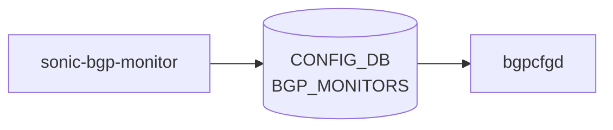

# sonic-bgp-monitor YANG

## 概要

- module: `sonic-bgp-monitor`
- namespace: `http://github.com/sonic-net/sonic-bgp-monitor`
- revision: `2022-01-11`
- import: `ietf-inet-types`, `sonic-bgp-common`
- top container: `sonic-bgp-monitor`

`bgpcfgd` が扱う [BGP](../../reference/glossary.md#term-bgp) monitor peer 設定。 BMP / monitoring collector 用の擬似ピアを定義する[^1]。

<!-- yang-mermaid -->
### データフロー (自動生成)



!!! note "凡例"
    YANG モジュールから CONFIG_DB テーブル経由で subscribe する daemon/orch までを `docs/reference/config-db-orch-map.md` から機械生成したミニ図。詳細・例外は本ページ本文を参照。
<!-- /yang-mermaid -->

## 関連ページ

<!-- yang-xref -->

本 YANG モジュールに対応する CONFIG_DB / CLI / HLD / Topics への相互リンク。`inject_yang_xref.py` により自動生成されます。

### 対応 CONFIG_DB

- [`BGP_MONITORS`](../config-db/bgp-monitors.md)

<!-- /yang-xref -->

## ツリー

```text
module: sonic-bgp-monitor
  +--rw sonic-bgp-monitor
     +--rw BGP_MONITORS
        +--rw BGP_MONITORS_LIST* [addr]
           +--rw addr            inet:ip-address
           +--rw asn?            uint32
           +--rw holdtime?       uint16
           +--rw keepalive?      uint16
           +--rw local_addr?     inet:ip-address
           +--rw name?           string
           +--rw nhopself?       uint8
           +--rw rrclient?       uint8
           +--rw admin_status?   stypes:admin_status
```

## leaf 一覧

| leaf | パス | 型 | 必須 | デフォルト | enum / 範囲 / leafref | 説明 |
|------|------|----|------|-----------|----------------------|------|
| `addr` | `sonic-bgp-monitor/BGP_MONITORS/BGP_MONITORS_LIST/addr` | `inet:ip-address` | yes |  |  | [BGP](../../reference/glossary.md#term-bgp) monitor peer address |
| `asn` | `sonic-bgp-monitor/BGP_MONITORS/BGP_MONITORS_LIST/asn` | `uint32` |  |  | range 0..4294967295 | Peer AS number |
| `holdtime` | `sonic-bgp-monitor/BGP_MONITORS/BGP_MONITORS_LIST/holdtime` | `uint16` |  |  |  | [BGP](../../reference/glossary.md#term-bgp) hold time in seconds |
| `keepalive` | `sonic-bgp-monitor/BGP_MONITORS/BGP_MONITORS_LIST/keepalive` | `uint16` |  |  |  | BGP keepalive interval in seconds |
| `local_addr` | `sonic-bgp-monitor/BGP_MONITORS/BGP_MONITORS_LIST/local_addr` | `inet:ip-address` |  |  |  | Local source address for the BGP session |
| `name` | `sonic-bgp-monitor/BGP_MONITORS/BGP_MONITORS_LIST/name` | `string` |  |  |  | Human-readable peer description |
| `nhopself` | `sonic-bgp-monitor/BGP_MONITORS/BGP_MONITORS_LIST/nhopself` | `uint8` |  |  | range 0..1 | Set nexthop to self for routes advertised to this peer |
| `rrclient` | `sonic-bgp-monitor/BGP_MONITORS/BGP_MONITORS_LIST/rrclient` | `uint8` |  |  | range 0..1 | Configure as route reflector client |
| `admin_status` | `sonic-bgp-monitor/BGP_MONITORS/BGP_MONITORS_LIST/admin_status` | `stypes:admin_status` |  |  | up, down | Administrative status of the BGP monitor peer |

## leafref / 依存

- なし（型・grouping は `sonic-bgp-common` から流用）

## augment / deviation

- なし

## 関連 CONFIG_DB / CLI

- [CONFIG_DB](../../reference/glossary.md#term-config_db): `BGP_MONITORS`
- CLI: なし（`bgpcfgd` が [config_db.json](../../reference/glossary.md#term-config_db.json) から読み取り [FRR](../../reference/glossary.md#term-frr) 設定に反映）

<!-- yang-sibling -->
### 関連 YANG モジュール

意味的に関連する SONiC YANG モジュール (slug prefix / curated group / frontmatter `related.yang` から自動抽出):

- [`sonic-bgp-aggregate-address`](sonic-bgp-aggregate-address.md)
- [`sonic-bgp-bbr`](sonic-bgp-bbr.md)
- [`sonic-bgp-device-global`](sonic-bgp-device-global.md)
- [`sonic-bgp-global`](sonic-bgp-global.md)
- [`sonic-bgp-neighbor`](sonic-bgp-neighbor.md)
<!-- /yang-sibling -->

<!-- ref-triangle:start -->

## 関連リファレンス

- [CONFIG_DB](../../reference/glossary.md#term-config_db): [`BGP_MONITORS`](../config-db/bgp-monitors.md)

<!-- ref-triangle:end -->

<!-- ops-hint -->
## 運用ヒント

### 典型的なデプロイ位置

- BMP / BGP モニタリング neighbor 設定。`BGP_MONITORS` テーブルが [bgpcfgd](../../reference/glossary.md#term-bgpcfgd) 経由で [FRR](../../reference/glossary.md#term-frr) に流し込まれる。

### よくある落とし穴

- `addr` (monitor peer address) は IPv4/IPv6 union。`name` leaf は [FRR](../../reference/glossary.md#term-frr) 内部で `'BGPMonitor'` 固定文字列が期待されるため、任意の値を設定すると `must` 制約違反となり commit が失敗する。

### 関連する config / show コマンド

```bash
sonic-db-cli CONFIG_DB keys 'BGP_MONITORS|*'
show bgp summary
```
<!-- /ops-hint -->

## 引用元

[^1]: `sonic-net/sonic-buildimage` `src/sonic-yang-models/yang-models/sonic-bgp-monitor.yang` @ `9ea932ec2e18f35e58268ec2e4456b1d4afd65cd`

<!-- glossary-links-injected: 203de1c951ab -->
