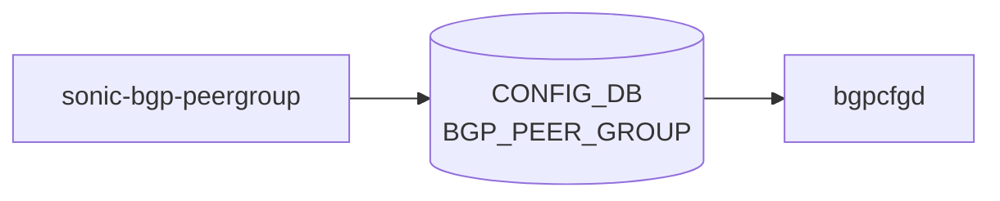

# sonic-bgp-peergroup YANG

## 概要

- module: `sonic-bgp-peergroup`
- namespace: `http://github.com/sonic-net/sonic-bgp-peergroup`
- revision: `2021-02-26`
- import: `ietf-inet-types`, `sonic-bgp-common`, `sonic-bgp-global`
- top container: `sonic-bgp-peergroup`

SONIC [BGP](../../reference/glossary.md#term-bgp) Peer Group [YANG](../../reference/glossary.md#term-yang)[^1]

<!-- yang-mermaid -->
### データフロー (自動生成)



!!! note "凡例"
    YANG モジュールから CONFIG_DB テーブル経由で subscribe する daemon/orch までを `docs/reference/config-db-orch-map.md` から機械生成したミニ図。詳細・例外は本ページ本文を参照。
<!-- /yang-mermaid -->

## 関連ページ

<!-- yang-xref -->

本 YANG モジュールに対応する CONFIG_DB / CLI / HLD / Topics への相互リンク。`inject_yang_xref.py` により自動生成されます。

### 対応 CONFIG_DB

- [`BGP_PEER_GROUP`](../config-db/bgp-peer-group.md)
- [`BGP_PEER_GROUP_AF`](../config-db/bgp-peer-group-af.md)

### 関連 CLI

- [`config bgp`](../cli/config-bgp.md)

<!-- /yang-xref -->

## ツリー

```text
module: sonic-bgp-peergroup
  +--rw sonic-bgp-peergroup
     +--rw BGP_PEER_GROUP
     |  +--rw BGP_PEER_GROUP_LIST* [vrf_name peer_group_name]
     |     +--rw vrf_name                              -> /bgpg:sonic-bgp-global/BGP_GLOBALS/BGP_GLOBALS_LIST/vrf_name
     |     +--rw peer_group_name                       string
     |     +--rw local_asn?                            uint32
     |     +--rw name?                                 string
     |     +--rw asn?                                  uint32
     |     +--rw peer_type?                            bgp_peer_type
     |     +--rw ebgp_multihop?                        boolean
     |     +--rw ebgp_multihop_ttl?                    uint8
     |     +--rw auth_password?                        string
     |     +--rw keepalive?                            uint16
     |     +--rw holdtime?                             uint16
     |     +--rw conn_retry?                           uint16
     |     +--rw min_adv_interval?                     uint16
     |     +--rw local_addr?                           union
     |     +--rw passive_mode?                         boolean
     |     +--rw capability_ext_nexthop?               boolean
     |     +--rw disable_ebgp_connected_route_check?   boolean
     |     +--rw enforce_first_as?                     boolean
     |     +--rw solo_peer?                            boolean
     |     +--rw ttl_security_hops?                    uint8
     |     +--rw bfd?                                  boolean
     |     +--rw bfd_check_ctrl_plane_failure?         boolean
     |     +--rw capability_dynamic?                   boolean
     |     +--rw dont_negotiate_capability?            boolean
     |     +--rw enforce_multihop?                     boolean
     |     +--rw override_capability?                  boolean
     |     +--rw peer_port?                            uint16
     |     +--rw shutdown_message?                     string
     |     +--rw strict_capability_match?              boolean
     |     +--rw admin_status?                         stypes:admin_status
     |     +--rw local_as_no_prepend?                  boolean
     |     +--rw local_as_replace_as?                  boolean
     +--rw BGP_PEER_GROUP_AF
     |  +--rw BGP_PEER_GROUP_AF_LIST* [vrf_name peer_group_name afi_safi]
     |     +--rw vrf_name                        -> /bgpg:sonic-bgp-global/BGP_GLOBALS/BGP_GLOBALS_LIST/vrf_name
     |     +--rw peer_group_name                 -> ../../../BGP_PEER_GROUP/BGP_PEER_GROUP_LIST[vrf_name=current()/../vrf_name]/peer_group_name
     |     +--rw afi_safi                        string
     |     +--rw admin_status?                   stypes:admin_status
     |     +--rw send_default_route?             boolean
     |     +--rw default_rmap?                   -> /rmap:sonic-route-map/ROUTE_MAP_SET/ROUTE_MAP_SET_LIST/name
     |     +--rw max_prefix_limit?               uint32
     |     +--rw max_prefix_warning_only?        boolean
     |     +--rw max_prefix_warning_threshold?   uint8
     |     +--rw max_prefix_restart_interval?    uint16
     |     +--rw route_map_in*                   -> /rmap:sonic-route-map/ROUTE_MAP_SET/ROUTE_MAP_SET_LIST/name
     |     +--rw route_map_out*                  -> /rmap:sonic-route-map/ROUTE_MAP_SET/ROUTE_MAP_SET_LIST/name
     |     +--rw soft_reconfiguration_in?        boolean
     |     +--rw unsuppress_map_name?            -> /rmap:sonic-route-map/ROUTE_MAP_SET/ROUTE_MAP_SET_LIST/name
     |     +--rw rrclient?                       boolean
     |     +--rw weight?                         uint16
     |     +--rw as_override?                    boolean
     |     +--rw send_community?                 bgp_community_type
     |     +--rw tx_add_paths?                   bgp_tx_add_paths_type
     |     +--rw unchanged_as_path?              boolean
     |     +--rw unchanged_med?                  boolean
     |     +--rw unchanged_nexthop?              boolean
     |     +--rw filter_list_in?                 -> /rpolsets:sonic-routing-policy-sets/AS_PATH_SET/AS_PATH_SET_LIST/name
     |     +--rw filter_list_out?                -> /rpolsets:sonic-routing-policy-sets/AS_PATH_SET/AS_PATH_SET_LIST/name
     |     +--rw nhself?                         boolean
     |     +--rw nexthop_self_force?             boolean
     |     +--rw prefix_list_in?                 -> /rpolsets:sonic-routing-policy-sets/PREFIX_SET/PREFIX_SET_LIST/name
     |     +--rw prefix_list_out?                -> /rpolsets:sonic-routing-policy-sets/PREFIX_SET/PREFIX_SET_LIST/name
     |     +--rw remove_private_as_enabled?      boolean
     |     +--rw replace_private_as?             boolean
     |     +--rw remove_private_as_all?          boolean
     |     +--rw allow_as_in?                    boolean
     |     +--rw allow_as_count?                 uint8
     |     +--rw allow_as_origin?                boolean
     |     +--rw cap_orf?                        sonic_bgp_orf
     |     +--rw route_server_client?            boolean
     +--rw BGP_GLOBALS_LISTEN_PREFIX
        +--rw BGP_GLOBALS_LISTEN_PREFIX_LIST* [vrf_name ip_prefix]
           +--rw vrf_name      -> /bgpg:sonic-bgp-global/BGP_GLOBALS/BGP_GLOBALS_LIST/vrf_name
           +--rw ip_prefix     inet:ip-prefix
           +--rw peer_group?   -> ../../../BGP_PEER_GROUP/BGP_PEER_GROUP_LIST[vrf_name=current()/../vrf_name]/peer_group_name
```

## leaf 一覧

| leaf | パス | 型 | 必須 | デフォルト | enum / 範囲 / leafref | 説明 |
|------|------|----|------|-----------|----------------------|------|
| `vrf_name` | `sonic-bgp-peergroup/BGP_PEER_GROUP/BGP_PEER_GROUP_LIST/vrf_name` | `leafref` | yes |  | /bgpg:sonic-bgp-global/bgpg:BGP_GLOBALS/bgpg:BGP_GLOBALS_LIST/bgpg:vrf_name | Network-instance/[VRF](../../reference/glossary.md#term-vrf) name |
| `peer_group_name` | `sonic-bgp-peergroup/BGP_PEER_GROUP/BGP_PEER_GROUP_LIST/peer_group_name` | `string` | yes |  |  | Peer group name |
| `local_asn` | `sonic-bgp-peergroup/BGP_PEER_GROUP/BGP_PEER_GROUP_LIST/local_asn` | `uint32` |  |  | range 1..4294967295 | Local AS number |
| `name` | `sonic-bgp-peergroup/BGP_PEER_GROUP/BGP_PEER_GROUP_LIST/name` | `string` |  |  |  | Peer description |
| `asn` | `sonic-bgp-peergroup/BGP_PEER_GROUP/BGP_PEER_GROUP_LIST/asn` | `uint32` |  |  | range 1..4294967295 | Peer AS number |
| `peer_type` | `sonic-bgp-peergroup/BGP_PEER_GROUP/BGP_PEER_GROUP_LIST/peer_type` | `bgp_peer_type` |  |  |  | [BGP](../../reference/glossary.md#term-bgp) peer type internal/external |
| `ebgp_multihop` | `sonic-bgp-peergroup/BGP_PEER_GROUP/BGP_PEER_GROUP_LIST/ebgp_multihop` | `boolean` |  |  |  | Enable eBGP multihop to allow peering with non-directly-connected external neighbors. |
| `ebgp_multihop_ttl` | `sonic-bgp-peergroup/BGP_PEER_GROUP/BGP_PEER_GROUP_LIST/ebgp_multihop_ttl` | `uint8` |  |  | range 1..255 | Maximum number of hops for eBGP multihop sessions. |
| `auth_password` | `sonic-bgp-peergroup/BGP_PEER_GROUP/BGP_PEER_GROUP_LIST/auth_password` | `string` |  |  |  | MD5 authentication password for the [BGP](../../reference/glossary.md#term-bgp) session. |
| `keepalive` | `sonic-bgp-peergroup/BGP_PEER_GROUP/BGP_PEER_GROUP_LIST/keepalive` | `uint16` |  |  |  | BGP keepalive interval in seconds. |
| `holdtime` | `sonic-bgp-peergroup/BGP_PEER_GROUP/BGP_PEER_GROUP_LIST/holdtime` | `uint16` |  |  |  | BGP hold time in seconds; session is reset if no keepalive is received within this period. |
| `conn_retry` | `sonic-bgp-peergroup/BGP_PEER_GROUP/BGP_PEER_GROUP_LIST/conn_retry` | `uint16` |  |  | range 1..65535 | BGP connect retry timer in seconds. |
| `min_adv_interval` | `sonic-bgp-peergroup/BGP_PEER_GROUP/BGP_PEER_GROUP_LIST/min_adv_interval` | `uint16` |  |  | range 0..600 | Minimum interval in seconds between sending BGP route updates to a peer. |
| `local_addr` | `sonic-bgp-peergroup/BGP_PEER_GROUP/BGP_PEER_GROUP_LIST/local_addr` | `union` |  |  | union(inet:ip-address, leafref, leafref, leafref, string) | Local source address or interface name to use for connection. |
| `passive_mode` | `sonic-bgp-peergroup/BGP_PEER_GROUP/BGP_PEER_GROUP_LIST/passive_mode` | `boolean` |  |  |  | Wait for the peer to initiate the BGP session instead of actively connecting. |
| `capability_ext_nexthop` | `sonic-bgp-peergroup/BGP_PEER_GROUP/BGP_PEER_GROUP_LIST/capability_ext_nexthop` | `boolean` |  |  |  | Advertise extended nexthop capability to allow IPv4 prefixes over IPv6 nexthops. |
| `disable_ebgp_connected_route_check` | `sonic-bgp-peergroup/BGP_PEER_GROUP/BGP_PEER_GROUP_LIST/disable_ebgp_connected_route_check` | `boolean` |  |  |  | Disable the check that an eBGP peer's address must be a connected route. |
| `enforce_first_as` | `sonic-bgp-peergroup/BGP_PEER_GROUP/BGP_PEER_GROUP_LIST/enforce_first_as` | `boolean` |  |  |  | Require the first AS in the AS path to be the peer's AS number for eBGP sessions. |
| `solo_peer` | `sonic-bgp-peergroup/BGP_PEER_GROUP/BGP_PEER_GROUP_LIST/solo_peer` | `boolean` |  |  |  | Place this peer in its own update group to prevent route sharing with other peers. |
| `ttl_security_hops` | `sonic-bgp-peergroup/BGP_PEER_GROUP/BGP_PEER_GROUP_LIST/ttl_security_hops` | `uint8` |  |  | range 1..254 | Maximum number of hops expected for the BGP TTL security mechanism (GTSM). |
| `bfd` | `sonic-bgp-peergroup/BGP_PEER_GROUP/BGP_PEER_GROUP_LIST/bfd` | `boolean` |  |  |  | Enable Bidirectional Forwarding Detection ([BFD](../../reference/glossary.md#term-bfd)) for rapid link failure detection on this peer. |
| `bfd_check_ctrl_plane_failure` | `sonic-bgp-peergroup/BGP_PEER_GROUP/BGP_PEER_GROUP_LIST/bfd_check_ctrl_plane_failure` | `boolean` |  |  |  | Trigger BGP session reset when a [BFD](../../reference/glossary.md#term-bfd) control plane failure is detected. |
| `capability_dynamic` | `sonic-bgp-peergroup/BGP_PEER_GROUP/BGP_PEER_GROUP_LIST/capability_dynamic` | `boolean` |  |  |  | Advertise dynamic capability |
| `dont_negotiate_capability` | `sonic-bgp-peergroup/BGP_PEER_GROUP/BGP_PEER_GROUP_LIST/dont_negotiate_capability` | `boolean` |  |  |  | Do not perform capability negotiation |
| `enforce_multihop` | `sonic-bgp-peergroup/BGP_PEER_GROUP/BGP_PEER_GROUP_LIST/enforce_multihop` | `boolean` |  |  |  | Enforce EBGP neighbors perform multihop |
| `override_capability` | `sonic-bgp-peergroup/BGP_PEER_GROUP/BGP_PEER_GROUP_LIST/override_capability` | `boolean` |  |  |  | Override capability negotiation result |
| `peer_port` | `sonic-bgp-peergroup/BGP_PEER_GROUP/BGP_PEER_GROUP_LIST/peer_port` | `uint16` |  |  |  | Peer port number |
| `shutdown_message` | `sonic-bgp-peergroup/BGP_PEER_GROUP/BGP_PEER_GROUP_LIST/shutdown_message` | `string` |  |  | length 1..127 | Human-readable message sent in the BGP NOTIFICATION when administratively shutting down the peer. |
| `strict_capability_match` | `sonic-bgp-peergroup/BGP_PEER_GROUP/BGP_PEER_GROUP_LIST/strict_capability_match` | `boolean` |  |  |  | Require exact match of capabilities; tear down session if capabilities do not match. |
| `admin_status` | `sonic-bgp-peergroup/BGP_PEER_GROUP/BGP_PEER_GROUP_LIST/admin_status` | `stypes:admin_status` |  |  |  | Administrative status to enable or disable this BGP peer. |
| `local_as_no_prepend` | `sonic-bgp-peergroup/BGP_PEER_GROUP/BGP_PEER_GROUP_LIST/local_as_no_prepend` | `boolean` |  |  |  | Do not prepend the local AS number to updates received from eBGP peers. |
| `local_as_replace_as` | `sonic-bgp-peergroup/BGP_PEER_GROUP/BGP_PEER_GROUP_LIST/local_as_replace_as` | `boolean` |  |  |  | Replace the real AS number with the local AS number in outbound updates. |
| `vrf_name` | `sonic-bgp-peergroup/BGP_PEER_GROUP_AF/BGP_PEER_GROUP_AF_LIST/vrf_name` | `leafref` | yes |  | /bgpg:sonic-bgp-global/bgpg:BGP_GLOBALS/bgpg:BGP_GLOBALS_LIST/bgpg:vrf_name | Network-instance/[VRF](../../reference/glossary.md#term-vrf) name |
| `peer_group_name` | `sonic-bgp-peergroup/BGP_PEER_GROUP_AF/BGP_PEER_GROUP_AF_LIST/peer_group_name` | `leafref` | yes |  | ../../../BGP_PEER_GROUP/BGP_PEER_GROUP_LIST[vrf_name=current()/../vrf_name]/peer_group_name | Peer group name |
| `afi_safi` | `sonic-bgp-peergroup/BGP_PEER_GROUP_AF/BGP_PEER_GROUP_AF_LIST/afi_safi` | `string` |  |  |  | Address family |
| `admin_status` | `sonic-bgp-peergroup/BGP_PEER_GROUP_AF/BGP_PEER_GROUP_AF_LIST/admin_status` | `stypes:admin_status` |  |  |  | Indicates address family active/inactive status |
| `send_default_route` | `sonic-bgp-peergroup/BGP_PEER_GROUP_AF/BGP_PEER_GROUP_AF_LIST/send_default_route` | `boolean` |  |  |  | Originate a default route to this neighbor. |
| `default_rmap` | `sonic-bgp-peergroup/BGP_PEER_GROUP_AF/BGP_PEER_GROUP_AF_LIST/default_rmap` | `leafref` |  |  | /rmap:sonic-route-map/rmap:ROUTE_MAP_SET/rmap:ROUTE_MAP_SET_LIST/rmap:name | Route map applied when originating a default route to this neighbor. |
| `max_prefix_limit` | `sonic-bgp-peergroup/BGP_PEER_GROUP_AF/BGP_PEER_GROUP_AF_LIST/max_prefix_limit` | `uint32` |  |  |  | Maximum number of prefixes accepted from this neighbor before taking action. |
| `max_prefix_warning_only` | `sonic-bgp-peergroup/BGP_PEER_GROUP_AF/BGP_PEER_GROUP_AF_LIST/max_prefix_warning_only` | `boolean` |  |  |  | Only log a warning instead of tearing down the session when the maximum prefix limit is exceeded. |
| `max_prefix_warning_threshold` | `sonic-bgp-peergroup/BGP_PEER_GROUP_AF/BGP_PEER_GROUP_AF_LIST/max_prefix_warning_threshold` | `uint8` |  |  | range 1..100 | Percentage of the maximum prefix limit at which a warning is generated. |
| `max_prefix_restart_interval` | `sonic-bgp-peergroup/BGP_PEER_GROUP_AF/BGP_PEER_GROUP_AF_LIST/max_prefix_restart_interval` | `uint16` |  |  | range 1..65535 | Time in seconds to wait before re-establishing the session after a max-prefix limit shutdown. |
| `route_map_in` | `sonic-bgp-peergroup/BGP_PEER_GROUP_AF/BGP_PEER_GROUP_AF_LIST/route_map_in` | `leafref` |  |  | /rmap:sonic-route-map/rmap:ROUTE_MAP_SET/rmap:ROUTE_MAP_SET_LIST/rmap:name | Route-map filter for incoming routes |
| `route_map_out` | `sonic-bgp-peergroup/BGP_PEER_GROUP_AF/BGP_PEER_GROUP_AF_LIST/route_map_out` | `leafref` |  |  | /rmap:sonic-route-map/rmap:ROUTE_MAP_SET/rmap:ROUTE_MAP_SET_LIST/rmap:name | Route-map filter for outgoing routes |
| `soft_reconfiguration_in` | `sonic-bgp-peergroup/BGP_PEER_GROUP_AF/BGP_PEER_GROUP_AF_LIST/soft_reconfiguration_in` | `boolean` |  |  |  | Enable storing of inbound updates to allow route refresh without resetting the session. |
| `unsuppress_map_name` | `sonic-bgp-peergroup/BGP_PEER_GROUP_AF/BGP_PEER_GROUP_AF_LIST/unsuppress_map_name` | `leafref` |  |  | /rmap:sonic-route-map/rmap:ROUTE_MAP_SET/rmap:ROUTE_MAP_SET_LIST/rmap:name | Route map used to selectively unsuppress suppressed routes to this neighbor. |
| `rrclient` | `sonic-bgp-peergroup/BGP_PEER_GROUP_AF/BGP_PEER_GROUP_AF_LIST/rrclient` | `boolean` |  |  |  | Configure this neighbor as a route reflector client. |
| `weight` | `sonic-bgp-peergroup/BGP_PEER_GROUP_AF/BGP_PEER_GROUP_AF_LIST/weight` | `uint16` |  |  | range 0..65535 | Default weight assigned to routes received from this neighbor for best-path selection. |
| `as_override` | `sonic-bgp-peergroup/BGP_PEER_GROUP_AF/BGP_PEER_GROUP_AF_LIST/as_override` | `boolean` |  |  |  | Replace the peer AS number with the local AS in outbound updates to prevent loops in dual-homed networks. |
| `send_community` | `sonic-bgp-peergroup/BGP_PEER_GROUP_AF/BGP_PEER_GROUP_AF_LIST/send_community` | `bgp_community_type` |  |  |  | Send Community attribute to this neighbor |
| `tx_add_paths` | `sonic-bgp-peergroup/BGP_PEER_GROUP_AF/BGP_PEER_GROUP_AF_LIST/tx_add_paths` | `bgp_tx_add_paths_type` |  |  |  | Advertise all paths or best path per AS using add path |
| `unchanged_as_path` | `sonic-bgp-peergroup/BGP_PEER_GROUP_AF/BGP_PEER_GROUP_AF_LIST/unchanged_as_path` | `boolean` |  |  |  | Propagate the AS path attribute unchanged to this neighbor. |
| `unchanged_med` | `sonic-bgp-peergroup/BGP_PEER_GROUP_AF/BGP_PEER_GROUP_AF_LIST/unchanged_med` | `boolean` |  |  |  | Propagate the MED attribute unchanged to this neighbor. |
| `unchanged_nexthop` | `sonic-bgp-peergroup/BGP_PEER_GROUP_AF/BGP_PEER_GROUP_AF_LIST/unchanged_nexthop` | `boolean` |  |  |  | Propagate the nexthop attribute unchanged to this neighbor. |
| `filter_list_in` | `sonic-bgp-peergroup/BGP_PEER_GROUP_AF/BGP_PEER_GROUP_AF_LIST/filter_list_in` | `leafref` |  |  | /rpolsets:sonic-routing-policy-sets/rpolsets:AS_PATH_SET/rpolsets:AS_PATH_SET_LIST/rpolsets:name | AS-path access list name for filtering inbound routes. |
| `filter_list_out` | `sonic-bgp-peergroup/BGP_PEER_GROUP_AF/BGP_PEER_GROUP_AF_LIST/filter_list_out` | `leafref` |  |  | /rpolsets:sonic-routing-policy-sets/rpolsets:AS_PATH_SET/rpolsets:AS_PATH_SET_LIST/rpolsets:name | AS-path access list name for filtering outbound routes. |
| `nhself` | `sonic-bgp-peergroup/BGP_PEER_GROUP_AF/BGP_PEER_GROUP_AF_LIST/nhself` | `boolean` |  |  |  | Nexthop is self, no nexthop calculation |
| `nexthop_self_force` | `sonic-bgp-peergroup/BGP_PEER_GROUP_AF/BGP_PEER_GROUP_AF_LIST/nexthop_self_force` | `boolean` |  |  |  | Force nexthop to be self for reflected routes |
| `prefix_list_in` | `sonic-bgp-peergroup/BGP_PEER_GROUP_AF/BGP_PEER_GROUP_AF_LIST/prefix_list_in` | `leafref` |  |  | /rpolsets:sonic-routing-policy-sets/rpolsets:PREFIX_SET/rpolsets:PREFIX_SET_LIST/rpolsets:name | Prefix list name for filtering inbound routes. |
| `prefix_list_out` | `sonic-bgp-peergroup/BGP_PEER_GROUP_AF/BGP_PEER_GROUP_AF_LIST/prefix_list_out` | `leafref` |  |  | /rpolsets:sonic-routing-policy-sets/rpolsets:PREFIX_SET/rpolsets:PREFIX_SET_LIST/rpolsets:name | Prefix list name for filtering outbound routes. |
| `remove_private_as_enabled` | `sonic-bgp-peergroup/BGP_PEER_GROUP_AF/BGP_PEER_GROUP_AF_LIST/remove_private_as_enabled` | `boolean` |  |  |  | Remove private AS numbers from the AS path in outbound updates. |
| `replace_private_as` | `sonic-bgp-peergroup/BGP_PEER_GROUP_AF/BGP_PEER_GROUP_AF_LIST/replace_private_as` | `boolean` |  |  |  | Replace private AS numbers with the local AS number in outbound updates. |
| `remove_private_as_all` | `sonic-bgp-peergroup/BGP_PEER_GROUP_AF/BGP_PEER_GROUP_AF_LIST/remove_private_as_all` | `boolean` |  |  |  | Remove all private AS numbers (including in the middle of the path) from outbound updates. |
| `allow_as_in` | `sonic-bgp-peergroup/BGP_PEER_GROUP_AF/BGP_PEER_GROUP_AF_LIST/allow_as_in` | `boolean` |  |  |  | Accept inbound routes even when the local AS number appears in the AS path. |
| `allow_as_count` | `sonic-bgp-peergroup/BGP_PEER_GROUP_AF/BGP_PEER_GROUP_AF_LIST/allow_as_count` | `uint8` |  |  |  | Maximum number of times the local AS number may appear in a received AS path. |
| `allow_as_origin` | `sonic-bgp-peergroup/BGP_PEER_GROUP_AF/BGP_PEER_GROUP_AF_LIST/allow_as_origin` | `boolean` |  |  |  | Accept routes that originated from the local AS. |
| `cap_orf` | `sonic-bgp-peergroup/BGP_PEER_GROUP_AF/BGP_PEER_GROUP_AF_LIST/cap_orf` | `sonic_bgp_orf` |  |  |  | Outbound Route Filtering (ORF) prefix-list capability to negotiate with this neighbor. |
| `route_server_client` | `sonic-bgp-peergroup/BGP_PEER_GROUP_AF/BGP_PEER_GROUP_AF_LIST/route_server_client` | `boolean` |  |  |  | Configure this neighbor as a route server client, disabling attribute modification. |
| `vrf_name` | `sonic-bgp-peergroup/BGP_GLOBALS_LISTEN_PREFIX/BGP_GLOBALS_LISTEN_PREFIX_LIST/vrf_name` | `leafref` | yes |  | /bgpg:sonic-bgp-global/bgpg:BGP_GLOBALS/bgpg:BGP_GLOBALS_LIST/bgpg:vrf_name | Network-instance/[VRF](../../reference/glossary.md#term-vrf) name |
| `ip_prefix` | `sonic-bgp-peergroup/BGP_GLOBALS_LISTEN_PREFIX/BGP_GLOBALS_LISTEN_PREFIX_LIST/ip_prefix` | `inet:ip-prefix` | yes |  |  | Configure BGP dynamic neighbors listen range |
| `peer_group` | `sonic-bgp-peergroup/BGP_GLOBALS_LISTEN_PREFIX/BGP_GLOBALS_LISTEN_PREFIX_LIST/peer_group` | `leafref` |  |  | ../../../BGP_PEER_GROUP/BGP_PEER_GROUP_LIST[vrf_name=current()/../vrf_name]/peer_group_name | Peer group name |

## leafref / 依存

- `sonic-bgp-peergroup/BGP_PEER_GROUP/BGP_PEER_GROUP_LIST/vrf_name` → `/bgpg:sonic-bgp-global/bgpg:BGP_GLOBALS/bgpg:BGP_GLOBALS_LIST/bgpg:vrf_name`
- `sonic-bgp-peergroup/BGP_PEER_GROUP_AF/BGP_PEER_GROUP_AF_LIST/vrf_name` → `/bgpg:sonic-bgp-global/bgpg:BGP_GLOBALS/bgpg:BGP_GLOBALS_LIST/bgpg:vrf_name`
- `sonic-bgp-peergroup/BGP_PEER_GROUP_AF/BGP_PEER_GROUP_AF_LIST/peer_group_name` → `../../../BGP_PEER_GROUP/BGP_PEER_GROUP_LIST[vrf_name=current()/../vrf_name]/peer_group_name`
- `sonic-bgp-peergroup/BGP_PEER_GROUP_AF/BGP_PEER_GROUP_AF_LIST/default_rmap` → `/rmap:sonic-route-map/rmap:ROUTE_MAP_SET/rmap:ROUTE_MAP_SET_LIST/rmap:name`
- `sonic-bgp-peergroup/BGP_PEER_GROUP_AF/BGP_PEER_GROUP_AF_LIST/route_map_in` → `/rmap:sonic-route-map/rmap:ROUTE_MAP_SET/rmap:ROUTE_MAP_SET_LIST/rmap:name`
- `sonic-bgp-peergroup/BGP_PEER_GROUP_AF/BGP_PEER_GROUP_AF_LIST/route_map_out` → `/rmap:sonic-route-map/rmap:ROUTE_MAP_SET/rmap:ROUTE_MAP_SET_LIST/rmap:name`
- `sonic-bgp-peergroup/BGP_PEER_GROUP_AF/BGP_PEER_GROUP_AF_LIST/unsuppress_map_name` → `/rmap:sonic-route-map/rmap:ROUTE_MAP_SET/rmap:ROUTE_MAP_SET_LIST/rmap:name`
- `sonic-bgp-peergroup/BGP_PEER_GROUP_AF/BGP_PEER_GROUP_AF_LIST/filter_list_in` → `/rpolsets:sonic-routing-policy-sets/rpolsets:AS_PATH_SET/rpolsets:AS_PATH_SET_LIST/rpolsets:name`
- `sonic-bgp-peergroup/BGP_PEER_GROUP_AF/BGP_PEER_GROUP_AF_LIST/filter_list_out` → `/rpolsets:sonic-routing-policy-sets/rpolsets:AS_PATH_SET/rpolsets:AS_PATH_SET_LIST/rpolsets:name`
- `sonic-bgp-peergroup/BGP_PEER_GROUP_AF/BGP_PEER_GROUP_AF_LIST/prefix_list_in` → `/rpolsets:sonic-routing-policy-sets/rpolsets:PREFIX_SET/rpolsets:PREFIX_SET_LIST/rpolsets:name`
- `sonic-bgp-peergroup/BGP_PEER_GROUP_AF/BGP_PEER_GROUP_AF_LIST/prefix_list_out` → `/rpolsets:sonic-routing-policy-sets/rpolsets:PREFIX_SET/rpolsets:PREFIX_SET_LIST/rpolsets:name`
- `sonic-bgp-peergroup/BGP_GLOBALS_LISTEN_PREFIX/BGP_GLOBALS_LISTEN_PREFIX_LIST/vrf_name` → `/bgpg:sonic-bgp-global/bgpg:BGP_GLOBALS/bgpg:BGP_GLOBALS_LIST/bgpg:vrf_name`
- `sonic-bgp-peergroup/BGP_GLOBALS_LISTEN_PREFIX/BGP_GLOBALS_LISTEN_PREFIX_LIST/peer_group` → `../../../BGP_PEER_GROUP/BGP_PEER_GROUP_LIST[vrf_name=current()/../vrf_name]/peer_group_name`

## augment / deviation

- なし

## 関連 CONFIG_DB / CLI

- [CONFIG_DB](../../reference/glossary.md#term-config_db): `BGP_PEER_GROUP`
- [CONFIG_DB](../../reference/glossary.md#term-config_db): `BGP_PEER_GROUP_AF`
- CLI: `config bgp`

<!-- yang-sibling -->
### 関連 YANG モジュール

意味的に関連する SONiC YANG モジュール (slug prefix / curated group / frontmatter `related.yang` から自動抽出):

- [`sonic-bgp-global`](sonic-bgp-global.md)
- [`sonic-bgp-aggregate-address`](sonic-bgp-aggregate-address.md)
- [`sonic-bgp-bbr`](sonic-bgp-bbr.md)
- [`sonic-bgp-device-global`](sonic-bgp-device-global.md)
- [`sonic-bgp-monitor`](sonic-bgp-monitor.md)
<!-- /yang-sibling -->

<!-- ref-triangle:start -->

## 関連リファレンス

- [CONFIG_DB](../../reference/glossary.md#term-config_db): [`BGP_PEER_GROUP`](../config-db/bgp-peer-group.md) / [`BGP_PEER_GROUP_AF`](../config-db/bgp-peer-group-af.md)
- CLI: [`config bgp`](../cli/config-bgp.md)

<!-- ref-triangle:end -->

<!-- ops-hint -->
## 運用ヒント

### 典型的なデプロイ位置

- BGP peer-group 設定。`BGP_PEER_GROUP|<name>` を [bgpcfgd](../../reference/glossary.md#term-bgpcfgd) が [FRR](../../reference/glossary.md#term-frr) `neighbor <pg> peer-group` に展開。

### よくある落とし穴

- neighbor 側から leafref 参照されるため、peer-group を消す前に依存 neighbor の解除が必要。

### 関連する config / show コマンド

```bash
sonic-db-cli CONFIG_DB keys 'BGP_PEER_GROUP|*'
vtysh -c 'show bgp peer-group'
```
<!-- /ops-hint -->

## 引用元

[^1]: `sonic-net/sonic-buildimage` `src/sonic-yang-models/yang-models/sonic-bgp-peergroup.yang` @ `9ea932ec2e18f35e58268ec2e4456b1d4afd65cd`

<!-- glossary-links-injected: 26ca9e81c971 -->
