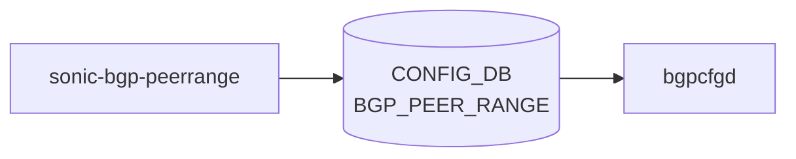

# sonic-bgp-peerrange YANG

## 概要

- module: `sonic-bgp-peerrange`
- namespace: `http://github.com/sonic-net/sonic-bgp-peerrange`
- revision: `2022-02-24`
- import: `ietf-inet-types`, `sonic-types`, `sonic-vrf`, `sonic-vnet`
- top container: `sonic-bgp-peerrange`

SONIC [BGP](../../reference/glossary.md#term-bgp) Peer Range [YANG](../../reference/glossary.md#term-yang)。 [BGP](../../reference/glossary.md#term-bgp) dynamic neighbor (listen range) 設定を [VRF](../../reference/glossary.md#term-vrf)/[VNET](../../reference/glossary.md#term-vnet) 別、 およびテンプレートとして保持する[^1]。

<!-- yang-mermaid -->
### データフロー (自動生成)



!!! note "凡例"
    YANG モジュールから CONFIG_DB テーブル経由で subscribe する daemon/orch までを `docs/reference/config-db-orch-map.md` から機械生成したミニ図。詳細・例外は本ページ本文を参照。
<!-- /yang-mermaid -->

## 関連ページ

<!-- yang-xref -->

本 YANG モジュールに対応する CONFIG_DB / CLI / HLD / Topics への相互リンク。`inject_yang_xref.py` により自動生成されます。

### 対応 CONFIG_DB

- [`BGP_PEER_RANGE`](../config-db/bgp-peer-range.md)

<!-- /yang-xref -->

## ツリー

```text
module: sonic-bgp-peerrange
  +--rw sonic-bgp-peerrange
     +--rw BGP_PEER_RANGE
        +--rw BGP_PEER_RANGE_LIST* [vrf_name peer_range_name]
        |  +--rw vrf_name           union
        |  +--rw peer_range_name    string
        |  +--rw name?              string
        |  +--rw src_address?       inet:ip-address
        |  +--rw peer_asn?          uint32
        |  +--rw ip_range*          stypes:sonic-ip-prefix
        +--rw BGP_PEER_RANGE_TEMPLATE_LIST* [peer_range_name]
           +--rw peer_range_name    string
           +--rw name?              string
           +--rw src_address?       inet:ip-address
           +--rw peer_asn?          uint32
           +--rw ip_range*          stypes:sonic-ip-prefix
```

## leaf 一覧

| leaf | パス | 型 | 必須 | デフォルト | enum / 範囲 / leafref | 説明 |
|------|------|----|------|-----------|----------------------|------|
| `vrf_name` | `sonic-bgp-peerrange/BGP_PEER_RANGE/BGP_PEER_RANGE_LIST/vrf_name` | `union` | yes |  | [VRF](../../reference/glossary.md#term-vrf) または [VNET](../../reference/glossary.md#term-vnet) leafref | [VRF](../../reference/glossary.md#term-vrf) or [VNET](../../reference/glossary.md#term-vnet) name for this peer range |
| `peer_range_name` | `sonic-bgp-peerrange/BGP_PEER_RANGE/BGP_PEER_RANGE_LIST/peer_range_name` | `string` | yes |  |  | Peer range name |
| `name` | `sonic-bgp-peerrange/BGP_PEER_RANGE/BGP_PEER_RANGE_LIST/name` | `string` |  |  |  | Peer range display name; must match the key |
| `src_address` | `sonic-bgp-peerrange/BGP_PEER_RANGE/BGP_PEER_RANGE_LIST/src_address` | `inet:ip-address` |  |  |  | Source address for the connection |
| `peer_asn` | `sonic-bgp-peerrange/BGP_PEER_RANGE/BGP_PEER_RANGE_LIST/peer_asn` | `uint32` |  |  | range 1..4294967295 | Peer AS number |
| `ip_range` | `sonic-bgp-peerrange/BGP_PEER_RANGE/BGP_PEER_RANGE_LIST/ip_range` | `leaf-list stypes:sonic-ip-prefix` |  |  | ordered-by user | A range of addresses (listen subnet) |
| `peer_range_name` | `sonic-bgp-peerrange/BGP_PEER_RANGE/BGP_PEER_RANGE_TEMPLATE_LIST/peer_range_name` | `string` | yes |  |  | Template peer range name |
| `name` | `sonic-bgp-peerrange/BGP_PEER_RANGE/BGP_PEER_RANGE_TEMPLATE_LIST/name` | `string` |  |  |  | Template display name; must match the key |
| `src_address` | `sonic-bgp-peerrange/BGP_PEER_RANGE/BGP_PEER_RANGE_TEMPLATE_LIST/src_address` | `inet:ip-address` |  |  |  | Source address for the connection |
| `peer_asn` | `sonic-bgp-peerrange/BGP_PEER_RANGE/BGP_PEER_RANGE_TEMPLATE_LIST/peer_asn` | `uint32` |  |  |  | Peer AS number |
| `ip_range` | `sonic-bgp-peerrange/BGP_PEER_RANGE/BGP_PEER_RANGE_TEMPLATE_LIST/ip_range` | `leaf-list stypes:sonic-ip-prefix` |  |  |  | A range of addresses (listen subnet) |

## leafref / 依存

- `BGP_PEER_RANGE_LIST/vrf_name` → VRF または VNET 名

## augment / deviation

- なし

## 関連 CONFIG_DB / CLI

- [CONFIG_DB](../../reference/glossary.md#term-config_db): `BGP_PEER_RANGE`
- CLI: なし（`bgpcfgd` が [config_db.json](../../reference/glossary.md#term-config_db.json) から読み取り [FRR](../../reference/glossary.md#term-frr) `bgp listen range` に反映）

<!-- yang-sibling -->
### 関連 YANG モジュール

意味的に関連する SONiC YANG モジュール (slug prefix / curated group / frontmatter `related.yang` から自動抽出):

- [`sonic-vrf`](sonic-vrf.md)
- [`sonic-vnet`](sonic-vnet.md)
- [`sonic-bgp-aggregate-address`](sonic-bgp-aggregate-address.md)
- [`sonic-bgp-bbr`](sonic-bgp-bbr.md)
<!-- /yang-sibling -->

<!-- ref-triangle:start -->

## 関連リファレンス

- [CONFIG_DB](../../reference/glossary.md#term-config_db): [`BGP_PEER_RANGE`](../config-db/bgp-peer-range.md)

<!-- ref-triangle:end -->

<!-- ops-hint -->
## 運用ヒント

### 典型的なデプロイ位置

- [BGP](../../reference/glossary.md#term-bgp) dynamic neighbor 用 prefix range 設定。`BGP_PEER_RANGE` テーブルが [bgpcfgd](../../reference/glossary.md#term-bgpcfgd) で [FRR](../../reference/glossary.md#term-frr) `bgp listen range` に変換される。

### よくある落とし穴

- `ip_range` は leaf-list (string)。typedef ではないため CIDR 妥当性は CLI 側で弾く必要あり。

### 関連する config / show コマンド

```bash
sonic-db-cli CONFIG_DB hgetall 'BGP_PEER_RANGE|<name>'
vtysh -c 'show bgp summary'
```
<!-- /ops-hint -->

## 引用元

[^1]: `sonic-net/sonic-buildimage` `src/sonic-yang-models/yang-models/sonic-bgp-peerrange.yang` @ `9ea932ec2e18f35e58268ec2e4456b1d4afd65cd`

<!-- glossary-links-injected: 20dbc11976b6 -->
