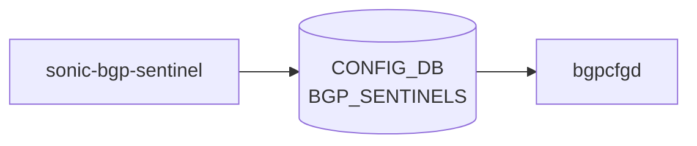

# sonic-bgp-sentinel YANG

## 概要

- module: `sonic-bgp-sentinel`
- namespace: `http://github.com/Azure/sonic-bgp-sentinel`
- revision: `2023-06-06`
- import: `ietf-inet-types`, `sonic-types`
- top container: `sonic-bgp-sentinel`

SONiC BGP Sentinel 機能の YANG モデル。ToR 配下の特定 IP 範囲に対する Sentinel BGP セッション設定[^1]。

<!-- yang-mermaid -->
### データフロー (自動生成)



!!! note "凡例"
    YANG モジュールから CONFIG_DB テーブル経由で subscribe する daemon/orch までを `docs/reference/config-db-orch-map.md` から機械生成したミニ図。詳細・例外は本ページ本文を参照。
<!-- /yang-mermaid -->

## ツリー

```
module: sonic-bgp-sentinel
  +--rw sonic-bgp-sentinel
     +--rw BGP_SENTINELS
        +--rw BGP_SENTINELS_LIST* [sentinel_name]
           +--rw sentinel_name    string
           +--rw name?            string
           +--rw src_address?     inet:ip-address
           +--rw ip_range*        stypes:sonic-ip-prefix
```

## leaf 一覧

| leaf | パス | 型 | 必須 | デフォルト | enum / 範囲 / leafref | 説明 |
|------|------|----|------|-----------|----------------------|------|
| `sentinel_name` | `sonic-bgp-sentinel/BGP_SENTINELS/BGP_SENTINELS_LIST/sentinel_name` | `string` | yes |  |  | BGP Sentinel 名（リストキー） |
| `name` | `sonic-bgp-sentinel/BGP_SENTINELS/BGP_SENTINELS_LIST/name` | `string` |  |  | must `current() = sentinel_name` | BGP Sentinel 名（`sentinel_name` と一致必須） |
| `src_address` | `sonic-bgp-sentinel/BGP_SENTINELS/BGP_SENTINELS_LIST/src_address` | `inet:ip-address` |  |  |  | 接続に使うソースアドレス |
| `ip_range` | `sonic-bgp-sentinel/BGP_SENTINELS/BGP_SENTINELS_LIST/ip_range` | `leaf-list stypes:sonic-ip-prefix` |  |  | ordered-by user | 受け入れるアドレスレンジ |

## leafref / 依存

- なし（must 制約 `name = sentinel_name` のみ）

## augment / deviation

- なし

## 関連 CONFIG_DB / CLI

- CONFIG_DB: `BGP_SENTINELS|<sentinel_name>`
- CLI: なし（CONFIG_DB 直接設定）

<!-- ref-triangle:start -->

## 関連リファレンス

- CONFIG_DB: `BGP_SENTINELS`

<!-- ref-triangle:end -->

<!-- ops-hint -->
## 運用ヒント

### 典型的なデプロイ位置

- BGP Sentinel (route monitor) 用 neighbor 定義。BMP 系と独立した経路で `BGP_SENTINELS` テーブルに書かれる。

### よくある落とし穴

- 通常の BGP neighbor と key 空間が異なるため `show bgp neighbors` には現れない。bgpcfgd のテンプレ確認が必要。

### 関連する config / show コマンド

```bash
sonic-db-cli CONFIG_DB keys 'BGP_SENTINELS|*'
show runningconfiguration bgp
```
<!-- /ops-hint -->

## 引用元

[^1]: `sonic-net/sonic-buildimage` `src/sonic-yang-models/yang-models/sonic-bgp-sentinel.yang` @ `9ea932ec2e18f35e58268ec2e4456b1d4afd65cd`
