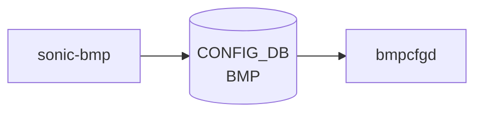

# sonic-bmp YANG

## 概要

- module: `sonic-bmp`
- namespace: `http://github.com/sonic-net/sonic-bmp`
- revision: `2024-03-20`
- import: `sonic-types`
- top container: `sonic-bmp`

[BGP](../../reference/glossary.md#term-bgp) Monitoring Protocol (BMP) によるテーブルダンプ送信の有効/無効を制御する [YANG](../../reference/glossary.md#term-yang) モジュール[^1]。

<!-- yang-mermaid -->
### データフロー (自動生成)



!!! note "凡例"
    YANG モジュールから CONFIG_DB テーブル経由で subscribe する daemon/orch までを `docs/reference/config-db-orch-map.md` から機械生成したミニ図。詳細・例外は本ページ本文を参照。
<!-- /yang-mermaid -->

## 関連ページ

<!-- yang-xref -->

本 [YANG](../../reference/glossary.md#term-yang) モジュールに対応する [CONFIG_DB](../../reference/glossary.md#term-config_db) / CLI / [HLD](../../reference/glossary.md#term-hld) / Topics への相互リンク。`inject_yang_xref.py` により自動生成されます。

### 対応 CONFIG_DB

- [`BMP`](../config-db/bmp.md)

<!-- /yang-xref -->

## ツリー

```
module: sonic-bmp
  +--rw sonic-bmp
     +--rw BMP
        +--rw table
           +--rw bgp_neighbor_table?    stypes:boolean_type
           +--rw bgp_rib_in_table?      stypes:boolean_type
           +--rw bgp_rib_out_table?     stypes:boolean_type
```

## leaf 一覧

| leaf | パス | 型 | 必須 | デフォルト | enum / 範囲 / leafref | 説明 |
|------|------|----|------|-----------|----------------------|------|
| `bgp_neighbor_table` | `sonic-bmp/BMP/table/bgp_neighbor_table` | `stypes:boolean_type` |  | `true` |  | BMP [BGP](../../reference/glossary.md#term-bgp) ネイバーテーブルダンプの有効/無効 |
| `bgp_rib_in_table` | `sonic-bmp/BMP/table/bgp_rib_in_table` | `stypes:boolean_type` |  | `false` |  | BMP Adj-RIB-In テーブルダンプの有効/無効 |
| `bgp_rib_out_table` | `sonic-bmp/BMP/table/bgp_rib_out_table` | `stypes:boolean_type` |  | `false` |  | BMP Adj-RIB-Out テーブルダンプの有効/無効 |

## leafref / 依存

- なし

## augment / deviation

- なし

## 関連 CONFIG_DB / CLI

- [CONFIG_DB](../../reference/glossary.md#term-config_db): `BMP|table`
- CLI: `config bmp`

<!-- ref-triangle:start -->

## 関連リファレンス

- [CONFIG_DB](../../reference/glossary.md#term-config_db): [`BMP`](../config-db/bmp.md)
- CLI: `config bmp`

<!-- ref-triangle:end -->

<!-- ops-hint -->
## 運用ヒント

### 典型的なデプロイ位置

- [BGP](../../reference/glossary.md#term-bgp) Monitoring Protocol (RFC 7854) コレクタ向け設定。openbmp / sonic-bmp コンテナで参照される。

### よくある落とし穴

- `bgp_neighbor_table` / `bgp_rib_*_table` のブール群を一度に切り替えると BMP セッション再確立で経路再送が発生する。

### 関連する config / show コマンド

```bash
sonic-db-cli CONFIG_DB hgetall 'BMP|table'
docker logs bmp
```
<!-- /ops-hint -->

## 引用元

[^1]: `sonic-net/sonic-buildimage` `src/sonic-yang-models/yang-models/sonic-bmp.yang` @ `9ea932ec2e18f35e58268ec2e4456b1d4afd65cd`

<!-- glossary-links-injected: 20dbc11976b6 -->
