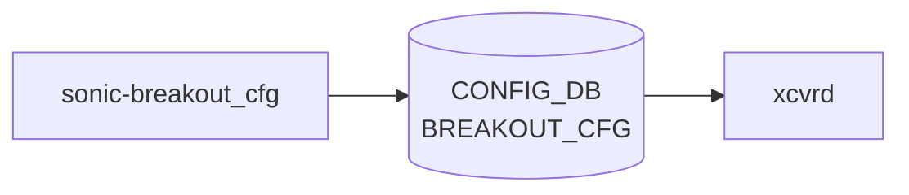

# sonic-breakout_cfg YANG

## 概要

- module: `sonic-breakout_cfg`
- namespace: `http://github.com/sonic-net/sonic-breakout_cfg`
- revision: `2020-04-10`
- import: なし
- top container: `sonic-breakout_cfg`

BREAKOUT_CFG [YANG](../../reference/glossary.md#term-yang) Module for [SONiC](../../reference/glossary.md#term-sonic) OS。動的ポート分割 (port breakout) 設定を親ポート単位で保持する[^1]。

<!-- yang-mermaid -->
### データフロー (自動生成)



!!! note "凡例"
    YANG モジュールから CONFIG_DB テーブル経由で subscribe する daemon/orch までを `docs/reference/config-db-orch-map.md` から機械生成したミニ図。詳細・例外は本ページ本文を参照。
<!-- /yang-mermaid -->

## 関連ページ

<!-- yang-xref -->

本 YANG モジュールに対応する CONFIG_DB / CLI / HLD / Topics への相互リンク。`inject_yang_xref.py` により自動生成されます。

### 対応 CONFIG_DB

- [`BREAKOUT_CFG`](../config-db/breakout-cfg.md)

### 関連 HLD

- [sonic-port YANG](../../reference/yang/sonic-port.md)

<!-- /yang-xref -->

## ツリー

```text
module: sonic-breakout_cfg
  +--rw sonic-breakout_cfg
     +--rw BREAKOUT_CFG
        +--rw BREAKOUT_CFG_LIST* [port]
           +--rw port           string
           +--rw brkout_mode?   string
```

## leaf 一覧

| leaf | パス | 型 | 必須 | デフォルト | enum / 範囲 / leafref | 説明 |
|------|------|----|------|-----------|----------------------|------|
| `port` | `sonic-breakout_cfg/BREAKOUT_CFG/BREAKOUT_CFG_LIST/port` | `string` | yes |  |  | Parent port name for breakout configuration |
| `brkout_mode` | `sonic-breakout_cfg/BREAKOUT_CFG/BREAKOUT_CFG_LIST/brkout_mode` | `string` |  |  | platform.json で検証 (例: `1x100G`, `4x25G`, `2x50G`) | Breakout mode for the port; validated against `platform.json` |

## leafref / 依存

- なし（`port` キーは `platform.json` 側で検証）

## augment / deviation

- なし

## 関連 CONFIG_DB / CLI

- [CONFIG_DB](../../reference/glossary.md#term-config_db): `BREAKOUT_CFG`
- CLI: `config interface breakout`

<!-- yang-sibling -->
### 関連 YANG モジュール

意味的に関連する SONiC YANG モジュール (slug prefix / curated group / frontmatter `related.yang` から自動抽出):

- [`sonic-fabric-port`](sonic-fabric-port.md)
- [`sonic-interface`](sonic-interface.md)
- [`sonic-loopback-interface`](sonic-loopback-interface.md)
- [`sonic-mgmt_interface`](sonic-mgmt_interface.md)
- [`sonic-mgmt_port`](sonic-mgmt_port.md)
<!-- /yang-sibling -->

<!-- ref-triangle:start -->

## 関連リファレンス

- [CONFIG_DB](../../reference/glossary.md#term-config_db): [`BREAKOUT_CFG`](../config-db/breakout-cfg.md)
- CLI: [`config interface breakout`](../cli/config-interface.md)

<!-- ref-triangle:end -->

<!-- ops-hint -->
## 運用ヒント

### 典型的なデプロイ位置

- Port breakout (4x25G 等) 設定。`BREAKOUT_CFG|<port>` を直接購読する runtime daemon は存在しない。CLI (`config interface breakout`) が [CONFIG_DB](../../reference/glossary.md#term-config_db)[PORT] を書き換え、[portsyncd](../../reference/glossary.md#term-portsyncd) 経由で [APPL_DB](../../reference/glossary.md#term-appl_db)[PORT_TABLE] → PortsOrch ([orchagent](../../reference/glossary.md#term-orchagent)) → [SAI](../../reference/glossary.md#term-sai) に伝播する。

### よくある落とし穴

- `brkout_mode` 文字列フォーマットは platform.json と一致が必要。typo すると全 port が default mode に戻る。

### 関連する config / show コマンド

```bash
sonic-db-cli CONFIG_DB hgetall 'BREAKOUT_CFG|Ethernet0'
show interfaces breakout current-mode
```
<!-- /ops-hint -->

## 引用元

[^1]: `sonic-net/sonic-buildimage` `src/sonic-yang-models/yang-models/sonic-breakout_cfg.yang` @ `9ea932ec2e18f35e58268ec2e4456b1d4afd65cd`

<!-- glossary-links-injected: dc62e86e7215 -->
