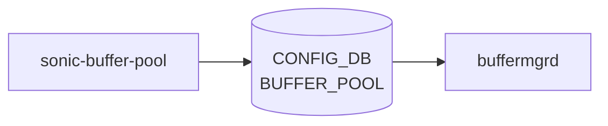

# sonic-buffer-pool YANG

## 概要

- module: `sonic-buffer-pool`
- namespace: `http://github.com/sonic-net/sonic-buffer-pool`
- revision: `2021-07-01`
- import: `sonic-device_metadata`
- top container: `sonic-buffer-pool`

パケットバッファリング用の共有・専用メモリプール設定を管理する [YANG](../../reference/glossary.md#term-yang) モジュール。[^1]

<!-- yang-mermaid -->
### データフロー (自動生成)



!!! note "凡例"
    YANG モジュールから CONFIG_DB テーブル経由で subscribe する daemon/orch までを `docs/reference/config-db-orch-map.md` から機械生成したミニ図。詳細・例外は本ページ本文を参照。
<!-- /yang-mermaid -->

## 関連ページ

<!-- yang-xref -->

本 YANG モジュールに対応する CONFIG_DB / CLI / HLD / Topics への相互リンク。`inject_yang_xref.py` により自動生成されます。

### 対応 CONFIG_DB

- [`BUFFER_POOL`](../config-db/buffer-pool.md)

<!-- /yang-xref -->

## ツリー

```text
module: sonic-buffer-pool
  +--rw sonic-buffer-pool
     +--rw BUFFER_POOL
        +--rw BUFFER_POOL_LIST* [name]
           +--rw name          string
           +--rw type          enumeration
           +--rw mode          enumeration
           +--rw size?         uint64
           +--rw xoff?         uint64
           +--rw percentage?   uint8
```

## leaf 一覧

| leaf | パス | 型 | 必須 | デフォルト | enum / 範囲 / leafref | 説明 |
|------|------|----|------|-----------|----------------------|------|
| `name` | `sonic-buffer-pool/BUFFER_POOL/BUFFER_POOL_LIST/name` | `string` | yes |  |  | [Buffer Pool](../../reference/glossary.md#term-buffer-pool) name |
| `type` | `sonic-buffer-pool/BUFFER_POOL/BUFFER_POOL_LIST/type` | `enumeration` | yes |  | ingress, egress, both | [Buffer Pool](../../reference/glossary.md#term-buffer-pool) Type |
| `mode` | `sonic-buffer-pool/BUFFER_POOL/BUFFER_POOL_LIST/mode` | `enumeration` | yes |  | static, dynamic | [Buffer Pool](../../reference/glossary.md#term-buffer-pool) Mode |
| `size` | `sonic-buffer-pool/BUFFER_POOL/BUFFER_POOL_LIST/size` | `uint64` |  |  |  | Buffer Pool Size (in Bytes) |
| `xoff` | `sonic-buffer-pool/BUFFER_POOL/BUFFER_POOL_LIST/xoff` | `uint64` |  | 0 |  | Buffer Pool Xoff Threshold (in Bytes) |
| `percentage` | `sonic-buffer-pool/BUFFER_POOL/BUFFER_POOL_LIST/percentage` | `uint8` |  |  |  | Buffer Pool percentage. The buffer pool size will be available_buffer * percentage / 100 if percentage is provided. It is valid in dynamic buffer model only. |

## leafref / 依存

- なし（このモジュール内で直接 leafref を持つ leaf はない）

## augment / deviation

- なし

## 関連 CONFIG_DB / CLI

- [CONFIG_DB](../../reference/glossary.md#term-config_db): `BUFFER_POOL`

<!-- yang-sibling -->
### 関連 YANG モジュール

意味的に関連する SONiC YANG モジュール (slug prefix / curated group / frontmatter `related.yang` から自動抽出):

- [`sonic-buffer-profile`](sonic-buffer-profile.md)
- [`sonic-buffer-queue`](sonic-buffer-queue.md)
- [`sonic-buffer-pg`](sonic-buffer-pg.md)
- [`sonic-dot1p-tc-map`](sonic-dot1p-tc-map.md)
- [`sonic-dscp-tc-map`](sonic-dscp-tc-map.md)
<!-- /yang-sibling -->

<!-- ref-triangle:start -->

## 関連リファレンス

- [CONFIG_DB](../../reference/glossary.md#term-config_db): [`BUFFER_POOL`](../config-db/buffer-pool.md)

<!-- ref-triangle:end -->

<!-- ops-hint -->
## 運用ヒント

### 典型的なデプロイ位置

- buffer pool (ingress/egress, lossless/lossy) のサイズ定義。`BUFFER_POOL|<name>` を bufferorch が処理。

### よくある落とし穴

- `size` を traffic 流入中に縮小すると packet drop が発生する。メンテ窓で `config qos reload` を併用するのが定石。

### 関連する config / show コマンド

```bash
sonic-db-cli CONFIG_DB keys 'BUFFER_POOL|*'
show buffer pool persistent-watermark
```
<!-- /ops-hint -->

## 引用元

[^1]: `sonic-net/sonic-buildimage` `src/sonic-yang-models/yang-models/sonic-buffer-pool.yang` @ `9ea932ec2e18f35e58268ec2e4456b1d4afd65cd`


<!-- topics-back-ref -->
## 関連 Topics

- [Topics: QoS / Buffer / PFC / Watermark](../../topics/08-qos-buffer/index.md)

<!-- /topics-back-ref -->

<!-- glossary-links-injected: 20dbc11976b6 -->
