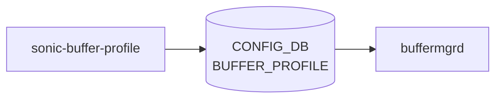

# sonic-buffer-profile YANG

## 概要

- module: `sonic-buffer-profile`
- namespace: `http://github.com/sonic-net/sonic-buffer-profile`
- revision: `2021-07-01`
- import: `sonic-buffer-pool`
- top container: `sonic-buffer-profile`

Named buffer configuration profiles with pool reference, size, and thresholds.[^1]

<!-- yang-mermaid -->
### データフロー (自動生成)



!!! note "凡例"
    YANG モジュールから CONFIG_DB テーブル経由で subscribe する daemon/orch までを `docs/reference/config-db-orch-map.md` から機械生成したミニ図。詳細・例外は本ページ本文を参照。
<!-- /yang-mermaid -->

## 関連ページ

<!-- yang-xref -->

本 YANG モジュールに対応する CONFIG_DB / CLI / HLD / Topics への相互リンク。`inject_yang_xref.py` により自動生成されます。

### 対応 CONFIG_DB

- [`BUFFER_PROFILE`](../config-db/buffer-profile.md)

### 関連 YANG

- [sonic-buffer-pool YANG](../../reference/yang/sonic-buffer-pool.md)

<!-- /yang-xref -->

## ツリー

```text
module: sonic-buffer-profile
  +--rw sonic-buffer-profile
     +--rw BUFFER_PROFILE
        +--rw BUFFER_PROFILE_LIST* [name]
           +--rw name                     string
           +--rw static_th?               uint64
           +--rw dynamic_th?              int32
           +--rw size                     uint64
           +--rw pool                     -> /bpl:sonic-buffer-pool/BUFFER_POOL/BUFFER_POOL_LIST/name
           +--rw xon_offset?              uint64
           +--rw xon?                     uint64
           +--rw xoff?                    uint64
           +--rw headroom_type?           enumeration
           +--rw packet_discard_action?   enumeration
```

## leaf 一覧

| leaf | パス | 型 | 必須 | デフォルト | enum / 範囲 / leafref | 説明 |
|------|------|----|------|-----------|----------------------|------|
| `name` | `sonic-buffer-profile/BUFFER_PROFILE/BUFFER_PROFILE_LIST/name` | `string` | yes |  |  | [Buffer Profile](../../reference/glossary.md#term-buffer-profile) name |
| `static_th` | `sonic-buffer-profile/BUFFER_PROFILE/BUFFER_PROFILE_LIST/static_th` | `uint64` |  |  |  | Static threshold in bytes for the maximum buffer pool occupancy. |
| `dynamic_th` | `sonic-buffer-profile/BUFFER_PROFILE/BUFFER_PROFILE_LIST/dynamic_th` | `int32` |  |  | range -8..7 | Dynamic threshold alpha value controlling the maximum proportion of free buffer pool space. |
| `size` | `sonic-buffer-profile/BUFFER_PROFILE/BUFFER_PROFILE_LIST/size` | `uint64` | yes |  |  | Reserved buffer size in bytes for this profile. |
| `pool` | `sonic-buffer-profile/BUFFER_PROFILE/BUFFER_PROFILE_LIST/pool` | `leafref` | yes |  | /bpl:sonic-buffer-pool/bpl:BUFFER_POOL/bpl:BUFFER_POOL_LIST/bpl:name | Reference to the buffer pool this profile draws from. |
| `xon_offset` | `sonic-buffer-profile/BUFFER_PROFILE/BUFFER_PROFILE_LIST/xon_offset` | `uint64` |  | 0 |  | Xon offset threshold in bytes; [PFC](../../reference/glossary.md#term-pfc) resume is triggered when buffer usage falls to max(xon, buffer_limit - xon_offset). |
| `xon` | `sonic-buffer-profile/BUFFER_PROFILE/BUFFER_PROFILE_LIST/xon` | `uint64` |  | 0 |  | Xon threshold in bytes for [PFC](../../reference/glossary.md#term-pfc) resume on the ingress priority group. |
| `xoff` | `sonic-buffer-profile/BUFFER_PROFILE/BUFFER_PROFILE_LIST/xoff` | `uint64` |  | 0 |  | Xoff threshold in bytes for [PFC](../../reference/glossary.md#term-pfc) pause generation on the ingress priority group. |
| `headroom_type` | `sonic-buffer-profile/BUFFER_PROFILE/BUFFER_PROFILE_LIST/headroom_type` | `enumeration` |  | static | static, dynamic | Whether the headroom is dynamically calculated or statically configured by the user. |
| `packet_discard_action` | `sonic-buffer-profile/BUFFER_PROFILE/BUFFER_PROFILE_LIST/packet_discard_action` | `enumeration` |  |  | drop, trim | Action taken when a packet cannot be admitted to the shared buffer (drop or trim for congestion telemetry). |

## leafref / 依存

- `sonic-buffer-profile/BUFFER_PROFILE/BUFFER_PROFILE_LIST/pool` → `/bpl:sonic-buffer-pool/bpl:BUFFER_POOL/bpl:BUFFER_POOL_LIST/bpl:name`

## augment / deviation

- なし

## 関連 CONFIG_DB / CLI

- [CONFIG_DB](../../reference/glossary.md#term-config_db): `BUFFER_PROFILE`

<!-- yang-sibling -->
### 関連 YANG モジュール

意味的に関連する SONiC YANG モジュール (slug prefix / curated group / frontmatter `related.yang` から自動抽出):

- [`sonic-buffer-pool`](sonic-buffer-pool.md)
- [`sonic-buffer-pg`](sonic-buffer-pg.md)
- [`sonic-buffer-queue`](sonic-buffer-queue.md)
- [`sonic-dot1p-tc-map`](sonic-dot1p-tc-map.md)
- [`sonic-dscp-tc-map`](sonic-dscp-tc-map.md)
<!-- /yang-sibling -->

<!-- ref-triangle:start -->

## 関連リファレンス

- [CONFIG_DB](../../reference/glossary.md#term-config_db): [`BUFFER_PROFILE`](../config-db/buffer-profile.md)

<!-- ref-triangle:end -->

<!-- ops-hint -->
## 運用ヒント

### 典型的なデプロイ位置

- buffer profile (size, xon/xoff threshold) 定義。`BUFFER_PROFILE|<name>` を bufferorch が [SAI](../../reference/glossary.md#term-sai) に渡す。

### よくある落とし穴

- `pool` leafref が `BUFFER_POOL` を参照。`BUFFER_PG` / `BUFFER_QUEUE` から再参照されるため、削除順序ミスで残骸エントリが残る。

### 関連する config / show コマンド

```bash
sonic-db-cli CONFIG_DB keys 'BUFFER_PROFILE|*'
show buffer profile
```
<!-- /ops-hint -->

## 引用元

[^1]: `sonic-net/sonic-buildimage` `src/sonic-yang-models/yang-models/sonic-buffer-profile.yang` @ `9ea932ec2e18f35e58268ec2e4456b1d4afd65cd`


<!-- topics-back-ref -->
## 関連 Topics

- [Topics: QoS / Buffer / PFC / Watermark](../../topics/08-qos-buffer/index.md)

<!-- /topics-back-ref -->

<!-- glossary-links-injected: 570311bfce27 -->
