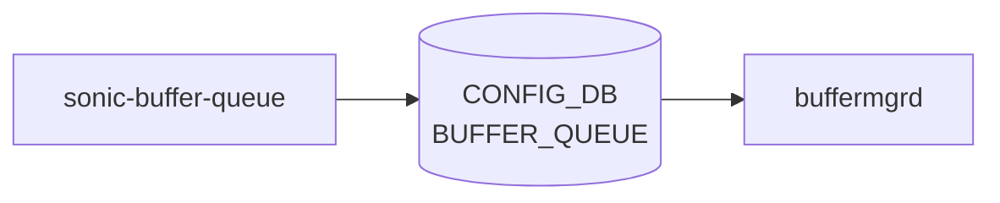

# sonic-buffer-queue YANG

## 概要

- module: `sonic-buffer-queue`
- namespace: `http://github.com/sonic-net/sonic-buffer-queue`
- revision: `2021-07-01`
- import: `sonic-port`, `sonic-buffer-profile`, `sonic-device_metadata`, `sonic-types`
- top container: `sonic-buffer-queue`

Egress queue buffer configuration per port.[^1]

<!-- yang-mermaid -->
### データフロー (自動生成)



!!! note "凡例"
    YANG モジュールから CONFIG_DB テーブル経由で subscribe する daemon/orch までを `docs/reference/config-db-orch-map.md` から機械生成したミニ図。詳細・例外は本ページ本文を参照。
<!-- /yang-mermaid -->

## 関連ページ

<!-- yang-xref -->

本 YANG モジュールに対応する CONFIG_DB / CLI / HLD / Topics への相互リンク。`inject_yang_xref.py` により自動生成されます。

### 対応 CONFIG_DB

- [`BUFFER_QUEUE`](../config-db/buffer-queue.md)

### 関連 YANG

- [sonic-buffer-pool YANG](../../reference/yang/sonic-buffer-pool.md)

<!-- /yang-xref -->

## ツリー

```text
module: sonic-buffer-queue
  +--rw sonic-buffer-queue
     +--rw BUFFER_QUEUE
        +--rw BUFFER_QUEUE_LIST* [port qindex]
        |  +--rw port       -> /prt:sonic-port/PORT/PORT_LIST/name
        |  +--rw qindex     string
        |  +--rw profile?   -> /bpf:sonic-buffer-profile/BUFFER_PROFILE/BUFFER_PROFILE_LIST/name
        +--rw VOQ_BUFFER_QUEUE_LIST* [hostname asic_name port qindex]
           +--rw hostname     stypes:hostname
           +--rw asic_name    stypes:asic_name
           +--rw port         string
           +--rw qindex       string
           +--rw profile?     -> /bpf:sonic-buffer-profile/BUFFER_PROFILE/BUFFER_PROFILE_LIST/name
```

## leaf 一覧

| leaf | パス | 型 | 必須 | デフォルト | enum / 範囲 / leafref | 説明 |
|------|------|----|------|-----------|----------------------|------|
| `port` | `sonic-buffer-queue/BUFFER_QUEUE/BUFFER_QUEUE_LIST/port` | `leafref` | yes |  | /prt:sonic-port/prt:PORT/prt:PORT_LIST/prt:name | Port on which the egress queue buffer is configured. |
| `qindex` | `sonic-buffer-queue/BUFFER_QUEUE/BUFFER_QUEUE_LIST/qindex` | `string` | yes |  | pattern `(1[0-5]|[0-9])((-)(1[0-5]|[0-9]))?` | Egress queue index or range (e.g. 0-3) on the port. |
| `profile` | `sonic-buffer-queue/BUFFER_QUEUE/BUFFER_QUEUE_LIST/profile` | `leafref` |  |  | /bpf:sonic-buffer-profile/bpf:BUFFER_PROFILE/bpf:BUFFER_PROFILE_LIST/bpf:name | Buffer profile applied to this egress queue. |
| `hostname` | `sonic-buffer-queue/BUFFER_QUEUE/VOQ_BUFFER_QUEUE_LIST/hostname` | `stypes:hostname` | yes |  |  | [VOQ](../../reference/glossary.md#term-voq) chassis hostname owning this port. |
| `asic_name` | `sonic-buffer-queue/BUFFER_QUEUE/VOQ_BUFFER_QUEUE_LIST/asic_name` | `stypes:asic_name` | yes |  |  | [ASIC](../../reference/glossary.md#term-asic) instance name within the [VOQ](../../reference/glossary.md#term-voq) chassis. |
| `port` | `sonic-buffer-queue/BUFFER_QUEUE/VOQ_BUFFER_QUEUE_LIST/port` | `string` | yes |  | length 1..128 | Port name on the [VOQ](../../reference/glossary.md#term-voq) chassis linecard. |
| `qindex` | `sonic-buffer-queue/BUFFER_QUEUE/VOQ_BUFFER_QUEUE_LIST/qindex` | `string` | yes |  | pattern `(1[0-5]|[0-9])((-)(1[0-5]|[0-9]))?` | Egress queue index or range (e.g. 0-3) on the port. |
| `profile` | `sonic-buffer-queue/BUFFER_QUEUE/VOQ_BUFFER_QUEUE_LIST/profile` | `leafref` |  |  | /bpf:sonic-buffer-profile/bpf:BUFFER_PROFILE/bpf:BUFFER_PROFILE_LIST/bpf:name | Buffer profile applied to this egress queue. |

## leafref / 依存

- `sonic-buffer-queue/BUFFER_QUEUE/BUFFER_QUEUE_LIST/port` → `/prt:sonic-port/prt:PORT/prt:PORT_LIST/prt:name`
- `sonic-buffer-queue/BUFFER_QUEUE/BUFFER_QUEUE_LIST/profile` → `/bpf:sonic-buffer-profile/bpf:BUFFER_PROFILE/bpf:BUFFER_PROFILE_LIST/bpf:name`
- `sonic-buffer-queue/BUFFER_QUEUE/VOQ_BUFFER_QUEUE_LIST/profile` → `/bpf:sonic-buffer-profile/bpf:BUFFER_PROFILE/bpf:BUFFER_PROFILE_LIST/bpf:name`

## augment / deviation

- なし

## 関連 CONFIG_DB / CLI

- [CONFIG_DB](../../reference/glossary.md#term-config_db): `BUFFER_QUEUE`

<!-- yang-sibling -->
### 関連 YANG モジュール

意味的に関連する SONiC YANG モジュール (slug prefix / curated group / frontmatter `related.yang` から自動抽出):

- [`sonic-port`](sonic-port.md)
- [`sonic-buffer-profile`](sonic-buffer-profile.md)
- [`sonic-buffer-pg`](sonic-buffer-pg.md)
- [`sonic-buffer-pool`](sonic-buffer-pool.md)
- [`sonic-dot1p-tc-map`](sonic-dot1p-tc-map.md)
<!-- /yang-sibling -->

<!-- ref-triangle:start -->

## 関連リファレンス

- [CONFIG_DB](../../reference/glossary.md#term-config_db): [`BUFFER_QUEUE`](../config-db/buffer-queue.md)

<!-- ref-triangle:end -->

<!-- ops-hint -->
## 運用ヒント

### 典型的なデプロイ位置

- [QoS](../../reference/glossary.md#term-qos) queue のバッファ割り当て。`BUFFER_QUEUE|<port>|<queue-range>` を bufferorch が処理する。

### よくある落とし穴

- queue index は `0-7` のような range 文字列。単一値と range を混在させると key 重複検出が漏れる例あり。

### 関連する config / show コマンド

```bash
sonic-db-cli CONFIG_DB keys 'BUFFER_QUEUE|*'
show queue persistent-watermark unicast
```
<!-- /ops-hint -->

## 引用元

[^1]: `sonic-net/sonic-buildimage` `src/sonic-yang-models/yang-models/sonic-buffer-queue.yang` @ `9ea932ec2e18f35e58268ec2e4456b1d4afd65cd`


<!-- topics-back-ref -->
## 関連 Topics

- [Topics: QoS / Buffer / PFC / Watermark](../../topics/08-qos-buffer/index.md)

<!-- /topics-back-ref -->

<!-- glossary-links-injected: c006405759d8 -->
