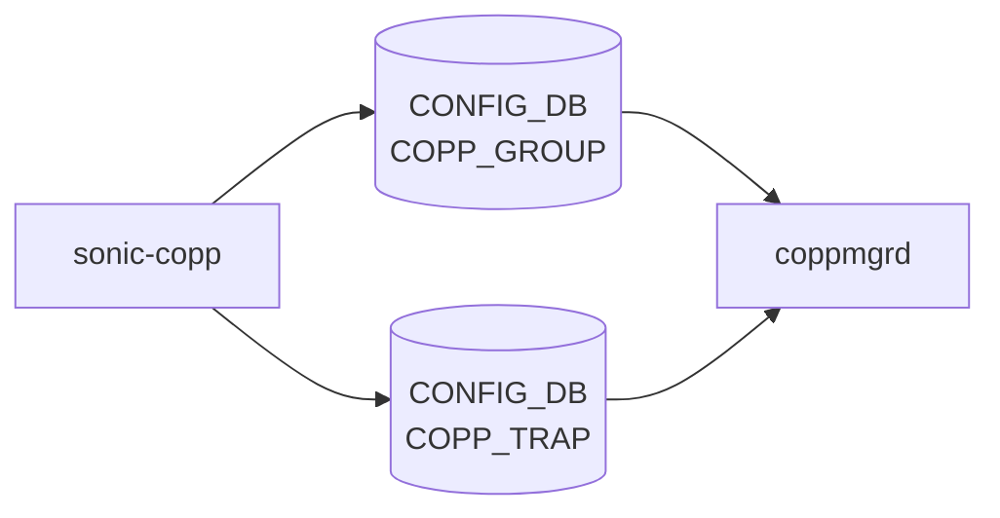

# sonic-copp YANG

## 概要

- module: `sonic-copp`
- namespace: `http://github.com/sonic-net/sonic-copp`
- revision: `2021-03-31`
- import: `sonic-types`
- top container: `sonic-copp`

[CoPP](../../reference/glossary.md#term-copp) [YANG](../../reference/glossary.md#term-yang) Module for [SONiC](../../reference/glossary.md#term-sonic) OS[^1]

<!-- yang-mermaid -->
### データフロー (自動生成)



!!! note "凡例"
    YANG モジュールから CONFIG_DB テーブル経由で subscribe する daemon/orch までを `docs/reference/config-db-orch-map.md` から機械生成したミニ図。詳細・例外は本ページ本文を参照。
<!-- /yang-mermaid -->

## 関連ページ

<!-- yang-xref -->

本 YANG モジュールに対応する CONFIG_DB / CLI / HLD / Topics への相互リンク。`inject_yang_xref.py` により自動生成されます。

### 対応 CONFIG_DB

- [`COPP_GROUP`](../config-db/copp-group.md)
- [`COPP_TRAP`](../config-db/copp-trap.md)

### 関連 HLD

- [POLICER テーブル](../../reference/config-db/policer.md)

<!-- /yang-xref -->

## ツリー

```yaml
module: sonic-copp
  +--rw sonic-copp
     +--rw COPP_GROUP
     |  +--rw COPP_GROUP_LIST* [name]
     |     +--rw name             string
     |     +--rw queue?           uint32
     |     +--rw trap_priority?   uint32
     |     +--rw trap_action      stypes:policer_packet_action
     |     +--rw meter_type       stypes:meter_type
     |     +--rw mode             enumeration
     |     +--rw color?           stypes:policer_color_source
     |     +--rw cir?             uint64
     |     +--rw cbs?             uint64
     |     +--rw pir?             uint64
     |     +--rw pbs?             uint64
     |     +--rw green_action?    stypes:policer_packet_action
     |     +--rw yellow_action?   stypes:policer_packet_action
     |     +--rw red_action?      stypes:policer_packet_action
     +--rw COPP_TRAP
        +--rw COPP_TRAP_LIST* [name]
           +--rw name              string
           +--rw trap_ids          string
           +--rw trap_group?       -> /sonic-copp/COPP_GROUP/COPP_GROUP_LIST/name
           +--rw always_enabled?   boolean

  rpcs:
    +---x get-match-protocols
       +--ro output
          +--ro Match_protocols* [Protocol]
             +--ro Protocol    string
```

## leaf 一覧

| leaf | パス | 型 | 必須 | デフォルト | enum / 範囲 / leafref | 説明 |
|------|------|----|------|-----------|----------------------|------|
| `name` | `sonic-copp/COPP_GROUP/COPP_GROUP_LIST/name` | `string` | yes |  |  | Control plane policing group name |
| `queue` | `sonic-copp/COPP_GROUP/COPP_GROUP_LIST/queue` | `uint32` |  | 0 |  | CPU receive queue number; higher values indicate higher priority. |
| `trap_priority` | `sonic-copp/COPP_GROUP/COPP_GROUP_LIST/trap_priority` | `uint32` |  | 0 |  | Priority assigned to the trap; higher values are matched first. |
| `trap_action` | `sonic-copp/COPP_GROUP/COPP_GROUP_LIST/trap_action` | `stypes:policer_packet_action` | yes |  |  | Action applied to trapped packets (forward, drop, copy, etc.). |
| `meter_type` | `sonic-copp/COPP_GROUP/COPP_GROUP_LIST/meter_type` | `stypes:meter_type` | yes |  |  | Metering unit for the embedded policer (packets or bytes). |
| `mode` | `sonic-copp/COPP_GROUP/COPP_GROUP_LIST/mode` | `enumeration` | yes |  | sr_tcm, tr_tcm, storm | [Policer](../../reference/glossary.md#term-policer) mode: single-rate TCM, two-rate TCM, or storm control. |
| `color` | `sonic-copp/COPP_GROUP/COPP_GROUP_LIST/color` | `stypes:policer_color_source` |  |  |  | [Policer](../../reference/glossary.md#term-policer) color awareness mode (aware or blind). |
| `cir` | `sonic-copp/COPP_GROUP/COPP_GROUP_LIST/cir` | `uint64` |  | 0 |  | Committed information rate for the dual-rate token  					bucket policer.  This value represents the rate at which  					tokens are added to the primary bucket. |
| `cbs` | `sonic-copp/COPP_GROUP/COPP_GROUP_LIST/cbs` | `uint64` |  | 0 |  | Committed burst size for the dual-rate token bucket  					policer.  This value represents the depth of the token  					bucket. |
| `pir` | `sonic-copp/COPP_GROUP/COPP_GROUP_LIST/pir` | `uint64` |  |  |  | Peak information rate for the dual-rate token bucket  					policer.  This value represents the rate at which tokens  					are added to the secondary bucket. |
| `pbs` | `sonic-copp/COPP_GROUP/COPP_GROUP_LIST/pbs` | `uint64` |  |  |  | Excess burst size for the dual-rate token bucket policer.  					This value represents the depth of the secondary bucket. |
| `green_action` | `sonic-copp/COPP_GROUP/COPP_GROUP_LIST/green_action` | `stypes:policer_packet_action` |  | forward |  | Action for packets classified as green by the policer. |
| `yellow_action` | `sonic-copp/COPP_GROUP/COPP_GROUP_LIST/yellow_action` | `stypes:policer_packet_action` |  | forward |  | Action for packets classified as yellow by the policer. |
| `red_action` | `sonic-copp/COPP_GROUP/COPP_GROUP_LIST/red_action` | `stypes:policer_packet_action` |  | forward |  | Action for packets classified as red by the policer. |
| `name` | `sonic-copp/COPP_TRAP/COPP_TRAP_LIST/name` | `string` | yes |  |  | Control plane policing trap name |
| `trap_ids` | `sonic-copp/COPP_TRAP/COPP_TRAP_LIST/trap_ids` | `string` | yes |  |  | Comma-separated list of trap identifiers bound to this entry. |
| `trap_group` | `sonic-copp/COPP_TRAP/COPP_TRAP_LIST/trap_group` | `leafref` |  |  | /sonic-copp/COPP_GROUP/COPP_GROUP_LIST/name | Reference to the [CoPP](../../reference/glossary.md#term-copp) group that polices these traps. |
| `always_enabled` | `sonic-copp/COPP_TRAP/COPP_TRAP_LIST/always_enabled` | `boolean` |  |  |  | When true, the trap is always installed regardless of feature enablement. |

## leafref / 依存

- `sonic-copp/COPP_TRAP/COPP_TRAP_LIST/trap_group` → `/sonic-copp/COPP_GROUP/COPP_GROUP_LIST/name`

## augment / deviation

- なし

## 関連 CONFIG_DB / CLI

- [CONFIG_DB](../../reference/glossary.md#term-config_db): `COPP_GROUP`
- [CONFIG_DB](../../reference/glossary.md#term-config_db): `COPP_TRAP`

<!-- yang-sibling -->
### 関連 YANG モジュール

意味的に関連する SONiC YANG モジュール (slug prefix / curated group / frontmatter `related.yang` から自動抽出):

- [`sonic-flex_counter`](sonic-flex_counter.md)
- [`sonic-debug-counter`](sonic-debug-counter.md)
- [`sonic-mirror-session`](sonic-mirror-session.md)
- [`sonic-pbh`](sonic-pbh.md)
<!-- /yang-sibling -->

<!-- ref-triangle:start -->

## 関連リファレンス

- [CONFIG_DB](../../reference/glossary.md#term-config_db): [`COPP_GROUP`](../config-db/copp-group.md) / [`COPP_TRAP`](../config-db/copp-trap.md)

<!-- ref-triangle:end -->

<!-- ops-hint -->
## 運用ヒント

### 典型的なデプロイ位置

- Control Plane [Policing](../../reference/glossary.md#term-policing)。`COPP_GROUP` / `COPP_TRAP` を copporch が [SAI](../../reference/glossary.md#term-sai) hostif trap policer に反映。

### よくある落とし穴

- `trap_ids` leaf-list の値は [SAI](../../reference/glossary.md#term-sai) trap 名と一致が必要。typo すると [orchagent](../../reference/glossary.md#term-orchagent) が trap 全体を skip する。

### 関連する config / show コマンド

```bash
sonic-db-cli CONFIG_DB keys 'COPP_*'
show copp config
```
<!-- /ops-hint -->

## 引用元

[^1]: `sonic-net/sonic-buildimage` `src/sonic-yang-models/yang-models/sonic-copp.yang` @ `9ea932ec2e18f35e58268ec2e4456b1d4afd65cd`


<!-- topics-back-ref -->
## 関連 Topics

- [Topics: ACL / CoPP / Mirror / Packet Action](../../topics/07-acl-copp-mirror/index.md)

<!-- /topics-back-ref -->

<!-- glossary-links-injected: 8ba32e5aa69d -->
