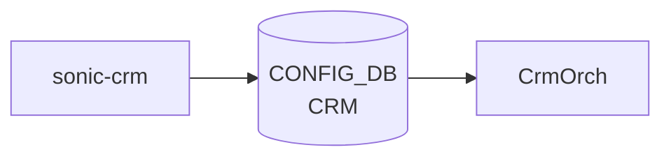

# sonic-crm YANG

## 概要

- module: `sonic-crm`
- namespace: `http://github.com/sonic-net/sonic-crm`
- revision: `2020-04-10`
- import: `sonic-types`, `sonic-device_metadata`
- top container: `sonic-crm`

Critical Resource Monitoring ([CRM](../../reference/glossary.md#term-crm)) 設定の [YANG](../../reference/glossary.md#term-yang) モデル[^1]。[ASIC](../../reference/glossary.md#term-asic) 上の各種ハードウェアリソース（[ACL](../../reference/glossary.md#term-acl) カウンタ/エントリ、route、neighbor、nexthop、[FDB](../../reference/glossary.md#term-fdb)、[NAT](../../reference/glossary.md#term-nat)、[MPLS](../../reference/glossary.md#term-mpls)、[SRv6](../../reference/glossary.md#term-srv6)、[DASH](../../reference/glossary.md#term-dash) オブジェクト 等）について `threshold_type` / `high_threshold` / `low_threshold` の 3 リーフをひとセットとして繰り返し定義する大型モジュール。

<!-- yang-mermaid -->
### データフロー (自動生成)



!!! note "凡例"
    YANG モジュールから CONFIG_DB テーブル経由で subscribe する daemon/orch までを `docs/reference/config-db-orch-map.md` から機械生成したミニ図。詳細・例外は本ページ本文を参照。
<!-- /yang-mermaid -->

## 関連ページ

<!-- yang-xref -->

本 YANG モジュールに対応する CONFIG_DB / CLI / HLD / Topics への相互リンク。`inject_yang_xref.py` により自動生成されます。

### 対応 CONFIG_DB

- [`CRM`](../config-db/crm.md)

<!-- /yang-xref -->

## ツリー（概略）

```text
module: sonic-crm
  +--rw sonic-crm
     +--rw CRM
        +--rw Config
           +--rw polling_interval?                              uint32
           # 各リソースクラスごとに以下 3 リーフ
           +--rw <resource>_threshold_type?                     stypes:crm_threshold_type (PERCENTAGE|USED|FREE)
           +--rw <resource>_high_threshold?                     uint16
           +--rw <resource>_low_threshold?                      uint16
```

すべての `_high_threshold` は対応する `_low_threshold` より大きいことが must 制約で要求される。`PERCENTAGE` 系では値 < 100 制約も付く。

## リソースクラス一覧

[CRM](../../reference/glossary.md#term-crm) が監視する論理リソース（`<class>_threshold_type` / `_high_threshold` / `_low_threshold` の 3 リーフが定義されているもの）:

### ACL 系

`acl_counter`, `acl_entry`, `acl_group`, `acl_table`

### FDB / Neighbor / Nexthop / Route 系

`fdb_entry`, `ipv4_neighbor`, `ipv6_neighbor`, `ipv4_nexthop`, `ipv6_nexthop`, `ipv4_route`, `ipv6_route`, `nexthop_group`, `nexthop_group_member`

### NAT / Multicast

`dnat_entry`, `snat_entry`, `ipmc_entry`

### MPLS / SRv6

`mpls_inseg`, `mpls_nexthop`, `srv6_my_sid_entry`, `srv6_nexthop`

### DASH (SmartSwitch)

`dash_vnet`, `dash_eni`, `dash_eni_ether_address_map`,
`dash_ipv4_inbound_routing`, `dash_ipv6_inbound_routing`,
`dash_ipv4_outbound_routing`, `dash_ipv6_outbound_routing`,
`dash_ipv4_pa_validation`, `dash_ipv6_pa_validation`,
`dash_ipv4_outbound_ca_to_pa`, `dash_ipv6_outbound_ca_to_pa`,
`dash_ipv4_acl_group`, `dash_ipv6_acl_group`,
`dash_ipv4_acl_rule`, `dash_ipv6_acl_rule`

## leaf（特殊なもの）

| leaf | パス | 型 | 必須 | デフォルト | 説明 |
|------|------|----|------|-----------|------|
| `polling_interval` | `sonic-crm/CRM/Config/polling_interval` | `uint32` |  |  | [CRM](../../reference/glossary.md#term-crm) ポーリング間隔（秒） |
| `<resource>_threshold_type` | `sonic-crm/CRM/Config/<resource>_threshold_type` | `stypes:crm_threshold_type` |  |  | 閾値タイプ（PERCENTAGE / USED / FREE） |
| `<resource>_high_threshold` | `sonic-crm/CRM/Config/<resource>_high_threshold` | `uint16` |  |  | THRESHOLD_EXCEEDED アラートを起こす上限値 |
| `<resource>_low_threshold` | `sonic-crm/CRM/Config/<resource>_low_threshold` | `uint16` |  |  | THRESHOLD_CLEAR アラートを起こす下限値 |

完全な leaf 一覧は [YANG](../../reference/glossary.md#term-yang) ソース（35 リソースクラス × 3 + `polling_interval` ＝ 106 リーフ）を直接参照のこと[^2]。

## must / 制約

- `<resource>_high_threshold > <resource>_low_threshold` を全リソースに対して要求
- `threshold_type = PERCENTAGE` のとき `high_threshold < 100` かつ `low_threshold < 100`

## leafref / 依存

- なし（`sonic-device_metadata` を import するが leafref は使用していない）

## augment / deviation

- なし

## 関連 CONFIG_DB / CLI

- [CONFIG_DB](../../reference/glossary.md#term-config_db): `CRM|Config`
- CLI: `crm config thresholds <type> <resource> ...`, `crm show resources`

<!-- yang-sibling -->
### 関連 YANG モジュール

意味的に関連する SONiC YANG モジュール (slug prefix / curated group / frontmatter `related.yang` から自動抽出):

- [`sonic-device_metadata`](sonic-device_metadata.md)
- [`sonic-bgp-monitor`](sonic-bgp-monitor.md)
- [`sonic-debug-counter`](sonic-debug-counter.md)
- [`sonic-fabric-monitor`](sonic-fabric-monitor.md)
- [`sonic-flex_counter`](sonic-flex_counter.md)
<!-- /yang-sibling -->

<!-- ref-triangle:start -->

## 関連リファレンス

- [CONFIG_DB](../../reference/glossary.md#term-config_db): [`CRM`](../config-db/crm.md)
- CLI: `crm config` / `crm show`

<!-- ref-triangle:end -->

<!-- ops-hint -->
## 運用ヒント

### 典型的なデプロイ位置

- Critical Resource Monitor の閾値設定。`CRM|Config` を crmorch が読んで [SAI](../../reference/glossary.md#term-sai) カウンタと比較し syslog 警告を出す。

### よくある落とし穴

- `*_threshold_type` を `percentage` に切り替えた直後は閾値判定が再計算されない場合がある。`config save` + reload が安全。

### 関連する config / show コマンド

```bash
sonic-db-cli CONFIG_DB hgetall 'CRM|Config'
crm show summary
crm show thresholds all
```
<!-- /ops-hint -->

## 引用元

[^1]: `sonic-net/sonic-buildimage` `src/sonic-yang-models/yang-models/sonic-crm.yang` @ `9ea932ec2e18f35e58268ec2e4456b1d4afd65cd`
[^2]: 同上ソースファイル全体（L1-970）。`leaf <name>_threshold_type` 35 個、`leaf <name>_high_threshold` 35 個、`leaf <name>_low_threshold` 35 個、加えて `leaf polling_interval` 1 個（重複 `grep -oE "leaf [a-zA-Z0-9_]+" | sort -u` で確認）。

<!-- glossary-links-injected: c006405759d8 -->
