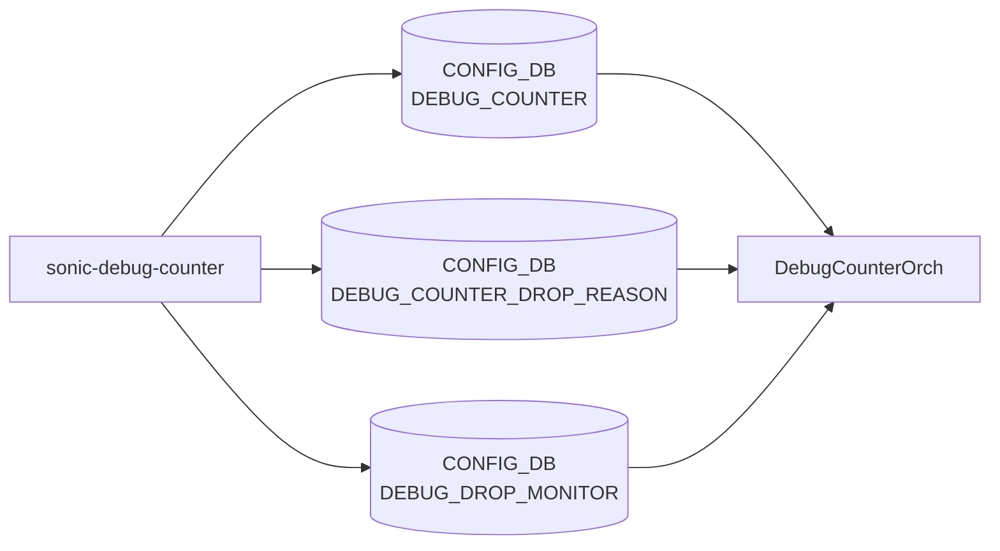

# sonic-debug-counter YANG

## 概要

- module: `sonic-debug-counter`
- namespace: `http://github.com/sonic-net/sonic-debug-counter`
- revision: `2024-03-07`
- import: `sonic-types`
- top container: `sonic-debug-counter`

パケットドロップ理由ベースのデバッグカウンタ設定と、永続的ドロップモニタの [YANG](../../reference/glossary.md#term-yang) モジュール[^1]。3 つのサブコンテナ `DEBUG_COUNTER` / `DEBUG_COUNTER_DROP_REASON` / `DEBUG_DROP_MONITOR` を持つ。

<!-- yang-mermaid -->
### データフロー (自動生成)



!!! note "凡例"
    YANG モジュールから CONFIG_DB テーブル経由で subscribe する daemon/orch までを `docs/reference/config-db-orch-map.md` から機械生成したミニ図。詳細・例外は本ページ本文を参照。
<!-- /yang-mermaid -->

## 関連ページ

<!-- yang-xref -->

本 YANG モジュールに対応する CONFIG_DB / CLI / HLD / Topics への相互リンク。`inject_yang_xref.py` により自動生成されます。

### 対応 CONFIG_DB

- [`DEBUG_COUNTER`](../config-db/debug-counter.md)

### 関連 HLD

- [VOQ カウンタ集約（chassis supervisor からの aggregate 表示）](../../internals/aggregate-voq-counters-in-sonic.md)

<!-- /yang-xref -->

## ツリー

```text
module: sonic-debug-counter
  +--rw sonic-debug-counter
     +--rw DEBUG_COUNTER
     |  +--rw DEBUG_COUNTER_LIST* [name]
     |     +--rw name                       string
     |     +--rw alias?                     string
     |     +--rw desc?                      string
     |     +--rw group?                     string
     |     +--rw drop_monitor_status?       stypes:admin_mode
     |     +--rw window?                    uint64
     |     +--rw incident_count_threshold?  uint64
     |     +--rw drop_count_threshold?      uint64
     |     +--rw type                       stypes:debug_counter_type
     +--rw DEBUG_COUNTER_DROP_REASON
     |  +--rw DEBUG_COUNTER_DROP_REASON_LIST* [name reason]
     |     +--rw name      string
     |     +--rw reason    stypes:counter_drop_reason
     +--rw DEBUG_DROP_MONITOR
        +--rw CONFIG
           +--rw status?   stypes:admin_mode
```

## leaf 一覧

| leaf | パス | 型 | 必須 | デフォルト | enum / 範囲 / leafref | 説明 |
|------|------|----|------|-----------|----------------------|------|
| `name` | `sonic-debug-counter/DEBUG_COUNTER/DEBUG_COUNTER_LIST/name` | `string` | yes |  |  | デバッグカウンタ識別名 |
| `alias` | `sonic-debug-counter/DEBUG_COUNTER/DEBUG_COUNTER_LIST/alias` | `string` |  |  |  | エイリアス名 |
| `desc` | `sonic-debug-counter/DEBUG_COUNTER/DEBUG_COUNTER_LIST/desc` | `string` |  |  |  | 説明文（用途・タイプ等） |
| `group` | `sonic-debug-counter/DEBUG_COUNTER/DEBUG_COUNTER_LIST/group` | `string` |  |  |  | カウンタをまとめるグループ名 |
| `drop_monitor_status` | `sonic-debug-counter/DEBUG_COUNTER/DEBUG_COUNTER_LIST/drop_monitor_status` | `stypes:admin_mode` |  | `disabled` |  | このカウンタのドロップモニタ機能の有効/無効 |
| `window` | `sonic-debug-counter/DEBUG_COUNTER/DEBUG_COUNTER_LIST/window` | `uint64` |  | `900` | units seconds | インシデント判定の時間窓（秒） |
| `incident_count_threshold` | `sonic-debug-counter/DEBUG_COUNTER/DEBUG_COUNTER_LIST/incident_count_threshold` | `uint64` |  | `3` |  | syslog 出力に至るインシデント発生数 |
| `drop_count_threshold` | `sonic-debug-counter/DEBUG_COUNTER/DEBUG_COUNTER_LIST/drop_count_threshold` | `uint64` |  | `100` |  | インシデント認定するドロップ数 |
| `type` | `sonic-debug-counter/DEBUG_COUNTER/DEBUG_COUNTER_LIST/type` | `stypes:debug_counter_type` | yes |  |  | カウンタ種別（switch/port × ingress/egress） |
| `name` | `sonic-debug-counter/DEBUG_COUNTER_DROP_REASON/DEBUG_COUNTER_DROP_REASON_LIST/name` | `string` | yes |  | must `DEBUG_COUNTER_LIST[name=current()]/name` 参照 | 紐付け先のカウンタ名 |
| `reason` | `sonic-debug-counter/DEBUG_COUNTER_DROP_REASON/DEBUG_COUNTER_DROP_REASON_LIST/reason` | `stypes:counter_drop_reason` | yes |  |  | このカウンタを増やすドロップ理由 |
| `status` | `sonic-debug-counter/DEBUG_DROP_MONITOR/CONFIG/status` | `stypes:admin_mode` |  | `disabled` |  | グローバルなドロップモニタ機能の有効/無効 |

## leafref / 依存

- `DEBUG_COUNTER_DROP_REASON_LIST/name` は `DEBUG_COUNTER_LIST/name` を must 制約で参照（leafref ではなく must 表現）

## augment / deviation

- なし

## 関連 CONFIG_DB / CLI

- [CONFIG_DB](../../reference/glossary.md#term-config_db): `DEBUG_COUNTER`, `DEBUG_COUNTER_DROP_REASON`, `DEBUG_DROP_MONITOR`
- CLI: `config debug-counter`, `show debug-counter`

<!-- yang-sibling -->
### 関連 YANG モジュール

意味的に関連する SONiC YANG モジュール (slug prefix / curated group / frontmatter `related.yang` から自動抽出):

- [`sonic-flex_counter`](sonic-flex_counter.md)
- [`sonic-copp`](sonic-copp.md)
- [`sonic-mirror-session`](sonic-mirror-session.md)
- [`sonic-pbh`](sonic-pbh.md)
- [`sonic-bgp-monitor`](sonic-bgp-monitor.md)
<!-- /yang-sibling -->

<!-- ref-triangle:start -->

## 関連リファレンス

- [CONFIG_DB](../../reference/glossary.md#term-config_db): [`DEBUG_COUNTER`](../config-db/debug-counter.md) / [`DEBUG_COUNTER_DROP_REASON`](../config-db/debug-counter.md) / `DEBUG_DROP_MONITOR`
- CLI: `config debug-counter` / `show debug-counter`

<!-- ref-triangle:end -->

<!-- ops-hint -->
## 運用ヒント

### 典型的なデプロイ位置

- デバッグカウンタ (drop reason 等) 定義。`DEBUG_COUNTER|<name>` を debug_counter_orch が [SAI](../../reference/glossary.md#term-sai) に登録。

### よくある落とし穴

- `type` (`PORT_INGRESS_DROPS` 等) と `reasons` leaf-list の組合せが platform 非対応だと sairedis でエラーになる。

### 関連する config / show コマンド

```bash
sonic-db-cli CONFIG_DB keys 'DEBUG_COUNTER|*'
show dropcounters configuration
```
<!-- /ops-hint -->

## 引用元

[^1]: `sonic-net/sonic-buildimage` `src/sonic-yang-models/yang-models/sonic-debug-counter.yang` @ `9ea932ec2e18f35e58268ec2e4456b1d4afd65cd`

<!-- glossary-links-injected: 20dbc11976b6 -->
