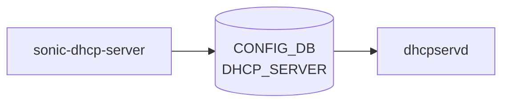

# sonic-dhcp-server YANG

## 概要

- module: `sonic-dhcp-server`
- namespace: `http://github.com/sonic-net/sonic-dhcp-server`
- revision: `2022-09-23`
- import: `ietf-inet-types`
- top container: `sonic-dhcp-server`

DHCP SERVER [YANG](../../reference/glossary.md#term-yang) module for [SONiC](../../reference/glossary.md#term-sonic) OS[^1]

<!-- yang-mermaid -->
### データフロー (自動生成)



!!! note "凡例"
    YANG モジュールから CONFIG_DB テーブル経由で subscribe する daemon/orch までを `docs/reference/config-db-orch-map.md` から機械生成したミニ図。詳細・例外は本ページ本文を参照。
<!-- /yang-mermaid -->

## ツリー

```text
module: sonic-dhcp-server
  +--rw sonic-dhcp-server
     +--rw DHCP_SERVER
        +--rw DHCP_SERVER_LIST* [ip]
           +--rw ip    inet:ip-address
```

## container / list 一覧

| 種別 | パス | key | 説明 |
|------|------|-----|------|
| `container` | `sonic-dhcp-server` |  |  |
| `container` | `sonic-dhcp-server/DHCP_SERVER` |  | DHCP server IP addresses used for relay forwarding |
| `list` | `sonic-dhcp-server/DHCP_SERVER/DHCP_SERVER_LIST` | `ip` | List of IPs in DHCP_SERVER Table |

## leaf 一覧

| leaf | パス | 型 | 必須 | デフォルト | enum / 範囲 / leafref | 説明 |
|------|------|----|------|-----------|----------------------|------|
| `ip` | `sonic-dhcp-server/DHCP_SERVER/DHCP_SERVER_LIST/ip` | `inet:ip-address` | yes |  |  | IP as DHCP_SERVER |

## leafref / 依存

- なし

## augment / deviation

- なし

## 関連 CONFIG_DB / CLI

- [CONFIG_DB](../../reference/glossary.md#term-config_db): `DHCP_SERVER`
- CLI: なし

<!-- yang-sibling -->
### 関連 YANG モジュール

意味的に関連する SONiC YANG モジュール (slug prefix / curated group / frontmatter `related.yang` から自動抽出):

- [`sonic-dns`](sonic-dns.md)
- [`sonic-interface`](sonic-interface.md)
- [`sonic-nat`](sonic-nat.md)
- [`sonic-neigh`](sonic-neigh.md)
<!-- /yang-sibling -->

<!-- ref-triangle:start -->

## 関連リファレンス

- [CONFIG_DB](../../reference/glossary.md#term-config_db): `DHCP_SERVER`

<!-- ref-triangle:end -->

<!-- ops-hint -->
## 運用ヒント

### 典型的なデプロイ位置

- DHCP relay が転送するサーバ IP アドレスのリスト。`DHCP_SERVER|<ip>` を dhcpservd が参照する。オンスイッチ DHCP サーバ (embedded kea) は別モジュール `sonic-dhcp-server-ipv4` が管轄するので混同しないこと。

### よくある落とし穴

- `gateway` leaf が [VLAN](../../reference/glossary.md#term-vlan) interface IP と不一致だと割り当て後の通信が壊れる。[VLAN](../../reference/glossary.md#term-vlan) サブネットと整合確認が必須。

### 関連する config / show コマンド

```bash
sonic-db-cli CONFIG_DB keys 'DHCP_SERVER|*'
```
<!-- /ops-hint -->

## 引用元

[^1]: `sonic-net/sonic-buildimage` `src/sonic-yang-models/yang-models/sonic-dhcp-server.yang` @ `9ea932ec2e18f35e58268ec2e4456b1d4afd65cd`

<!-- topics-back-ref -->
## 関連 Topics

- [Topics: NAT / DHCP Relay / Time-DNS Services](../../topics/16-nat-dhcp-dns/index.md)

<!-- /topics-back-ref -->

<!-- glossary-links-injected: 8ba32e5aa69d -->
