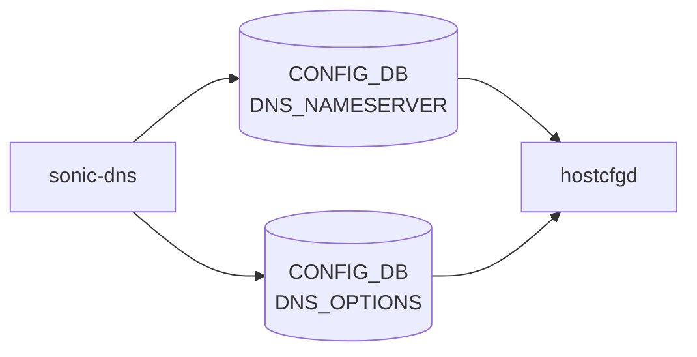

# sonic-dns YANG

## 概要

- module: `sonic-dns`
- namespace: `http://github.com/sonic-net/sonic-dns`
- revision: `2023-02-14`
- import: `ietf-inet-types`
- top container: `sonic-dns`

Domain Name System (DNS) resolver configuration [YANG](../../reference/glossary.md#term-yang) module for [SONiC](../../reference/glossary.md#term-sonic) OS.[^1]

<!-- yang-mermaid -->
### データフロー (自動生成)



!!! note "凡例"
    YANG モジュールから CONFIG_DB テーブル経由で subscribe する daemon/orch までを `docs/reference/config-db-orch-map.md` から機械生成したミニ図。詳細・例外は本ページ本文を参照。
<!-- /yang-mermaid -->

## ツリー

```text
module: sonic-dns
  +--rw sonic-dns
     +--rw DNS_NAMESERVER
     |  +--rw DNS_NAMESERVER_LIST* [ip]
     |     +--rw ip    inet:ip-address
     +--rw DNS_OPTIONS
        +--rw search*     inet:host
        +--rw ndots?      uint8
        +--rw timeout?    uint8
        +--rw attempts?   uint8
```

## container / list 一覧

| 種別 | パス | key | 説明 |
|------|------|-----|------|
| `container` | `sonic-dns` |  |  |
| `container` | `sonic-dns/DNS_NAMESERVER` |  | DNS nameserver addresses for name resolution. |
| `list` | `sonic-dns/DNS_NAMESERVER/DNS_NAMESERVER_LIST` | `ip` | Ordered list of DNS nameserver IP addresses. |
| `container` | `sonic-dns/DNS_OPTIONS` |  | DNS resolver options; requires at least one nameserver to be configured. |

## leaf 一覧

| leaf | パス | 型 | 必須 | デフォルト | enum / 範囲 / leafref | 説明 |
|------|------|----|------|-----------|----------------------|------|
| `ip` | `sonic-dns/DNS_NAMESERVER/DNS_NAMESERVER_LIST/ip` | `inet:ip-address` | yes |  |  | IPv4 or IPv6 address of a DNS nameserver. |
| `search[]` | `sonic-dns/DNS_OPTIONS/search` | `inet:host` |  |  |  | Configure the DNS search suffix list |
| `ndots` | `sonic-dns/DNS_OPTIONS/ndots` | `uint8` |  | 1 | range `0..15` | Sets a threshold for the number of dots which must appear in a name given before an initial absolute query will be made |
| `timeout` | `sonic-dns/DNS_OPTIONS/timeout` | `uint8` |  | 5 | range `1..30` | Sets the amount of time in seconds the resolver will wait for a response from a remote name server before retrying the query via a different name server. |
| `attempts` | `sonic-dns/DNS_OPTIONS/attempts` | `uint8` |  | 2 | range `1..5` | Sets the number of times the resolver will send a query to its name servers before giving up and returning an error to the calling application. |

## leafref / 依存

- なし

## augment / deviation

- なし

## 関連 CONFIG_DB / CLI

- [CONFIG_DB](../../reference/glossary.md#term-config_db): `DNS_NAMESERVER`
- [CONFIG_DB](../../reference/glossary.md#term-config_db): `DNS_OPTIONS`
- CLI: `config dns`

<!-- yang-sibling -->
### 関連 YANG モジュール

意味的に関連する SONiC YANG モジュール (slug prefix / curated group / frontmatter `related.yang` から自動抽出):

- [`sonic-system-defaults`](sonic-system-defaults.md)
- [`sonic-dhcp-server`](sonic-dhcp-server.md)
- [`sonic-interface`](sonic-interface.md)
- [`sonic-nat`](sonic-nat.md)
- [`sonic-neigh`](sonic-neigh.md)
<!-- /yang-sibling -->

<!-- ref-triangle:start -->

## 関連リファレンス

- [CONFIG_DB](../../reference/glossary.md#term-config_db): `DNS_NAMESERVER` / `DNS_OPTIONS`
- CLI: `config dns`

<!-- ref-triangle:end -->

<!-- ops-hint -->
## 運用ヒント

### 典型的なデプロイ位置

- DNS resolver / domain 設定。`DNS_NAMESERVER|<ip>` を [hostcfgd](../../reference/glossary.md#term-hostcfgd) が `/etc/resolv.conf` に書く。

### よくある落とし穴

- [VRF](../../reference/glossary.md#term-vrf) (mgmt) 環境で `mgmt-vrf` 上の DNS とグローバル DNS の優先順序が [hostcfgd](../../reference/glossary.md#term-hostcfgd) の reload 順序で変わる。

### 関連する config / show コマンド

```bash
sonic-db-cli CONFIG_DB keys 'DNS_NAMESERVER|*'
show dns nameserver
```
<!-- /ops-hint -->

## 引用元

[^1]: `sonic-net/sonic-buildimage` `src/sonic-yang-models/yang-models/sonic-dns.yang` @ `9ea932ec2e18f35e58268ec2e4456b1d4afd65cd`

<!-- topics-back-ref -->
## 関連 Topics

- [Topics: NAT / DHCP Relay / Time-DNS Services](../../topics/16-nat-dhcp-dns/index.md)

<!-- /topics-back-ref -->

<!-- glossary-links-injected: 8ba32e5aa69d -->
