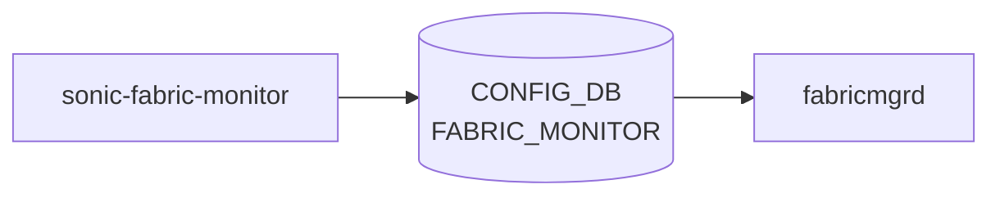

# sonic-fabric-monitor YANG

## 概要

- module: `sonic-fabric-monitor`
- namespace: `http://github.com/sonic-net/sonic-fabric-monitor`
- revision: `2023-03-14`
- import: `sonic-types`
- top container: `sonic-fabric-monitor`

VoQ Chassis のファブリックリンクモニタリング設定。CRC エラー率に基づくリンク isolation / inclusion の閾値、容量警告閾値を保持する[^1]。

<!-- yang-mermaid -->
### データフロー (自動生成)



!!! note "凡例"
    YANG モジュールから CONFIG_DB テーブル経由で subscribe する daemon/orch までを `docs/reference/config-db-orch-map.md` から機械生成したミニ図。詳細・例外は本ページ本文を参照。
<!-- /yang-mermaid -->

## ツリー

```
module: sonic-fabric-monitor
  +--rw sonic-fabric-monitor
     +--rw FABRIC_MONITOR
        +--rw FABRIC_MONITOR_DATA
           +--rw monErrThreshCrcCells?      uint32
           +--rw monErrThreshRxCells?       uint32
           +--rw monPollThreshIsolation?    uint8
           +--rw monPollThreshRecovery?     uint8
           +--rw monCapacityThreshWarn?     uint8
           +--rw monState?                  stypes:mode-status
```

## leaf 一覧

| leaf | パス | 型 | 必須 | デフォルト | enum / 範囲 / leafref | 説明 |
|------|------|----|------|-----------|----------------------|------|
| `monErrThreshCrcCells` | `sonic-fabric-monitor/FABRIC_MONITOR/FABRIC_MONITOR_DATA/monErrThreshCrcCells` | `uint32` |  | `1` |  | エラーセル数の閾値 |
| `monErrThreshRxCells` | `sonic-fabric-monitor/FABRIC_MONITOR/FABRIC_MONITOR_DATA/monErrThreshRxCells` | `uint32` |  | `61035156` |  | 受信セル数の閾値。`monErrThreshRxCells` のうち `monErrThreshCrcCells` 以上のエラーがあれば isolation 対象 |
| `monPollThreshIsolation` | `sonic-fabric-monitor/FABRIC_MONITOR/FABRIC_MONITOR_DATA/monPollThreshIsolation` | `uint8` |  | `1` | range 1..10 | 連続して閾値超過するポーリング回数（isolation 起動） |
| `monPollThreshRecovery` | `sonic-fabric-monitor/FABRIC_MONITOR/FABRIC_MONITOR_DATA/monPollThreshRecovery` | `uint8` |  | `8` | range 1..10 | 連続して閾値以下となるポーリング回数（inclusion 復帰） |
| `monCapacityThreshWarn` | `sonic-fabric-monitor/FABRIC_MONITOR/FABRIC_MONITOR_DATA/monCapacityThreshWarn` | `uint8` |  | `10` | range 5..100 | ファブリックリンク UP 比率の警告閾値（%） |
| `monState` | `sonic-fabric-monitor/FABRIC_MONITOR/FABRIC_MONITOR_DATA/monState` | `stypes:mode-status` |  | `disable` | enable / disable | ファブリックリンクモニタリング全体の有効/無効 |

## leafref / 依存

- なし

## augment / deviation

- なし

## 関連 CONFIG_DB / CLI

- CONFIG_DB: `FABRIC_MONITOR|FABRIC_MONITOR_DATA`
- CLI: `config fabric monitor`

<!-- ref-triangle:start -->

## 関連リファレンス

- CONFIG_DB: [`FABRIC_MONITOR`](../config-db/fabric-monitor.md)
- CLI: `config fabric monitor`

<!-- ref-triangle:end -->

## 引用元

[^1]: `sonic-net/sonic-buildimage` `src/sonic-yang-models/yang-models/sonic-fabric-monitor.yang` @ `9ea932ec2e18f35e58268ec2e4456b1d4afd65cd`
