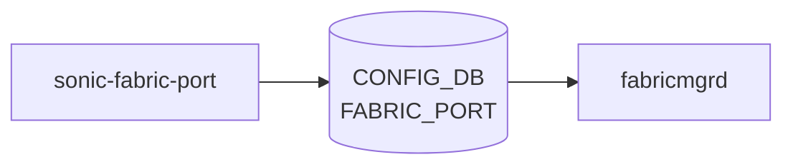

# sonic-fabric-port YANG

## 概要

- module: `sonic-fabric-port`
- namespace: `http://github.com/sonic-net/sonic-fabric-port`
- revision: `2023-03-14`
- import: `sonic-types`
- top container: `sonic-fabric-port`

[VOQ](../../reference/glossary.md#term-voq) chassis におけるラインカード間ファブリックリンクの port 設定を保持する。隔離状態、 alias、 lanes、強制 unisolate 状態などを定義する[^1]。

<!-- yang-mermaid -->
### データフロー (自動生成)



!!! note "凡例"
    YANG モジュールから CONFIG_DB テーブル経由で subscribe する daemon/orch までを `docs/reference/config-db-orch-map.md` から機械生成したミニ図。詳細・例外は本ページ本文を参照。
<!-- /yang-mermaid -->

## ツリー

```
module: sonic-fabric-port
  +--rw sonic-fabric-port
     +--rw FABRIC_PORT
        +--rw FABRIC_PORT_LIST* [name]
           +--rw name                    string
           +--rw isolateStatus?          stypes:boolean_type
           +--rw alias?                  string
           +--rw lanes                   string
           +--rw forceUnisolateStatus?   uint32
```

## leaf 一覧

| leaf | パス | 型 | 必須 | デフォルト | enum / 範囲 / leafref | 説明 |
|------|------|----|------|-----------|----------------------|------|
| `name` | `sonic-fabric-port/FABRIC_PORT/FABRIC_PORT_LIST/name` | `string` | yes |  |  | Fabric port name identifier (例: `Fabric0`) |
| `isolateStatus` | `sonic-fabric-port/FABRIC_PORT/FABRIC_PORT_LIST/isolateStatus` | `stypes:boolean_type` |  |  | true, false | Isolation status of the fabric port |
| `alias` | `sonic-fabric-port/FABRIC_PORT/FABRIC_PORT_LIST/alias` | `string` |  |  |  | Alias of the fabric port |
| `lanes` | `sonic-fabric-port/FABRIC_PORT/FABRIC_PORT_LIST/lanes` | `string` | yes |  |  | Lanes of the fabric port |
| `forceUnisolateStatus` | `sonic-fabric-port/FABRIC_PORT/FABRIC_PORT_LIST/forceUnisolateStatus` | `uint32` |  |  |  | Force unisolate status of the fabric port |

## leafref / 依存

- なし

## augment / deviation

- なし

## 関連 CONFIG_DB / CLI

- [CONFIG_DB](../../reference/glossary.md#term-config_db): `FABRIC_PORT`
- CLI: `show fabric`

<!-- ref-triangle:start -->

## 関連リファレンス

- [CONFIG_DB](../../reference/glossary.md#term-config_db): [`FABRIC_PORT`](../config-db/fabric-port.md)
- CLI: `show fabric`

<!-- ref-triangle:end -->

<!-- ops-hint -->
## 運用ヒント

### 典型的なデプロイ位置

- VoQ chassis の fabric port 設定。`FABRIC_PORT|<port>` を fabricmgrd が処理。

### よくある落とし穴

- `isolate_status` の手動設定と auto-isolate ロジックが競合してフラップするケースあり。

### 関連する config / show コマンド

```bash
sonic-db-cli CONFIG_DB keys 'FABRIC_PORT|*'
show fabric port status
```
<!-- /ops-hint -->

## 引用元

[^1]: `sonic-net/sonic-buildimage` `src/sonic-yang-models/yang-models/sonic-fabric-port.yang` @ `9ea932ec2e18f35e58268ec2e4456b1d4afd65cd`

<!-- glossary-links-injected: 896d391185a9 -->
