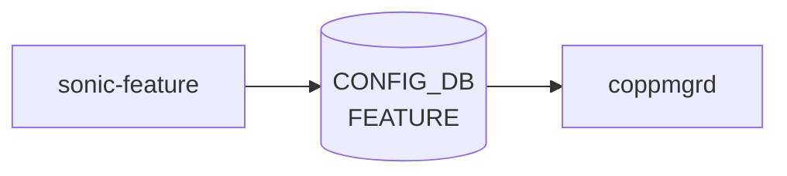

# sonic-feature YANG

## 概要

- module: `sonic-feature`
- namespace: `http://github.com/sonic-net/sonic-feature`
- revision: （[YANG](../../reference/glossary.md#term-yang) ファイル内に revision ステートメントなし）
- import: `sonic-types`
- top container: `sonic-feature`

[SONiC](../../reference/glossary.md#term-sonic) service/feature enable, disable, and auto-restart control [YANG](../../reference/glossary.md#term-yang) module.[^1]

<!-- yang-mermaid -->
### データフロー (自動生成)



!!! note "凡例"
    YANG モジュールから CONFIG_DB テーブル経由で subscribe する daemon/orch までを `docs/reference/config-db-orch-map.md` から機械生成したミニ図。詳細・例外は本ページ本文を参照。
<!-- /yang-mermaid -->

## 関連ページ

<!-- yang-xref -->

本 YANG モジュールに対応する CONFIG_DB / CLI / HLD / Topics への相互リンク。`inject_yang_xref.py` により自動生成されます。

### 対応 CONFIG_DB

- [`FEATURE`](../config-db/feature.md)

### 関連 HLD

- [SONiC Application Extension 開発・移植ガイド](../../management/sonic-application-extension-guide.md)
- [sonic-warm-restart YANG](../../reference/yang/sonic-warm-restart.md)
- [SONiC Boot Chart（systemd-bootchart 統合）](../../system/sonic-boot-chart.md)
- [config-setup サービス（first-boot config 生成 / 版間 migration）](../../system/sonic-configuration-setup-service.md)
- [System Health Monitor（critical service / Monit / peripheral）](../../system/sonic-system-health-monitor-high-level-design.md)
- [設定 / 運用](../../topics/19-build-packaging/operations.md)

<!-- /yang-xref -->

## ツリー

```text
module: sonic-feature
  +--rw sonic-feature
     +--rw FEATURE
        +--rw FEATURE_LIST* [name]
           +--rw name                         string
           +--rw state?                       feature-state
           +--rw auto_restart?                feature-state
           +--rw delayed?                     feature-delay-status
           +--rw has_global_scope?            feature-scope-status
           +--rw has_per_asic_scope?          feature-scope-status
           +--rw has_per_dpu_scope?           feature-scope-status
           +--rw high_mem_alert?              feature-state
           +--rw set_owner?                   feature-owner
           +--rw check_up_status?             stypes:boolean_type
           +--rw support_syslog_rate_limit?   stypes:boolean_type
```

## leaf 一覧

| leaf | パス | 型 | 必須 | デフォルト | enum / 範囲 / leafref | 説明 |
|------|------|----|------|-----------|----------------------|------|
| `name` | `sonic-feature/FEATURE/FEATURE_LIST/name` | `string` | yes |  | length 1..32 | Name of the [SONiC](../../reference/glossary.md#term-sonic) feature or service. |
| `state` | `sonic-feature/FEATURE/FEATURE_LIST/state` | `feature-state` |  | enabled |  | Administrative state of the feature (enabled, disabled, or always_enabled). |
| `auto_restart` | `sonic-feature/FEATURE/FEATURE_LIST/auto_restart` | `feature-state` |  | enabled |  | Enable or disable automatic restart of the feature on failure. |
| `delayed` | `sonic-feature/FEATURE/FEATURE_LIST/delayed` | `feature-delay-status` |  | false |  | Delay starting this feature until system initialization completes. |
| `has_global_scope` | `sonic-feature/FEATURE/FEATURE_LIST/has_global_scope` | `feature-scope-status` |  | false |  | When true, only one instance of this service runs on the device. |
| `has_per_asic_scope` | `sonic-feature/FEATURE/FEATURE_LIST/has_per_asic_scope` | `feature-scope-status` |  | false |  | When true, one instance of this service runs per [ASIC](../../reference/glossary.md#term-asic). |
| `has_per_dpu_scope` | `sonic-feature/FEATURE/FEATURE_LIST/has_per_dpu_scope` | `feature-scope-status` |  | false |  | When true, one instance of this service runs per [DPU](../../reference/glossary.md#term-dpu). |
| `high_mem_alert` | `sonic-feature/FEATURE/FEATURE_LIST/high_mem_alert` | `feature-state` |  | disabled |  | Enable or disable alerting on high memory utilization by this feature. |
| `set_owner` | `sonic-feature/FEATURE/FEATURE_LIST/set_owner` | `feature-owner` |  | local |  | Whether the feature container is managed by Kubernetes or locally. |
| `check_up_status` | `sonic-feature/FEATURE/FEATURE_LIST/check_up_status` | `stypes:boolean_type` |  | false |  | When true, the system-ready tool monitors this feature's readiness. |
| `support_syslog_rate_limit` | `sonic-feature/FEATURE/FEATURE_LIST/support_syslog_rate_limit` | `stypes:boolean_type` |  | false |  | When true, this feature supports per-service syslog rate limiting. |

## leafref / 依存

- なし（このモジュール内で直接 leafref を持つ leaf はない）

## augment / deviation

- なし

## 関連 CONFIG_DB / CLI

- [CONFIG_DB](../../reference/glossary.md#term-config_db): `FEATURE`
- CLI: `config feature`

<!-- yang-sibling -->
### 関連 YANG モジュール

意味的に関連する SONiC YANG モジュール (slug prefix / curated group / frontmatter `related.yang` から自動抽出):

- [`sonic-versions`](sonic-versions.md)
- [`sonic-system-defaults`](sonic-system-defaults.md)
- [`sonic-banner`](sonic-banner.md)
- [`sonic-device_metadata`](sonic-device_metadata.md)
- [`sonic-fips`](sonic-fips.md)
<!-- /yang-sibling -->

<!-- ref-triangle:start -->

## 関連リファレンス

- [CONFIG_DB](../../reference/glossary.md#term-config_db): [`FEATURE`](../config-db/feature.md)
- CLI: `config feature`

<!-- ref-triangle:end -->

<!-- ops-hint -->
## 運用ヒント

### 典型的なデプロイ位置

- feature コンテナの有効化 / 自動起動制御。`FEATURE|<name>` を [hostcfgd](../../reference/glossary.md#term-hostcfgd) が systemd unit にマッピング。

### よくある落とし穴

- `state` を `disabled` に変更すると docker 停止のみで [CONFIG_DB](../../reference/glossary.md#term-config_db) の関連エントリは残る。意図せず再有効化時に古い設定が復活する。

### 関連する config / show コマンド

```bash
sonic-db-cli CONFIG_DB keys 'FEATURE|*'
show feature status
```
<!-- /ops-hint -->

## 引用元

[^1]: `sonic-net/sonic-buildimage` `src/sonic-yang-models/yang-models/sonic-feature.yang` @ `9ea932ec2e18f35e58268ec2e4456b1d4afd65cd`

<!-- glossary-links-injected: d5320e852f7a -->
