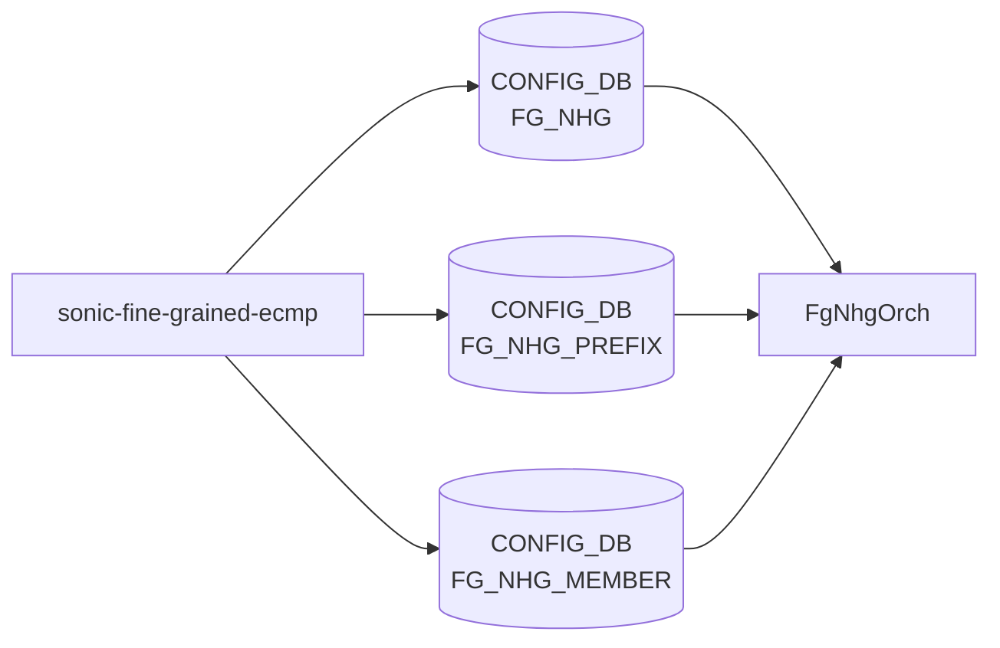

# sonic-fine-grained-ecmp YANG

## 概要

- module: `sonic-fine-grained-ecmp`
- namespace: `http://github.com/sonic-net/sonic-fine-grained-ecmp`
- revision: `2024-09-15` (Added support for dynamic nexthop group), `2023-01-19` (initial)
- import: `ietf-inet-types`, `sonic-portchannel`, `sonic-port`, `sonic-types`
- top container: `sonic-fine-grained-ecmp`

Fine-Grained [ECMP](../../reference/glossary.md#term-ecmp) (FG_NHG) のグループ・対象プレフィックス・メンバの 3 テーブルを保持する。bucket-size と match_mode により flow-to-nexthop の固定マッピングを記述する[^1]。

<!-- yang-mermaid -->
### データフロー (自動生成)



!!! note "凡例"
    YANG モジュールから CONFIG_DB テーブル経由で subscribe する daemon/orch までを `docs/reference/config-db-orch-map.md` から機械生成したミニ図。詳細・例外は本ページ本文を参照。
<!-- /yang-mermaid -->

## 関連ページ

<!-- yang-xref -->

本 YANG モジュールに対応する CONFIG_DB / CLI / HLD / Topics への相互リンク。`inject_yang_xref.py` により自動生成されます。

### 対応 CONFIG_DB

- [`FG_NHG`](../config-db/fg-nhg.md)
- [`FG_NHG_PREFIX`](../config-db/fg-nhg.md)
- [`FG_NHG_MEMBER`](../config-db/fg-nhg.md)

### 関連 Topics

- [VRF / ECMP / RIB-FIB パイプライン](../../topics/04-vrf-ecmp/index.md)

<!-- /yang-xref -->

## ツリー

```text
module: sonic-fine-grained-ecmp
  +--rw sonic-fine-grained-ecmp
     +--rw FG_NHG
     |  +--rw FG_NHG_LIST* [name]
     |     +--rw name             string
     |     +--rw bucket_size      uint16
     |     +--rw match_mode       match-mode-name
     |     +--rw max_next_hops    uint16
     +--rw FG_NHG_PREFIX
     |  +--rw FG_NHG_PREFIX_LIST* [ip_prefix]
     |     +--rw ip_prefix    stypes:sonic-ip-prefix
     |     +--rw FG_NHG       -> /sonic-fine-grained-ecmp/FG_NHG/FG_NHG_LIST/name
     +--rw FG_NHG_MEMBER
        +--rw FG_NHG_MEMBER_LIST* [next_hop_ip]
           +--rw next_hop_ip    inet:ip-address
           +--rw FG_NHG         -> /sonic-fine-grained-ecmp/FG_NHG/FG_NHG_LIST/name
           +--rw bank           uint16
           +--rw link?          union
```

## leaf 一覧

| leaf | パス | 型 | 必須 | デフォルト | enum / 範囲 / leafref | 説明 |
|------|------|----|------|-----------|----------------------|------|
| `name` | `sonic-fine-grained-ecmp/FG_NHG/FG_NHG_LIST/name` | `string` | yes |  |  | FG_NHG group name |
| `bucket_size` | `sonic-fine-grained-ecmp/FG_NHG/FG_NHG_LIST/bucket_size` | `uint16` | yes |  |  | Total hash bucket size (recommended LCM of 1..max nexthops) |
| `match_mode` | `sonic-fine-grained-ecmp/FG_NHG/FG_NHG_LIST/match_mode` | `match-mode-name` | yes |  | nexthop-based, route-based, prefix-based | Filtering method to identify when to use Fine Grained handling |
| `max_next_hops` | `sonic-fine-grained-ecmp/FG_NHG/FG_NHG_LIST/max_next_hops` | `uint16` | yes |  |  | Max nexthops in route updates (prefix-based mode only) |
| `ip_prefix` | `sonic-fine-grained-ecmp/FG_NHG_PREFIX/FG_NHG_PREFIX_LIST/ip_prefix` | `stypes:sonic-ip-prefix` | yes |  |  | Prefix for which FG behavior is desired |
| `FG_NHG` | `sonic-fine-grained-ecmp/FG_NHG_PREFIX/FG_NHG_PREFIX_LIST/FG_NHG` | `leafref` | yes |  | /sonic-fine-grained-ecmp/FG_NHG/FG_NHG_LIST/name | Fine Grained nexthop group name |
| `next_hop_ip` | `sonic-fine-grained-ecmp/FG_NHG_MEMBER/FG_NHG_MEMBER_LIST/next_hop_ip` | `inet:ip-address` | yes |  |  | Member nexthop IP associated with the prefix |
| `FG_NHG` | `sonic-fine-grained-ecmp/FG_NHG_MEMBER/FG_NHG_MEMBER_LIST/FG_NHG` | `leafref` | yes |  | /sonic-fine-grained-ecmp/FG_NHG/FG_NHG_LIST/name | Fine Grained nexthop group name |
| `bank` | `sonic-fine-grained-ecmp/FG_NHG_MEMBER/FG_NHG_MEMBER_LIST/bank` | `uint16` | yes |  |  | Index of bank/group for redistribution |
| `link` | `sonic-fine-grained-ecmp/FG_NHG_MEMBER/FG_NHG_MEMBER_LIST/link` | `union` |  |  | union(port leafref, portchannel leafref) | Local link associated with the nexthop |

## leafref / 依存

- `sonic-fine-grained-ecmp/FG_NHG_PREFIX/FG_NHG_PREFIX_LIST/FG_NHG` → `/sonic-fine-grained-ecmp/FG_NHG/FG_NHG_LIST/name`
- `sonic-fine-grained-ecmp/FG_NHG_MEMBER/FG_NHG_MEMBER_LIST/FG_NHG` → `/sonic-fine-grained-ecmp/FG_NHG/FG_NHG_LIST/name`
- `sonic-fine-grained-ecmp/FG_NHG_MEMBER/FG_NHG_MEMBER_LIST/link` → port または portchannel leafref

## augment / deviation

- なし

## 関連 CONFIG_DB / CLI

- [CONFIG_DB](../../reference/glossary.md#term-config_db): `FG_NHG`, `FG_NHG_PREFIX`, `FG_NHG_MEMBER`
- CLI: なし（[config_db.json](../../reference/glossary.md#term-config_db.json) で直接設定）

<!-- yang-sibling -->
### 関連 YANG モジュール

意味的に関連する SONiC YANG モジュール (slug prefix / curated group / frontmatter `related.yang` から自動抽出):

- [`sonic-portchannel`](sonic-portchannel.md)
- [`sonic-port`](sonic-port.md)
- [`sonic-hash`](sonic-hash.md)
- [`sonic-route-common`](sonic-route-common.md)
- [`sonic-trimming`](sonic-trimming.md)
<!-- /yang-sibling -->

<!-- ref-triangle:start -->

## 関連リファレンス

- [CONFIG_DB](../../reference/glossary.md#term-config_db): [`FG_NHG`](../config-db/fg-nhg.md) / [`FG_NHG_PREFIX`](../config-db/fg-nhg.md) / [`FG_NHG_MEMBER`](../config-db/fg-nhg.md)

<!-- ref-triangle:end -->

## 引用元

[^1]: `sonic-net/sonic-buildimage` `src/sonic-yang-models/yang-models/sonic-fine-grained-ecmp.yang` @ `9ea932ec2e18f35e58268ec2e4456b1d4afd65cd`

<!-- glossary-links-injected: 20dbc11976b6 -->
