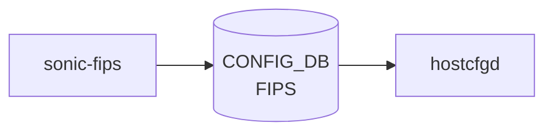

# sonic-fips YANG

## 概要

- module: `sonic-fips`
- namespace: `http://github.com/sonic-net/sonic-fips`
- revision: `2023-06-20`
- import: `sonic-types`
- top container: `sonic-fips`

Federal Information Processing Standards (FIPS) 140-3 compliance [YANG](../../reference/glossary.md#term-yang) module for [SONiC](../../reference/glossary.md#term-sonic) OS.[^1]

<!-- yang-mermaid -->
### データフロー (自動生成)



!!! note "凡例"
    YANG モジュールから CONFIG_DB テーブル経由で subscribe する daemon/orch までを `docs/reference/config-db-orch-map.md` から機械生成したミニ図。詳細・例外は本ページ本文を参照。
<!-- /yang-mermaid -->

## 関連ページ

<!-- yang-xref -->

本 YANG モジュールに対応する CONFIG_DB / CLI / HLD / Topics への相互リンク。`inject_yang_xref.py` により自動生成されます。

### 対応 CONFIG_DB

- [`FIPS`](../config-db/fips.md)

<!-- /yang-xref -->

## ツリー

```text
module: sonic-fips
  +--rw sonic-fips
     +--rw FIPS
        +--rw global
           +--rw enable?    stypes:boolean_type
           +--rw enforce?   stypes:boolean_type
```

## leaf 一覧

| leaf | パス | 型 | 必須 | デフォルト | enum / 範囲 / leafref | 説明 |
|------|------|----|------|-----------|----------------------|------|
| `enable` | `sonic-fips/FIPS/global/enable` | `stypes:boolean_type` |  | `false` |  | Enable or disable FIPS-validated cryptographic modules. |
| `enforce` | `sonic-fips/FIPS/global/enforce` | `stypes:boolean_type` |  | `false` |  | When true, enforce FIPS compliance and reject non-compliant operations. |

## leafref / 依存

- なし

## augment / deviation

- なし

## 関連 CONFIG_DB / CLI

- [CONFIG_DB](../../reference/glossary.md#term-config_db): `FIPS|global`
- CLI: `config fips`

<!-- yang-sibling -->
### 関連 YANG モジュール

意味的に関連する SONiC YANG モジュール (slug prefix / curated group / frontmatter `related.yang` から自動抽出):

- [`sonic-ssh-server`](sonic-ssh-server.md)
- [`sonic-system-aaa`](sonic-system-aaa.md)
- [`sonic-banner`](sonic-banner.md)
- [`sonic-device_metadata`](sonic-device_metadata.md)
- [`sonic-feature`](sonic-feature.md)
<!-- /yang-sibling -->

<!-- ref-triangle:start -->

## 関連リファレンス

- [CONFIG_DB](../../reference/glossary.md#term-config_db): [`FIPS`](../config-db/fips.md)
- CLI: `config fips`

<!-- ref-triangle:end -->

<!-- ops-hint -->
## 運用ヒント

### 典型的なデプロイ位置

- FIPS モード (連邦暗号規格) 制御。`FIPS|global` を [hostcfgd](../../reference/glossary.md#term-hostcfgd) が openssl / kernel crypto に反映。

### よくある落とし穴

- FIPS 有効化後は md5 ベース TACACS+ 認証が拒否される。事前に SHA 系へ移行が必要。

### 関連する config / show コマンド

```bash
sonic-db-cli CONFIG_DB hgetall 'FIPS|global'
show fips status
```
<!-- /ops-hint -->

## 引用元

[^1]: `sonic-net/sonic-buildimage` `src/sonic-yang-models/yang-models/sonic-fips.yang` @ `9ea932ec2e18f35e58268ec2e4456b1d4afd65cd`

<!-- glossary-links-injected: 8ba32e5aa69d -->
