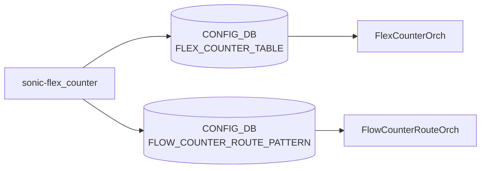

# sonic-flex_counter YANG

## 概要

- module: `sonic-flex_counter`
- namespace: `http://github.com/sonic-net/sonic-flex_counter`
- revision: `2020-04-10`
- import: `ietf-inet-types`, `sonic-types`
- top container: `sonic-flex_counter`

`syncd` の Flex Counter Manager が [ASIC](../../reference/glossary.md#term-asic) [SAI](../../reference/glossary.md#term-sai) カウンタをポーリングする際の有効/無効・ポーリング間隔・delay 起動を制御する [YANG](../../reference/glossary.md#term-yang) モジュール[^1]。カウンタ種別ごとに 1 つのコンテナを持ち、全コンテナで共通の `FLEX_COUNTER_STATUS` / `FLEX_COUNTER_DELAY_STATUS` / `POLL_INTERVAL` パターン（一部は `POLL_INTERVAL` を持たない）が繰り返される。加えてルート単位フローカウンタ用の `FLOW_COUNTER_ROUTE_PATTERN` を別コンテナで定義する。

<!-- yang-mermaid -->
### データフロー (自動生成)



!!! note "凡例"
    YANG モジュールから CONFIG_DB テーブル経由で subscribe する daemon/orch までを `docs/reference/config-db-orch-map.md` から機械生成したミニ図。詳細・例外は本ページ本文を参照。
<!-- /yang-mermaid -->

## 関連ページ

<!-- yang-xref -->

本 YANG モジュールに対応する CONFIG_DB / CLI / HLD / Topics への相互リンク。`inject_yang_xref.py` により自動生成されます。

### 対応 CONFIG_DB

- [`FLEX_COUNTER_TABLE`](../config-db/flex-counter-table.md)

### 関連 HLD

- [VOQ カウンタ集約（chassis supervisor からの aggregate 表示）](../../internals/aggregate-voq-counters-in-sonic.md)
- [counter が更新されない (FLEX_COUNTER)](../../reference/runbooks/flex-counter-stuck.md)
- [sonic-copp YANG](../../reference/yang/sonic-copp.md)

<!-- /yang-xref -->

## ツリー（概略）

```text
module: sonic-flex_counter
  +--rw sonic-flex_counter
     +--rw FLEX_COUNTER_TABLE
     |  +--rw <COUNTER_GROUP>
     |     +--rw FLEX_COUNTER_STATUS?         flex_status (enable|disable)
     |     +--rw FLEX_COUNTER_DELAY_STATUS?   flex_delay_status (boolean_type)
     |     +--rw POLL_INTERVAL?               poll_interval (uint32 range 100..)
     +--rw FLOW_COUNTER_ROUTE_PATTERN
        +--rw FLOW_COUNTER_ROUTE_PATTERN_LIST* [ip_prefix]
        |  +--rw ip_prefix         inet:ip-prefix
        |  +--rw max_match_count?  uint32 (range 1..50)
        +--rw FLOW_COUNTER_ROUTE_PATTERN_VRF_LIST* [vrf_name ip_prefix]
           +--rw vrf_name          string (length 0..16)
           +--rw ip_prefix         inet:ip-prefix
           +--rw max_match_count?  uint32 (range 1..50)
```

## カウンタグループ一覧

`FLEX_COUNTER_TABLE` 配下のサブコンテナ:

| コンテナ | 用途 | `POLL_INTERVAL` |
|---------|------|----------------|
| `BUFFER_POOL_WATERMARK` | バッファプール ウォーターマーク | ○ |
| `DEBUG_COUNTER` | デバッグカウンタ（ドロップ理由など） | × |
| `ENI` | [DASH](../../reference/glossary.md#term-dash) [ENI](../../reference/glossary.md#term-eni) 統計 | ○ |
| `DASH_METER` | [DASH](../../reference/glossary.md#term-dash) メーター統計 | ○ |
| `HA_SET` | [DASH](../../reference/glossary.md#term-dash) HA セット統計 | ○ |
| `PFCWD` | [PFC Watchdog](../../reference/glossary.md#term-pfc-watchdog) | ○ |
| `PG_DROP` | [Priority Group](../../reference/glossary.md#term-priority-group) ドロップ | ○ |
| `PG_WATERMARK` | [Priority Group](../../reference/glossary.md#term-priority-group) ウォーターマーク | ○ |
| `PORT` | ポート統計 | ○ |
| `PORT_RATES` | ポートレート計算 | ○ |
| `PORT_BUFFER_DROP` | ポートバッファドロップ | ○ |
| `PORT_PHY_ATTR` | ポート PHY 属性 | ○ |
| `QUEUE` | キュー統計 | ○ |
| `QUEUE_WATERMARK` | キューウォーターマーク | ○ |
| `RIF` | Router Interface 統計 | ○ |
| `RIF_RATES` | [RIF](../../reference/glossary.md#term-rif) レート計算 | ○ |
| `ACL` | [ACL](../../reference/glossary.md#term-acl) 統計 | × |
| `FLOW_CNT_TRAP` | trap フローカウンタ | ○ |
| `FLOW_CNT_ROUTE` | route フローカウンタ | ○ |
| `TUNNEL` | トンネル統計 | ○ |
| `WRED_ECN_QUEUE` | [WRED](../../reference/glossary.md#term-wred)/ECN キュー統計 | ○ |
| `WRED_ECN_PORT` | [WRED](../../reference/glossary.md#term-wred)/ECN ポート統計 | ○ |
| `SRV6` | [SRv6](../../reference/glossary.md#term-srv6) 統計 | ○ |
| `SWITCH` | スイッチ全体統計 | ○ |

## typedef

| typedef | 定義 |
|---------|------|
| `flex_status` | enum `enable` / `disable` |
| `flex_delay_status` | `stypes:boolean_type`（ファストリブート時のポーリング遅延） |
| `poll_interval` | `uint32` range 100..4294967295（ミリ秒） |
| `bulk_chunk_size` | `uint32` range 1..4294967295（[SAI](../../reference/glossary.md#term-sai) bulk counter API 呼び出しごとのエントリ数） |
| `bulk_chunk_size_per_prefix` | `string`（プレフィックス毎の bulk chunk size） |

## 共通 leaf

各カウンタグループに以下のリーフが存在（`POLL_INTERVAL` の有無は上表のとおり）:

| leaf | 型 | 説明 |
|------|----|------|
| `FLEX_COUNTER_STATUS` | `flex_status` | ポーリング有効/無効 |
| `FLEX_COUNTER_DELAY_STATUS` | `flex_delay_status` | システム ready までポーリング遅延 |
| `POLL_INTERVAL` | `poll_interval` | ポーリング間隔（ミリ秒） |

## `FLOW_COUNTER_ROUTE_PATTERN`

ルート単位のフローカウンタを動的に紐付けるためのプレフィックスパターン。デフォルト [VRF](../../reference/glossary.md#term-vrf) 用 `FLOW_COUNTER_ROUTE_PATTERN_LIST` と [VRF](../../reference/glossary.md#term-vrf)/[VNET](../../reference/glossary.md#term-vnet) スコープ用 `FLOW_COUNTER_ROUTE_PATTERN_VRF_LIST` の 2 リストを持つ。`vrf_name` は leafref ではなく文字列（[VNET](../../reference/glossary.md#term-vnet) 名も受け入れる、[orchagent](../../reference/glossary.md#term-orchagent) が後で解決する）。

| leaf | 型 | 必須 | 説明 |
|------|----|------|------|
| `ip_prefix` | `inet:ip-prefix` | yes | マッチさせる IP プレフィックスパターン |
| `max_match_count` | `uint32` (1..50) |  | バインドする最大ルート数 |
| `vrf_name` | `string` (length 0..16) | yes ([VRF](../../reference/glossary.md#term-vrf) list のみ) | VRF または [VNET](../../reference/glossary.md#term-vnet) 名 |

## leafref / 依存

- なし（`vrf_name` は意図的に leafref にしていない）

## augment / deviation

- なし

## 関連 CONFIG_DB / CLI

- [CONFIG_DB](../../reference/glossary.md#term-config_db): `FLEX_COUNTER_TABLE|<GROUP>`, `FLOW_COUNTER_ROUTE_PATTERN`
- CLI: `counterpoll <group> {enable|disable|interval <ms>}`

<!-- yang-sibling -->
### 関連 YANG モジュール

意味的に関連する SONiC YANG モジュール (slug prefix / curated group / frontmatter `related.yang` から自動抽出):

- [`sonic-debug-counter`](sonic-debug-counter.md)
- [`sonic-pfcwd`](sonic-pfcwd.md)
- [`sonic-port`](sonic-port.md)
- [`sonic-queue`](sonic-queue.md)
- [`sonic-srv6`](sonic-srv6.md)
<!-- /yang-sibling -->

<!-- ref-triangle:start -->

## 関連リファレンス

- [CONFIG_DB](../../reference/glossary.md#term-config_db): [`FLEX_COUNTER_TABLE`](../config-db/flex-counter-table.md) / `FLOW_COUNTER_ROUTE_PATTERN`
- CLI: `counterpoll`

<!-- ref-triangle:end -->

<!-- ops-hint -->
## 運用ヒント

### 典型的なデプロイ位置

- Flex counter polling 制御。`FLEX_COUNTER_TABLE|<group>` を flex counter orch が [SAI](../../reference/glossary.md#term-sai) に渡す。

### よくある落とし穴

- `POLL_INTERVAL` を極端に小さく (< 1000ms) すると [syncd](../../reference/glossary.md#term-syncd) CPU が張り付き、[orchagent](../../reference/glossary.md#term-orchagent) の他処理が遅延する。

### 関連する config / show コマンド

```bash
sonic-db-cli CONFIG_DB keys 'FLEX_COUNTER_TABLE|*'
counterpoll show
```
<!-- /ops-hint -->

## 引用元

[^1]: `sonic-net/sonic-buildimage` `src/sonic-yang-models/yang-models/sonic-flex_counter.yang` @ `9ea932ec2e18f35e58268ec2e4456b1d4afd65cd`

<!-- glossary-links-injected: 69034d0d8988 -->
