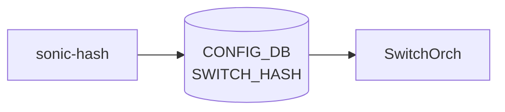

# sonic-hash YANG

## 概要

- module: `sonic-hash`
- namespace: `http://github.com/sonic-net/sonic-hash`
- revision: `2023-09-25`（前 revision: 2022-09-05）
- import: `sonic-types`
- top container: `sonic-hash`

[ECMP](../../reference/glossary.md#term-ecmp) および [LAG](../../reference/glossary.md#term-lag) パケットハッシングに使用するフィールドとアルゴリズムをグローバルに指定する [YANG](../../reference/glossary.md#term-yang) モジュール[^1]。

<!-- yang-mermaid -->
### データフロー (自動生成)



!!! note "凡例"
    YANG モジュールから CONFIG_DB テーブル経由で subscribe する daemon/orch までを `docs/reference/config-db-orch-map.md` から機械生成したミニ図。詳細・例外は本ページ本文を参照。
<!-- /yang-mermaid -->

## 関連ページ

<!-- yang-xref -->

本 [YANG](../../reference/glossary.md#term-yang) モジュールに対応する [CONFIG_DB](../../reference/glossary.md#term-config_db) / CLI / [HLD](../../reference/glossary.md#term-hld) / Topics への相互リンク。`inject_yang_xref.py` により自動生成されます。

### 対応 CONFIG_DB

- [`SWITCH_HASH`](../config-db/switch-hash.md)

<!-- /yang-xref -->

## ツリー

```
module: sonic-hash
  +--rw sonic-hash
     +--rw SWITCH_HASH
        +--rw GLOBAL
           +--rw ecmp_hash*             hash:hash-field
           +--rw lag_hash*              hash:hash-field
           +--rw ecmp_hash_algorithm?   stypes:hash-algorithm
           +--rw lag_hash_algorithm?    stypes:hash-algorithm
```

## leaf 一覧

| leaf | パス | 型 | 必須 | デフォルト | enum / 範囲 / leafref | 説明 |
|------|------|----|------|-----------|----------------------|------|
| `ecmp_hash` | `sonic-hash/SWITCH_HASH/GLOBAL/ecmp_hash` | `leaf-list hash:hash-field` |  |  | enum 一覧（下記） | [ECMP](../../reference/glossary.md#term-ecmp) 経路選択用のハッシュフィールド集合 |
| `lag_hash` | `sonic-hash/SWITCH_HASH/GLOBAL/lag_hash` | `leaf-list hash:hash-field` |  |  | enum 一覧（下記） | [LAG](../../reference/glossary.md#term-lag) メンバ選択用のハッシュフィールド集合 |
| `ecmp_hash_algorithm` | `sonic-hash/SWITCH_HASH/GLOBAL/ecmp_hash_algorithm` | `stypes:hash-algorithm` |  |  |  | [ECMP](../../reference/glossary.md#term-ecmp) ハッシュアルゴリズム |
| `lag_hash_algorithm` | `sonic-hash/SWITCH_HASH/GLOBAL/lag_hash_algorithm` | `stypes:hash-algorithm` |  |  |  | [LAG](../../reference/glossary.md#term-lag) ハッシュアルゴリズム |

### typedef `hash-field` enum

`IN_PORT`, `DST_MAC`, `SRC_MAC`, `ETHERTYPE`, `VLAN_ID`, `IP_PROTOCOL`, `DST_IP`, `SRC_IP`, `L4_DST_PORT`, `L4_SRC_PORT`, `INNER_DST_MAC`, `INNER_SRC_MAC`, `INNER_ETHERTYPE`, `INNER_IP_PROTOCOL`, `INNER_DST_IP`, `INNER_SRC_IP`, `INNER_L4_DST_PORT`, `INNER_L4_SRC_PORT`, `IPV6_FLOW_LABEL`

## leafref / 依存

- なし

## augment / deviation

- なし

## 関連 CONFIG_DB / CLI

- [CONFIG_DB](../../reference/glossary.md#term-config_db): `SWITCH_HASH|GLOBAL`
- CLI: `config switch-hash`

<!-- ref-triangle:start -->

## 関連リファレンス

- [CONFIG_DB](../../reference/glossary.md#term-config_db): [`SWITCH_HASH`](../config-db/switch-hash.md)
- CLI: `config switch-hash`

<!-- ref-triangle:end -->

<!-- ops-hint -->
## 運用ヒント

### 典型的なデプロイ位置

- ECMP / LAG hash 設定。`SWITCH_HASH|GLOBAL` を switchorch が [SAI](../../reference/glossary.md#term-sai) hash 属性へ反映。

### よくある落とし穴

- `ecmp_hash` leaf-list の値は [SAI](../../reference/glossary.md#term-sai) hash field enum 文字列と一致が必要。プラットフォーム非対応 field を含めると全体反映が拒否される。

### 関連する config / show コマンド

```bash
sonic-db-cli CONFIG_DB hgetall 'SWITCH_HASH|GLOBAL'
show switch-hash global
```
<!-- /ops-hint -->

## 引用元

[^1]: `sonic-net/sonic-buildimage` `src/sonic-yang-models/yang-models/sonic-hash.yang` @ `9ea932ec2e18f35e58268ec2e4456b1d4afd65cd`

<!-- glossary-links-injected: 20dbc11976b6 -->
