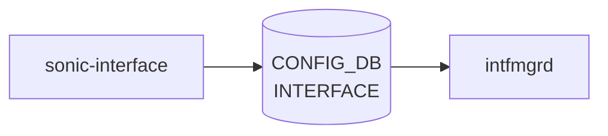

# sonic-interface YANG

## 概要

- module: `sonic-interface`
- namespace: `http://github.com/sonic-net/sonic-interface`
- revision: `2025-03-06`
- import: `ietf-yang-types`, `sonic-types`, `sonic-port`, `sonic-vrf`, `sonic-vnet`
- top container: `sonic-interface`

物理 Ethernet インターフェイスの L3 設定（IP アドレス付与・[VRF](../../reference/glossary.md#term-vrf) バインド・[NAT](../../reference/glossary.md#term-nat) ゾーン・MPLS 有効化など）を管理する [YANG](../../reference/glossary.md#term-yang) モジュール[^1]。

<!-- yang-mermaid -->
### データフロー (自動生成)



!!! note "凡例"
    YANG モジュールから CONFIG_DB テーブル経由で subscribe する daemon/orch までを `docs/reference/config-db-orch-map.md` から機械生成したミニ図。詳細・例外は本ページ本文を参照。
<!-- /yang-mermaid -->

## 関連ページ

<!-- yang-xref -->

本 YANG モジュールに対応する CONFIG_DB / CLI / HLD / Topics への相互リンク。`inject_yang_xref.py` により自動生成されます。

### 対応 CONFIG_DB

- [`INTERFACE`](../config-db/interface.md)

### 関連 CLI

- [`config interface`](../cli/config-interface.md)

### 関連 YANG

- [sonic-loopback-interface YANG](../../reference/yang/sonic-loopback-interface.md)
- [sonic-nat YANG](../../reference/yang/sonic-nat.md)
- [sonic-port YANG](../../reference/yang/sonic-port.md)
- [sonic-vrf YANG](../../reference/yang/sonic-vrf.md)

<!-- /yang-xref -->

## ツリー

```text
module: sonic-interface
  +--rw sonic-interface
     +--rw INTERFACE
        +--rw INTERFACE_LIST* [name]
        |  +--rw name                        -> /port:sonic-port/PORT/PORT_LIST/name
        |  +--rw vrf_name?                   -> /vrf:sonic-vrf/VRF/VRF_LIST/name
        |  +--rw vnet_name?                  -> /svnet:sonic-vnet/VNET/VNET_LIST/name
        |  +--rw nat_zone?                   uint8
        |  +--rw mpls?                       enumeration
        |  +--rw ipv6_use_link_local_only?   stypes:mode-status
        |  +--rw mac_addr?                   yang:mac-address
        |  +--rw loopback_action?            stypes:loopback_action
        +--rw INTERFACE_IPPREFIX_LIST* [name ip-prefix]
           +--rw name         -> /port:sonic-port/PORT/PORT_LIST/name
           +--rw ip-prefix    union
           +--rw scope?       enumeration
           +--rw family?      stypes:ip-family
```

## leaf 一覧

| leaf | パス | 型 | 必須 | デフォルト | enum / 範囲 / leafref | 説明 |
|------|------|----|------|-----------|----------------------|------|
| `name` | `sonic-interface/INTERFACE/INTERFACE_LIST/name` | `leafref` | yes |  | /port:sonic-port/port:PORT/port:PORT_LIST/port:name | Reference to a physical Ethernet port |
| `vrf_name` | `sonic-interface/INTERFACE/INTERFACE_LIST/vrf_name` | `leafref` |  |  | /vrf:sonic-vrf/vrf:[VRF](../../reference/glossary.md#term-vrf)/vrf:VRF_LIST/vrf:name | [VRF](../../reference/glossary.md#term-vrf) instance to which this interface is bound |
| `vnet_name` | `sonic-interface/INTERFACE/INTERFACE_LIST/vnet_name` | `leafref` |  |  | /svnet:sonic-vnet/svnet:[VNET](../../reference/glossary.md#term-vnet)/svnet:VNET_LIST/svnet:name | Reference to the name of a [VNET](../../reference/glossary.md#term-vnet) in sonic-vnet model |
| `nat_zone` | `sonic-interface/INTERFACE/INTERFACE_LIST/nat_zone` | `uint8` |  | 0 | range 0..3 | [NAT](../../reference/glossary.md#term-nat) Zone for the interface |
| `mpls` | `sonic-interface/INTERFACE/INTERFACE_LIST/mpls` | `enumeration` |  |  | enable, disable | Enable/disable [MPLS](../../reference/glossary.md#term-mpls) routing for the interface |
| `ipv6_use_link_local_only` | `sonic-interface/INTERFACE/INTERFACE_LIST/ipv6_use_link_local_only` | `stypes:mode-status` |  | disable |  | Enable/Disable IPv6 link local address on interface |
| `mac_addr` | `sonic-interface/INTERFACE/INTERFACE_LIST/mac_addr` | `yang:mac-address` |  |  |  | Assign administrator-provided MAC address to Interface |
| `loopback_action` | `sonic-interface/INTERFACE/INTERFACE_LIST/loopback_action` | `stypes:loopback_action` |  |  |  | Packet action when a packet ingress and gets routed on the same IP interface |
| `name` | `sonic-interface/INTERFACE/INTERFACE_IPPREFIX_LIST/name` | `leafref` | yes |  | /port:sonic-port/port:PORT/port:PORT_LIST/port:name | Reference to a physical Ethernet port that must also exist in INTERFACE_LIST |
| `ip-prefix` | `sonic-interface/INTERFACE/INTERFACE_IPPREFIX_LIST/ip-prefix` | `union` | yes |  | union(stypes:sonic-ip4-prefix, stypes:sonic-ip6-prefix) | IPv4 or IPv6 address with prefix length assigned to the interface |
| `scope` | `sonic-interface/INTERFACE/INTERFACE_IPPREFIX_LIST/scope` | `enumeration` |  |  | global, local | Address scope indicating global or link-local reachability |
| `family` | `sonic-interface/INTERFACE/INTERFACE_IPPREFIX_LIST/family` | `stypes:ip-family` |  |  |  | IP address family, must match the format of ip-prefix |

## leafref / 依存

- `sonic-interface/INTERFACE/INTERFACE_LIST/name` → `/port:sonic-port/port:PORT/port:PORT_LIST/port:name`
- `sonic-interface/INTERFACE/INTERFACE_LIST/vrf_name` → `/vrf:sonic-vrf/vrf:VRF/vrf:VRF_LIST/vrf:name`
- `sonic-interface/INTERFACE/INTERFACE_LIST/vnet_name` → `/svnet:sonic-vnet/svnet:VNET/svnet:VNET_LIST/svnet:name`
- `sonic-interface/INTERFACE/INTERFACE_IPPREFIX_LIST/name` → `/port:sonic-port/port:PORT/port:PORT_LIST/port:name`

## augment / deviation

- なし

## 関連 CONFIG_DB / CLI

- [CONFIG_DB](../../reference/glossary.md#term-config_db): `INTERFACE`
- CLI: `config interface`

<!-- yang-sibling -->
### 関連 YANG モジュール

意味的に関連する SONiC YANG モジュール (slug prefix / curated group / frontmatter `related.yang` から自動抽出):

- [`sonic-port`](sonic-port.md)
- [`sonic-portchannel`](sonic-portchannel.md)
- [`sonic-vlan-sub-interface`](sonic-vlan-sub-interface.md)
- [`sonic-bgp-global`](sonic-bgp-global.md)
- [`sonic-loopback-interface`](sonic-loopback-interface.md)
<!-- /yang-sibling -->

<!-- ref-triangle:start -->

## 関連リファレンス

- [CONFIG_DB](../../reference/glossary.md#term-config_db): [`INTERFACE`](../config-db/interface.md)
- CLI: [`config interface`](../cli/config-interface.md)

<!-- ref-triangle:end -->

<!-- ops-hint -->
## 運用ヒント

### 典型的なデプロイ位置

- L3 interface (sub-IP) 設定。`INTERFACE|<port>` / `INTERFACE|<port>|<prefix>` を [intfmgrd](../../reference/glossary.md#term-intfmgrd) が処理。

### よくある落とし穴

- `vrf_name` leafref を後から付け替えると IP プレフィクスエントリが孤立する。VRF 変更前に IP を削除するのが安全。

### 関連する config / show コマンド

```bash
sonic-db-cli CONFIG_DB keys 'INTERFACE|*'
show ip interface
```
<!-- /ops-hint -->

## 引用元

[^1]: `sonic-net/sonic-buildimage` `src/sonic-yang-models/yang-models/sonic-interface.yang` @ `9ea932ec2e18f35e58268ec2e4456b1d4afd65cd`

<!-- glossary-links-injected: 20dbc11976b6 -->
