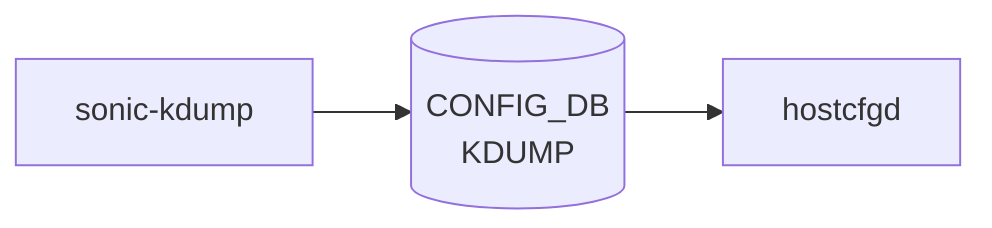

# sonic-kdump YANG

## 概要

- module: `sonic-kdump`
- namespace: `http://github.com/sonic-net/sonic-kdump`
- revision: `2022-05-09`
- import: なし
- top container: `sonic-kdump`

Linux Kernel crash dumping (Kdump) mechanism configuration. Kdump はカーネルクラッシュ時のメモリダンプを取得する。[^1]

<!-- yang-mermaid -->
### データフロー (自動生成)



!!! note "凡例"
    YANG モジュールから CONFIG_DB テーブル経由で subscribe する daemon/orch までを `docs/reference/config-db-orch-map.md` から機械生成したミニ図。詳細・例外は本ページ本文を参照。
<!-- /yang-mermaid -->

## 関連ページ

<!-- yang-xref -->

本 YANG モジュールに対応する CONFIG_DB / CLI / HLD / Topics への相互リンク。`inject_yang_xref.py` により自動生成されます。

### 対応 CONFIG_DB

- [`KDUMP`](../config-db/kdump.md)

### 関連 CLI

- [`config kdump`](../cli/config-kdump.md)

<!-- /yang-xref -->

## ツリー

```
module: sonic-kdump
  +--rw sonic-kdump
     +--rw KDUMP
        +--rw config
           +--rw enabled?       boolean
           +--rw memory?        string
           +--rw num_dumps?     uint8
           +--rw remote?        boolean
           +--rw ssh_string?    string
           +--rw ssh_path?      string
```

## leaf 一覧

| leaf | パス | 型 | 必須 | デフォルト | enum / 範囲 / leafref | 説明 |
|------|------|----|------|-----------|----------------------|------|
| `enabled` | `sonic-kdump/KDUMP/config/enabled` | `boolean` |  |  |  | Enable or Disable the Kdump mechanism. |
| `memory` | `sonic-kdump/KDUMP/config/memory` | `string` |  |  | pattern `(((([0-9]+[MG]?)?(-([0-9]+[MG])?):)?[0-9]+[MG],?)+)` | Memory reserved for loading the crash handler kernel. 可変メモリ予約構文 `<range1>:<size1>,<range2>:<size2>`（例: `512M-2G:64M,2G-:128M`）または絶対値 `512M` `1G`。 |
| `num_dumps` | `sonic-kdump/KDUMP/config/num_dumps` | `uint8` |  |  | range 1..9 | Maximum number of Kernel Core files Stored. |
| `remote` | `sonic-kdump/KDUMP/config/remote` | `boolean` |  |  |  | Enable or Disable the Kdump remote ssh mechanism. |
| `ssh_string` | `sonic-kdump/KDUMP/config/ssh_string` | `string` |  |  | pattern `([a-zA-Z0-9._%+-]+@(host\|IPv4))` | Remote ssh connection string. |
| `ssh_path` | `sonic-kdump/KDUMP/config/ssh_path` | `string` |  |  | pattern `(/[a-zA-Z0-9._-]+)+` | Remote ssh private key path. |

## leafref / 依存

- なし

## augment / deviation

- なし

## 関連 CONFIG_DB / CLI

- [CONFIG_DB](../../reference/glossary.md#term-config_db): `KDUMP|config`
- CLI: `config kdump`

<!-- yang-sibling -->
### 関連 YANG モジュール

意味的に関連する SONiC YANG モジュール (slug prefix / curated group / frontmatter `related.yang` から自動抽出):

- [`sonic-banner`](sonic-banner.md)
- [`sonic-device_metadata`](sonic-device_metadata.md)
- [`sonic-feature`](sonic-feature.md)
- [`sonic-fips`](sonic-fips.md)
- [`sonic-lldp`](sonic-lldp.md)
<!-- /yang-sibling -->

<!-- ref-triangle:start -->

## 関連リファレンス

- [CONFIG_DB](../../reference/glossary.md#term-config_db): [`KDUMP`](../config-db/kdump.md)
- CLI: [`config kdump`](../cli/config-kdump.md)

<!-- ref-triangle:end -->

<!-- ops-hint -->
## 運用ヒント

### 典型的なデプロイ位置

- kernel crash dump (kdump) 設定。`KDUMP|config` を [hostcfgd](../../reference/glossary.md#term-hostcfgd) が `kdump-tools` に反映。

### よくある落とし穴

- `memory` 文字列を `0M-2G:256M,2G-:512M` のような range 式で書く必要があり、空白混在で kdump サービスが起動失敗。

### 関連する config / show コマンド

```bash
sonic-db-cli CONFIG_DB hgetall 'KDUMP|config'
show kdump status
```
<!-- /ops-hint -->

## 引用元

[^1]: `sonic-net/sonic-buildimage` `src/sonic-yang-models/yang-models/sonic-kdump.yang` @ `9ea932ec2e18f35e58268ec2e4456b1d4afd65cd`

<!-- glossary-links-injected: 20dbc11976b6 -->
