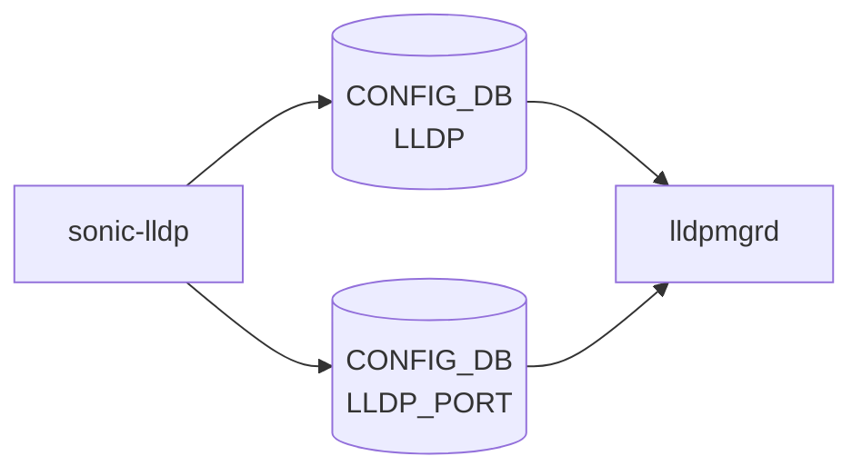

# sonic-lldp YANG

## 概要

- module: `sonic-lldp`
- namespace: `http://github.com/sonic-net/sonic-lldp`
- revision: `2021-07-08`
- import: `sonic-port`
- top container: `sonic-lldp`

[SONiC](../../reference/glossary.md#term-sonic) [LLDP](../../reference/glossary.md#term-lldp) yang model[^1]

<!-- yang-mermaid -->
### データフロー (自動生成)



!!! note "凡例"
    YANG モジュールから CONFIG_DB テーブル経由で subscribe する daemon/orch までを `docs/reference/config-db-orch-map.md` から機械生成したミニ図。詳細・例外は本ページ本文を参照。
<!-- /yang-mermaid -->

## 関連ページ

<!-- yang-xref -->

本 YANG モジュールに対応する CONFIG_DB / CLI / HLD / Topics への相互リンク。`inject_yang_xref.py` により自動生成されます。

### 対応 CONFIG_DB

- [`LLDP`](../config-db/lldp.md)
- [`LLDP_PORT`](../config-db/lldp-port.md)

### 関連 CLI

- [`show lldp`](../cli/show-lldp.md)

<!-- /yang-xref -->

## ツリー

```text
module: sonic-lldp
  +--rw sonic-lldp
     +--rw LLDP
     |  +--rw GLOBAL
     |     +--rw hello_time?                     uint8
     |     +--rw multiplier?                     uint8
     |     +--rw system_name?                    string
     |     +--rw system_description?             string
     |     +--rw supp_mgmt_address_tlv?          boolean
     |     +--rw supp_system_capabilities_tlv?   boolean
     |     +--rw enabled?                        boolean
     |     +--rw mode?                           enumeration
     +--rw LLDP_PORT
        +--rw LLDP_PORT_LIST* [ifname]
           +--rw ifname     -> /prt:sonic-port/PORT/PORT_LIST/name
           +--rw enabled?   boolean
           +--rw mode?      enumeration
```

## container / list 一覧

| 種別 | パス | key | 説明 |
|------|------|-----|------|
| `container` | `sonic-lldp` |  |  |
| `container` | `sonic-lldp/LLDP` |  |  |
| `container` | `sonic-lldp/LLDP/GLOBAL` |  |  |
| `container` | `sonic-lldp/LLDP_PORT` |  |  |
| `list` | `sonic-lldp/LLDP_PORT/LLDP_PORT_LIST` | `ifname` |  |

## leaf 一覧

| leaf | パス | 型 | 必須 | デフォルト | enum / 範囲 / leafref | 説明 |
|------|------|----|------|-----------|----------------------|------|
| `hello_time` | `sonic-lldp/LLDP/GLOBAL/hello_time` | `uint8` |  | 30 | range `5..254` | It is the time interval at which periodic hellos are exchanged. Default is 30 seconds |
| `multiplier` | `sonic-lldp/LLDP/GLOBAL/multiplier` | `uint8` |  | 4 | range `1..10` | This multiplier value is used to determine the timeout interval (i.e. hello-time x multiplier value) after which [LLDP](../../reference/glossary.md#term-lldp) neighbor entry is deleted. |
| `system_name` | `sonic-lldp/LLDP/GLOBAL/system_name` | `string` |  |  |  | System administratively assigned name |
| `system_description` | `sonic-lldp/LLDP/GLOBAL/system_description` | `string` |  |  |  | System description |
| `supp_mgmt_address_tlv` | `sonic-lldp/LLDP/GLOBAL/supp_mgmt_address_tlv` | `boolean` |  | false |  | Suppress sending of Management Address TLV in [LLDP](../../reference/glossary.md#term-lldp) frames |
| `supp_system_capabilities_tlv` | `sonic-lldp/LLDP/GLOBAL/supp_system_capabilities_tlv` | `boolean` |  | false |  | Suppress sending of System Capabilities TLV in LLDP frames |
| `ifname` | `sonic-lldp/LLDP_PORT/LLDP_PORT_LIST/ifname` | `leafref` | yes |  | /prt:sonic-port/prt:PORT/prt:PORT_LIST/prt:name | Reference of port on which LLDP to be configured. |

## leafref / 依存

- `sonic-lldp/LLDP_PORT/LLDP_PORT_LIST/ifname` → `/prt:sonic-port/prt:PORT/prt:PORT_LIST/prt:name`

## augment / deviation

- なし

## 関連 CONFIG_DB / CLI

- [CONFIG_DB](../../reference/glossary.md#term-config_db): `LLDP`
- [CONFIG_DB](../../reference/glossary.md#term-config_db): `LLDP_PORT`
- CLI: `show lldp`

<!-- yang-sibling -->
### 関連 YANG モジュール

意味的に関連する SONiC YANG モジュール (slug prefix / curated group / frontmatter `related.yang` から自動抽出):

- [`sonic-port`](sonic-port.md)
- [`sonic-banner`](sonic-banner.md)
- [`sonic-device_metadata`](sonic-device_metadata.md)
- [`sonic-feature`](sonic-feature.md)
- [`sonic-fips`](sonic-fips.md)
<!-- /yang-sibling -->

<!-- ref-triangle:start -->

## 関連リファレンス

- [CONFIG_DB](../../reference/glossary.md#term-config_db): [`LLDP`](../config-db/lldp.md) / [`LLDP_PORT`](../config-db/lldp-port.md)
- CLI: [`show lldp`](../cli/show-lldp.md)

<!-- ref-triangle:end -->

<!-- ops-hint -->
## 運用ヒント

### 典型的なデプロイ位置

- LLDP デーモン設定。`LLDP` / `LLDP_PORT|<port>` を lldpmgrd が `lldpcli configure` に反映。

### よくある落とし穴

- `hello_time` (5..254) と `multiplier` (1..10) の組み合わせで TTL が決まる (TTL = hello_time × multiplier)。過小値で隣接が flapping する。

### 関連する config / show コマンド

```bash
sonic-db-cli CONFIG_DB hgetall 'LLDP|GLOBAL'
show lldp table
```
<!-- /ops-hint -->

## 引用元

[^1]: `sonic-net/sonic-buildimage` `src/sonic-yang-models/yang-models/sonic-lldp.yang` @ `9ea932ec2e18f35e58268ec2e4456b1d4afd65cd`

<!-- glossary-links-injected: 8ba32e5aa69d -->
