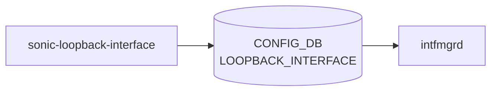

# sonic-loopback-interface YANG

## 概要

- module: `sonic-loopback-interface`
- namespace: `http://github.com/sonic-net/sonic-loopback-interface`
- revision: `2021-04-05`
- import: `sonic-types`, `sonic-vrf`
- top container: `sonic-loopback-interface`

Loopback interface configuration for virtual interfaces used as router IDs and service IPs[^1]

<!-- yang-mermaid -->
### データフロー (自動生成)



!!! note "凡例"
    YANG モジュールから CONFIG_DB テーブル経由で subscribe する daemon/orch までを `docs/reference/config-db-orch-map.md` から機械生成したミニ図。詳細・例外は本ページ本文を参照。
<!-- /yang-mermaid -->

## 関連ページ

<!-- yang-xref -->

本 YANG モジュールに対応する CONFIG_DB / CLI / HLD / Topics への相互リンク。`inject_yang_xref.py` により自動生成されます。

### 対応 CONFIG_DB

- [`LOOPBACK_INTERFACE`](../config-db/loopback-interface.md)

<!-- /yang-xref -->

## ツリー

```text
module: sonic-loopback-interface
  +--rw sonic-loopback-interface
     +--rw LOOPBACK_INTERFACE
        +--rw LOOPBACK_INTERFACE_LIST* [name]
        |  +--rw name            stypes:interface_name
        |  +--rw vrf_name?       -> /vrf:sonic-vrf/VRF/VRF_LIST/name
        |  +--rw nat_zone?       uint8
        |  +--rw admin_status?   stypes:admin_status
        +--rw LOOPBACK_INTERFACE_IPPREFIX_LIST* [name ip-prefix]
           +--rw name         -> ../../LOOPBACK_INTERFACE_LIST/name
           +--rw ip-prefix    union
           +--rw scope?       enumeration
           +--rw family?      stypes:ip-family
```

## leaf 一覧

| leaf | パス | 型 | 必須 | デフォルト | enum / 範囲 / leafref | 説明 |
|------|------|----|------|-----------|----------------------|------|
| `name` | `sonic-loopback-interface/LOOPBACK_INTERFACE/LOOPBACK_INTERFACE_LIST/name` | `stypes:interface_name` | yes |  |  | Loopback interface name (e.g. Loopback0) |
| `vrf_name` | `sonic-loopback-interface/LOOPBACK_INTERFACE/LOOPBACK_INTERFACE_LIST/vrf_name` | `leafref` |  |  | /vrf:sonic-vrf/vrf:[VRF](../../reference/glossary.md#term-vrf)/vrf:VRF_LIST/vrf:name | [VRF](../../reference/glossary.md#term-vrf) instance to which this loopback interface is bound |
| `nat_zone` | `sonic-loopback-interface/LOOPBACK_INTERFACE/LOOPBACK_INTERFACE_LIST/nat_zone` | `uint8` |  | 0 | range 0..3 | [NAT](../../reference/glossary.md#term-nat) Zone for the loopback interface |
| `admin_status` | `sonic-loopback-interface/LOOPBACK_INTERFACE/LOOPBACK_INTERFACE_LIST/admin_status` | `stypes:admin_status` |  | up |  | Administrative state of the loopback interface |
| `name` | `sonic-loopback-interface/LOOPBACK_INTERFACE/LOOPBACK_INTERFACE_IPPREFIX_LIST/name` | `leafref` | yes |  | ../../LOOPBACK_INTERFACE_LIST/name | Loopback interface name |
| `ip-prefix` | `sonic-loopback-interface/LOOPBACK_INTERFACE/LOOPBACK_INTERFACE_IPPREFIX_LIST/ip-prefix` | `union` | yes |  | union(stypes:sonic-ip4-prefix, stypes:sonic-ip6-prefix) | IPv4 or IPv6 address with prefix length assigned to the loopback interface |
| `scope` | `sonic-loopback-interface/LOOPBACK_INTERFACE/LOOPBACK_INTERFACE_IPPREFIX_LIST/scope` | `enumeration` |  |  | global, local | Address scope indicating global or link-local reachability |
| `family` | `sonic-loopback-interface/LOOPBACK_INTERFACE/LOOPBACK_INTERFACE_IPPREFIX_LIST/family` | `stypes:ip-family` |  |  | `IPv4` / `IPv6` (must 制約あり、下記参照) | IP address family, must match the format of ip-prefix。`ip-prefix` の表記と整合させる必要があり、[YANG](../../reference/glossary.md#term-yang) `must` で検証される[^2] |

## leafref / 依存

- `sonic-loopback-interface/LOOPBACK_INTERFACE/LOOPBACK_INTERFACE_LIST/vrf_name` → `/vrf:sonic-vrf/vrf:VRF/vrf:VRF_LIST/vrf:name`
- `sonic-loopback-interface/LOOPBACK_INTERFACE/LOOPBACK_INTERFACE_IPPREFIX_LIST/name` → `../../LOOPBACK_INTERFACE_LIST/name`

## 制約 (must)

`LOOPBACK_INTERFACE_IPPREFIX_LIST/family` には以下の `must` 式が定義されており、`family` と `ip-prefix` の整合性が [YANG](../../reference/glossary.md#term-yang) validation で強制される[^2]:

```yang
must "(contains(../ip-prefix, ':') and current()='IPv6') or
      (contains(../ip-prefix, '.') and current()='IPv4')";
```

意味:

- `ip-prefix` に `:` が含まれる (IPv6 表記) かつ `family='IPv6'`、または
- `ip-prefix` に `.` が含まれる (IPv4 表記) かつ `family='IPv4'`

のいずれかが成立しない場合、設定は [YANG](../../reference/glossary.md#term-yang) validation で reject される。例えば `ip-prefix='10.0.0.1/32'` に対して `family='IPv6'` を指定すると弾かれる。`family` leaf 自体は省略可能 (backward compatibility のため後付け) だが、指定する場合は `ip-prefix` と整合させる必要がある。

## augment / deviation

- なし

## 関連 CONFIG_DB / CLI

- [CONFIG_DB](../../reference/glossary.md#term-config_db): `LOOPBACK_INTERFACE`
- CLI: `config loopback`

<!-- yang-sibling -->
### 関連 YANG モジュール

意味的に関連する SONiC YANG モジュール (slug prefix / curated group / frontmatter `related.yang` から自動抽出):

- [`sonic-interface`](sonic-interface.md)
- [`sonic-vlan-sub-interface`](sonic-vlan-sub-interface.md)
- [`sonic-port`](sonic-port.md)
- [`sonic-bgp-global`](sonic-bgp-global.md)
- [`sonic-mgmt_vrf`](sonic-mgmt_vrf.md)
<!-- /yang-sibling -->

<!-- ref-triangle:start -->

## 関連リファレンス

- [CONFIG_DB](../../reference/glossary.md#term-config_db): [`LOOPBACK_INTERFACE`](../config-db/loopback-interface.md)
- CLI: `config loopback`

<!-- ref-triangle:end -->

## 引用元

[^1]: `sonic-net/sonic-buildimage` `src/sonic-yang-models/yang-models/sonic-loopback-interface.yang` @ `9ea932ec2e18f35e58268ec2e4456b1d4afd65cd`
[^2]: `sonic-net/sonic-buildimage` `src/sonic-yang-models/yang-models/sonic-loopback-interface.yang` L99-L111 (`leaf family` の `must` 式 + 後方互換コメント) @ `9ea932ec2e18f35e58268ec2e4456b1d4afd65cd`

<!-- glossary-links-injected: e7d158f734a4 -->
