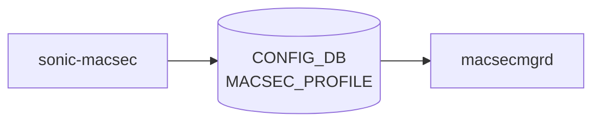

# sonic-macsec YANG

## 概要

- module: `sonic-macsec`
- namespace: `http://github.com/sonic-net/sonic-macsec`
- revision: `2022-04-12`
- import: `sonic-types`
- top container: `sonic-macsec`

IEEE 802.1AE [MACsec](../../reference/glossary.md#term-macsec) のプロファイル（CAK/CKN、cipher、replay protection、rekey 等）を保持する [YANG](../../reference/glossary.md#term-yang) モジュール[^1]。ポートへの紐付けは `sonic-port` の `macsec` リーフ側で行う。

<!-- yang-mermaid -->
### データフロー (自動生成)



!!! note "凡例"
    YANG モジュールから CONFIG_DB テーブル経由で subscribe する daemon/orch までを `docs/reference/config-db-orch-map.md` から機械生成したミニ図。詳細・例外は本ページ本文を参照。
<!-- /yang-mermaid -->

## 関連ページ

<!-- yang-xref -->

本 YANG モジュールに対応する CONFIG_DB / CLI / HLD / Topics への相互リンク。`inject_yang_xref.py` により自動生成されます。

### 対応 CONFIG_DB

- [`MACSEC_PROFILE`](../config-db/macsec-profile.md)

### 関連 HLD

- [FIPS 向け MACsec SAI POST（FIPS_MACSEC_POST_TABLE）](../../switching/sonic-sai-post-support-for-macsec.md)

<!-- /yang-xref -->

## ツリー

```text
module: sonic-macsec
  +--rw sonic-macsec
     +--rw MACSEC_PROFILE
        +--rw MACSEC_PROFILE_LIST* [name]
           +--rw name                    string
           +--rw priority?               uint8
           +--rw cipher_suite?           string
           +--rw primary_cak             string
           +--rw primary_ckn             string
           +--rw fallback_cak?           string
           +--rw fallback_ckn?           string
           +--rw policy?                 string
           +--rw enable_replay_protect?  stypes:boolean_type
           +--rw replay_window?          uint32
           +--rw send_sci?               stypes:boolean_type
           +--rw rekey_period?           uint32
```

## leaf 一覧

| leaf | パス | 型 | 必須 | デフォルト | enum / 範囲 / leafref | 説明 |
|------|------|----|------|-----------|----------------------|------|
| `name` | `sonic-macsec/MACSEC_PROFILE/MACSEC_PROFILE_LIST/name` | `string` | yes |  | length 1..128 | プロファイル名 |
| `priority` | `.../priority` | `uint8` |  | `255` |  | MKA actor priority（小さいほど key server に勝ちやすい） |
| `cipher_suite` | `.../cipher_suite` | `string` |  | `GCM-AES-128` | `GCM-AES-128` / `GCM-AES-256` / `GCM-AES-XPN-128` / `GCM-AES-XPN-256` | [MACsec](../../reference/glossary.md#term-macsec) 暗号スイート |
| `primary_cak` | `.../primary_cak` | `string` | yes |  | hex 66 桁または 130 桁 | プライマリ CAK（Connectivity Association Key） |
| `primary_ckn` | `.../primary_ckn` | `string` | yes |  | hex 32 桁または 64 桁 | プライマリ CKN（CAK Name） |
| `fallback_cak` | `.../fallback_cak` | `string` |  |  | hex 66 桁または 130 桁。must: 長さ 0 または primary_cak と同長 | フォールバック CAK |
| `fallback_ckn` | `.../fallback_ckn` | `string` |  |  | hex 32 桁または 64 桁。must: 空または primary_ckn と異なる | フォールバック CKN |
| `policy` | `.../policy` | `string` |  | `security` | `integrity_only` / `security` | [MACsec](../../reference/glossary.md#term-macsec) ポリシー（暗号化なしの完全性のみ or 完全暗号化） |
| `enable_replay_protect` | `.../enable_replay_protect` | `stypes:boolean_type` |  | `false` |  | リプレイ保護の有効/無効 |
| `replay_window` | `.../replay_window` | `uint32` |  |  | when `enable_replay_protect = 'true'` | リプレイ保護のウィンドウサイズ |
| `send_sci` | `.../send_sci` | `stypes:boolean_type` |  | `true` |  | 送信フレームに SCI を含めるか |
| `rekey_period` | `.../rekey_period` | `uint32` |  | `0` | 秒。0 は無効 | プロアクティブな SAK リフレッシュ周期 |

## leafref / 依存

- なし（must 制約のみ）

## augment / deviation

- なし

## 関連 CONFIG_DB / CLI

- [CONFIG_DB](../../reference/glossary.md#term-config_db): `MACSEC_PROFILE|<name>`
- CLI: `config macsec`

<!-- yang-sibling -->
### 関連 YANG モジュール

意味的に関連する SONiC YANG モジュール (slug prefix / curated group / frontmatter `related.yang` から自動抽出):

- [`sonic-port`](sonic-port.md)
- [`sonic-passw-hardening`](sonic-passw-hardening.md)
- [`sonic-system-aaa`](sonic-system-aaa.md)
<!-- /yang-sibling -->

<!-- ref-triangle:start -->

## 関連リファレンス

- [CONFIG_DB](../../reference/glossary.md#term-config_db): [`MACSEC_PROFILE`](../config-db/macsec-profile.md)
- CLI: `config macsec`

<!-- ref-triangle:end -->

<!-- ops-hint -->
## 運用ヒント

### 典型的なデプロイ位置

- MACsec profile / port 設定。`MACSEC_PROFILE` / `MACSEC_PORT` を macsecmgrd が wpa_supplicant に渡す。

### よくある落とし穴

- `primary_cak` / `primary_ckn` の鍵長 / hex 形式不整合で wpa_supplicant が静かに落ちる。syslog 監視が必須。

### 関連する config / show コマンド

```bash
sonic-db-cli CONFIG_DB keys 'MACSEC_*'
show macsec
```
<!-- /ops-hint -->

## 引用元

[^1]: `sonic-net/sonic-buildimage` `src/sonic-yang-models/yang-models/sonic-macsec.yang` @ `9ea932ec2e18f35e58268ec2e4456b1d4afd65cd`

<!-- glossary-links-injected: eda261e08159 -->
