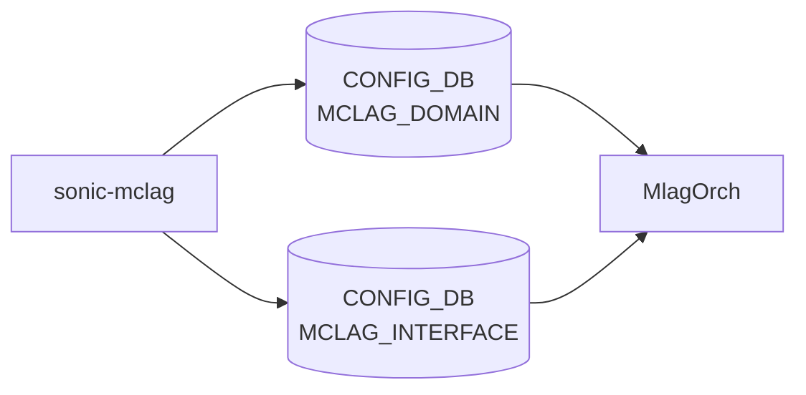

# sonic-mclag YANG

## 概要

- module: `sonic-mclag`
- namespace: `http://github.com/sonic-net/sonic-mclag`
- revision: `2019-10-01`
- import: `ietf-inet-types`, `sonic-port`, `sonic-portchannel`
- top container: `sonic-mclag`

SONIC [MCLAG](../../reference/glossary.md#term-mclag)[^1]

<!-- yang-mermaid -->
### データフロー (自動生成)



!!! note "凡例"
    YANG モジュールから CONFIG_DB テーブル経由で subscribe する daemon/orch までを `docs/reference/config-db-orch-map.md` から機械生成したミニ図。詳細・例外は本ページ本文を参照。
<!-- /yang-mermaid -->

## 関連ページ

<!-- yang-xref -->

本 YANG モジュールに対応する CONFIG_DB / CLI / HLD / Topics への相互リンク。`inject_yang_xref.py` により自動生成されます。

### 対応 CONFIG_DB

- [`MCLAG_DOMAIN`](../config-db/mclag-domain.md)
- [`MCLAG_INTERFACE`](../config-db/mclag-interface.md)
- [`MCLAG_UNIQUE_IP`](../config-db/mclag-unique-ip.md)

### 関連 CLI

- [`config mclag`](../cli/config-mclag.md)

<!-- /yang-xref -->

## ツリー

```text
module: sonic-mclag
  +--rw sonic-mclag
     +--rw MCLAG_DOMAIN
     |  +--rw MCLAG_DOMAIN_LIST* [domain_id]
     |     +--rw domain_id             uint16
     |     +--rw source_ip?            inet:ipv4-address
     |     +--rw peer_ip?              inet:ipv4-address
     |     +--rw peer_link?            union
     |     +--rw keepalive_interval?   uint16
     |     +--rw session_timeout?      uint16
     +--rw MCLAG_INTERFACE
     |  +--rw MCLAG_INTERFACE_LIST* [domain_id if_name]
     |     +--rw domain_id    -> ../../../MCLAG_DOMAIN/MCLAG_DOMAIN_LIST/domain_id
     |     +--rw if_name      -> /lag:sonic-portchannel/PORTCHANNEL/PORTCHANNEL_LIST/name
     |     +--rw if_type?     string
     +--rw MCLAG_UNIQUE_IP
        +--rw MCLAG_UNIQUE_IP_LIST* [if_name]
           +--rw if_name      string
           +--rw unique_ip?   enumeration
```

## leaf 一覧

| leaf | パス | 型 | 必須 | デフォルト | enum / 範囲 / leafref | 説明 |
|------|------|----|------|-----------|----------------------|------|
| `domain_id` | `sonic-mclag/MCLAG_DOMAIN/MCLAG_DOMAIN_LIST/domain_id` | `uint16` | yes |  | range 1..4095 | [MCLAG](../../reference/glossary.md#term-mclag) Domain ID |
| `source_ip` | `sonic-mclag/MCLAG_DOMAIN/MCLAG_DOMAIN_LIST/source_ip` | `inet:ipv4-address` |  |  |  | [MCLAG](../../reference/glossary.md#term-mclag) Domain source ip address for session between MCLAG Peers |
| `peer_ip` | `sonic-mclag/MCLAG_DOMAIN/MCLAG_DOMAIN_LIST/peer_ip` | `inet:ipv4-address` |  |  |  | MCLAG Domain peer ip address for session between MCLAG Peers |
| `peer_link` | `sonic-mclag/MCLAG_DOMAIN/MCLAG_DOMAIN_LIST/peer_link` | `union` |  |  | union(leafref, leafref) | MCLAG Domain peer link, data backup path link between MCLAG peers |
| `keepalive_interval` | `sonic-mclag/MCLAG_DOMAIN/MCLAG_DOMAIN_LIST/keepalive_interval` | `uint16` |  | 1 | range 1..60 | keepalive interval in seconds for MCLAG session between peers |
| `session_timeout` | `sonic-mclag/MCLAG_DOMAIN/MCLAG_DOMAIN_LIST/session_timeout` | `uint16` |  | 30 | range 1..3600 | Session timeout in seconds for MCLAG session between peers |
| `domain_id` | `sonic-mclag/MCLAG_INTERFACE/MCLAG_INTERFACE_LIST/domain_id` | `leafref` | yes |  | ../../../MCLAG_DOMAIN/MCLAG_DOMAIN_LIST/domain_id | Reference to the MCLAG domain this interface belongs to |
| `if_name` | `sonic-mclag/MCLAG_INTERFACE/MCLAG_INTERFACE_LIST/if_name` | `leafref` | yes |  | /lag:sonic-portchannel/lag:PORTCHANNEL/lag:PORTCHANNEL_LIST/lag:name | MCLAG interface name |
| `if_type` | `sonic-mclag/MCLAG_INTERFACE/MCLAG_INTERFACE_LIST/if_type` | `string` |  |  |  | MCLAG interface type, placeholder field to create instance |
| `if_name` | `sonic-mclag/MCLAG_UNIQUE_IP/MCLAG_UNIQUE_IP_LIST/if_name` | `string` | yes |  | pattern `Vlan([0-9]{1,3}|[1-3][0-9]{3}|[4][0][0-8][0-9]|[4][0][9][...` | Vlan interface name on which MCLAG unique ip config is done |
| `unique_ip` | `sonic-mclag/MCLAG_UNIQUE_IP/MCLAG_UNIQUE_IP_LIST/unique_ip` | `enumeration` |  |  | enable | unique ip enable, by default disable |

## leafref / 依存

- `sonic-mclag/MCLAG_INTERFACE/MCLAG_INTERFACE_LIST/domain_id` → `../../../MCLAG_DOMAIN/MCLAG_DOMAIN_LIST/domain_id`
- `sonic-mclag/MCLAG_INTERFACE/MCLAG_INTERFACE_LIST/if_name` → `/lag:sonic-portchannel/lag:PORTCHANNEL/lag:PORTCHANNEL_LIST/lag:name`

## augment / deviation

- なし

## 関連 CONFIG_DB / CLI

- [CONFIG_DB](../../reference/glossary.md#term-config_db): `MCLAG_DOMAIN`
- [CONFIG_DB](../../reference/glossary.md#term-config_db): `MCLAG_INTERFACE`
- [CONFIG_DB](../../reference/glossary.md#term-config_db): `MCLAG_UNIQUE_IP`
- CLI: `config mclag`

<!-- yang-sibling -->
### 関連 YANG モジュール

意味的に関連する SONiC YANG モジュール (slug prefix / curated group / frontmatter `related.yang` から自動抽出):

- [`sonic-port`](sonic-port.md)
- [`sonic-portchannel`](sonic-portchannel.md)
- [`sonic-vlan`](sonic-vlan.md)
- [`sonic-spanning-tree`](sonic-spanning-tree.md)
- [`sonic-storm-control`](sonic-storm-control.md)
<!-- /yang-sibling -->

<!-- ref-triangle:start -->

## 関連リファレンス

- CONFIG_DB: [`MCLAG_DOMAIN`](../config-db/mclag-domain.md) / `MCLAG_INTERFACE` / `MCLAG_UNIQUE_IP`
- CLI: [`config mclag`](../cli/config-mclag.md)

<!-- ref-triangle:end -->

## 引用元

[^1]: `sonic-net/sonic-buildimage` `src/sonic-yang-models/yang-models/sonic-mclag.yang` @ `9ea932ec2e18f35e58268ec2e4456b1d4afd65cd`

<!-- glossary-links-injected: 26ca9e81c971 -->
