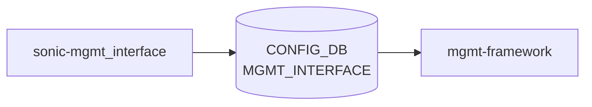

# sonic-mgmt_interface YANG

## 概要

- module: `sonic-mgmt_interface`
- namespace: `http://github.com/sonic-net/sonic-mgmt_interface`
- revision: `2021-04-07`
- import: `sonic-mgmt_port`, `ietf-inet-types`, `sonic-types`
- top container: `sonic-mgmt_interface`

OOB マネジメントインタフェース（`eth0` 等）の IP アドレス・デフォルトゲートウェイ・強制ルートを定義する [YANG](../../reference/glossary.md#term-yang) モジュール[^1]。

<!-- yang-mermaid -->
### データフロー (自動生成)



!!! note "凡例"
    YANG モジュールから CONFIG_DB テーブル経由で subscribe する daemon/orch までを `docs/reference/config-db-orch-map.md` から機械生成したミニ図。詳細・例外は本ページ本文を参照。
<!-- /yang-mermaid -->

## 関連ページ

<!-- yang-xref -->

本 YANG モジュールに対応する CONFIG_DB / CLI / HLD / Topics への相互リンク。`inject_yang_xref.py` により自動生成されます。

### 対応 CONFIG_DB

- [`MGMT_INTERFACE`](../config-db/mgmt-interface.md)

<!-- /yang-xref -->

## ツリー

```text
module: sonic-mgmt_interface
  +--rw sonic-mgmt_interface
     +--rw MGMT_INTERFACE
        +--rw MGMT_INTERFACE_LIST* [name ip_prefix]
           +--rw name                  -> /mgmtprt:sonic-mgmt_port/MGMT_PORT/MGMT_PORT_LIST/name
           +--rw ip_prefix             stypes:sonic-ip-prefix
           +--rw gwaddr?               inet:ip-address
           +--rw forced_mgmt_routes*   union(stypes:sonic-ip-prefix, inet:ip-address)
```

## leaf 一覧

| leaf | パス | 型 | 必須 | デフォルト | enum / 範囲 / leafref | 説明 |
|------|------|----|------|-----------|----------------------|------|
| `name` | `sonic-mgmt_interface/MGMT_INTERFACE/MGMT_INTERFACE_LIST/name` | `leafref` | yes |  | `/mgmtprt:sonic-mgmt_port/MGMT_PORT/MGMT_PORT_LIST/name` | 対象マネジメントポート名（`eth0` 等） |
| `ip_prefix` | `sonic-mgmt_interface/MGMT_INTERFACE/MGMT_INTERFACE_LIST/ip_prefix` | `stypes:sonic-ip-prefix` | yes |  | must: `gwaddr` と family が一致 | マネジメントインタフェース IP/プレフィックス |
| `gwaddr` | `sonic-mgmt_interface/MGMT_INTERFACE/MGMT_INTERFACE_LIST/gwaddr` | `inet:ip-address` |  |  | must: `ip_prefix` と family が一致 | デフォルトゲートウェイアドレス |
| `forced_mgmt_routes` | `sonic-mgmt_interface/MGMT_INTERFACE/MGMT_INTERFACE_LIST/forced_mgmt_routes` | `leaf-list union(sonic-ip-prefix, ip-address)` |  |  | ordered-by user | デフォルト [VRF](../../reference/glossary.md#term-vrf) または management [VRF](../../reference/glossary.md#term-vrf) に追加する強制ルート（`interfaces.j2` で展開） |

## leafref / 依存

- `MGMT_INTERFACE_LIST/name` → `sonic-mgmt_port` の `MGMT_PORT_LIST/name`

## augment / deviation

- なし

## 関連 CONFIG_DB / CLI

- [CONFIG_DB](../../reference/glossary.md#term-config_db): `MGMT_INTERFACE|<name>|<ip_prefix>`
- CLI: `config interface ip add eth0 <addr>`

<!-- yang-sibling -->
### 関連 YANG モジュール

意味的に関連する SONiC YANG モジュール (slug prefix / curated group / frontmatter `related.yang` から自動抽出):

- [`sonic-mgmt_port`](sonic-mgmt_port.md)
- [`sonic-mgmt_vrf`](sonic-mgmt_vrf.md)
- [`sonic-breakout_cfg`](sonic-breakout_cfg.md)
- [`sonic-fabric-port`](sonic-fabric-port.md)
- [`sonic-interface`](sonic-interface.md)
<!-- /yang-sibling -->

<!-- ref-triangle:start -->

## 関連リファレンス

- [CONFIG_DB](../../reference/glossary.md#term-config_db): [`MGMT_INTERFACE`](../config-db/mgmt-interface.md)
- CLI: [`config interface ip`](../cli/config-interface.md)

<!-- ref-triangle:end -->

<!-- ops-hint -->
## 運用ヒント

### 典型的なデプロイ位置

- Management interface の IP / GW 設定。`MGMT_INTERFACE|eth0|<prefix>` を [hostcfgd](../../reference/glossary.md#term-hostcfgd) / networking が処理。

### よくある落とし穴

- `gwaddr` leaf に同一サブネット外の GW を入れると default route が適用されない。

### 関連する config / show コマンド

```bash
sonic-db-cli CONFIG_DB keys 'MGMT_INTERFACE|*'
show management_interface address
```
<!-- /ops-hint -->

## 引用元

[^1]: `sonic-net/sonic-buildimage` `src/sonic-yang-models/yang-models/sonic-mgmt_interface.yang` @ `9ea932ec2e18f35e58268ec2e4456b1d4afd65cd`

<!-- glossary-links-injected: 20dbc11976b6 -->
