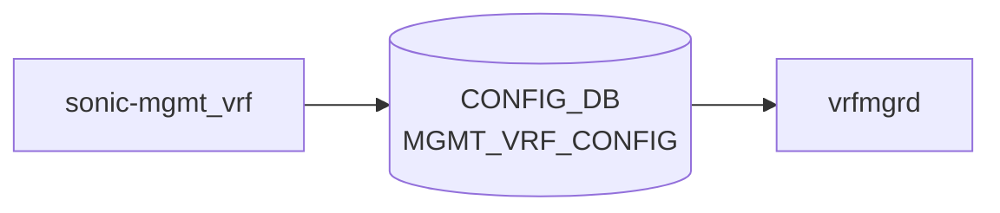

# sonic-mgmt_vrf YANG

## 概要

- module: `sonic-mgmt_vrf`
- namespace: `http://github.com/sonic-net/sonic-mgmt_vrf`
- revision: `2021-04-07`
- import: なし
- top container: `sonic-mgmt_vrf`

マネジメント [VRF](../../reference/glossary.md#term-vrf) (mgmt traffic を data-plane と分離する [VRF](../../reference/glossary.md#term-vrf)) のグローバル有効/無効を保持する [YANG](../../reference/glossary.md#term-yang) モジュール[^1]。

<!-- yang-mermaid -->
### データフロー (自動生成)



!!! note "凡例"
    YANG モジュールから CONFIG_DB テーブル経由で subscribe する daemon/orch までを `docs/reference/config-db-orch-map.md` から機械生成したミニ図。詳細・例外は本ページ本文を参照。
<!-- /yang-mermaid -->

## 関連ページ

<!-- yang-xref -->

本 YANG モジュールに対応する CONFIG_DB / CLI / HLD / Topics への相互リンク。`inject_yang_xref.py` により自動生成されます。

### 対応 CONFIG_DB

- [`MGMT_VRF_CONFIG`](../config-db/mgmt-vrf-config.md)

### 関連 CLI

- [`config vrf`](../cli/config-vrf.md)

### 関連 YANG

- [sonic-ntp YANG](../../reference/yang/sonic-ntp.md)
- [sonic-snmp YANG](../../reference/yang/sonic-snmp.md)
- [sonic-vrf YANG](../../reference/yang/sonic-vrf.md)

<!-- /yang-xref -->

## ツリー

```text
module: sonic-mgmt_vrf
  +--rw sonic-mgmt_vrf
     +--rw MGMT_VRF_CONFIG
        +--rw vrf_global
           +--rw mgmtVrfEnabled?   boolean
```

## leaf 一覧

| leaf | パス | 型 | 必須 | デフォルト | enum / 範囲 / leafref | 説明 |
|------|------|----|------|-----------|----------------------|------|
| `mgmtVrfEnabled` | `sonic-mgmt_vrf/MGMT_VRF_CONFIG/vrf_global/mgmtVrfEnabled` | `boolean` |  | `false` |  | マネジメント [VRF](../../reference/glossary.md#term-vrf) の有効/無効 |

## leafref / 依存

- なし

## augment / deviation

- なし

## 関連 CONFIG_DB / CLI

- [CONFIG_DB](../../reference/glossary.md#term-config_db): `MGMT_VRF_CONFIG|vrf_global`
- CLI: `config vrf add mgmt`

<!-- yang-sibling -->
### 関連 YANG モジュール

意味的に関連する SONiC YANG モジュール (slug prefix / curated group / frontmatter `related.yang` から自動抽出):

- [`sonic-mgmt_interface`](sonic-mgmt_interface.md)
- [`sonic-mgmt_port`](sonic-mgmt_port.md)
- [`sonic-bgp-global`](sonic-bgp-global.md)
- [`sonic-interface`](sonic-interface.md)
- [`sonic-loopback-interface`](sonic-loopback-interface.md)
<!-- /yang-sibling -->

<!-- ref-triangle:start -->

## 関連リファレンス

- [CONFIG_DB](../../reference/glossary.md#term-config_db): [`MGMT_VRF_CONFIG`](../config-db/mgmt-vrf-config.md)
- CLI: [`config vrf`](../cli/config-vrf.md)

<!-- ref-triangle:end -->

<!-- ops-hint -->
## 運用ヒント

### 典型的なデプロイ位置

- management VRF 制御。`MGMT_VRF_CONFIG|vrf_global` を [hostcfgd](../../reference/glossary.md#term-hostcfgd) が iproute2 + iptables に反映。

### よくある落とし穴

- mgmt-vrf を有効化すると eth0 が `mgmt` netns 相当のルーティングテーブルに移動。SSH / DNS / NTP 個別に VRF 対応必要。

### 関連する config / show コマンド

```bash
sonic-db-cli CONFIG_DB hgetall 'MGMT_VRF_CONFIG|vrf_global'
show mgmt-vrf
```
<!-- /ops-hint -->

## 引用元

[^1]: `sonic-net/sonic-buildimage` `src/sonic-yang-models/yang-models/sonic-mgmt_vrf.yang` @ `9ea932ec2e18f35e58268ec2e4456b1d4afd65cd`

<!-- glossary-links-injected: 20dbc11976b6 -->
