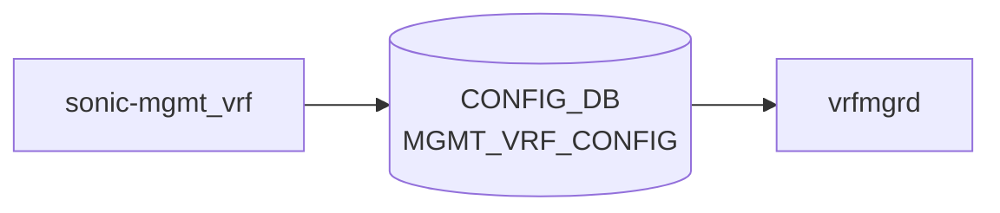

# sonic-mgmt_vrf YANG

## 概要

- module: `sonic-mgmt_vrf`
- namespace: `http://github.com/sonic-net/sonic-mgmt_vrf`
- revision: `2021-04-07`
- import: なし
- top container: `sonic-mgmt_vrf`

マネジメント VRF (mgmt traffic を data-plane と分離する VRF) のグローバル有効/無効を保持する YANG モジュール[^1]。

<!-- yang-mermaid -->
### データフロー (自動生成)



!!! note "凡例"
    YANG モジュールから CONFIG_DB テーブル経由で subscribe する daemon/orch までを `docs/reference/config-db-orch-map.md` から機械生成したミニ図。詳細・例外は本ページ本文を参照。
<!-- /yang-mermaid -->

## ツリー

```
module: sonic-mgmt_vrf
  +--rw sonic-mgmt_vrf
     +--rw MGMT_VRF_CONFIG
        +--rw vrf_global
           +--rw mgmtVrfEnabled?   boolean
```

## leaf 一覧

| leaf | パス | 型 | 必須 | デフォルト | enum / 範囲 / leafref | 説明 |
|------|------|----|------|-----------|----------------------|------|
| `mgmtVrfEnabled` | `sonic-mgmt_vrf/MGMT_VRF_CONFIG/vrf_global/mgmtVrfEnabled` | `boolean` |  | `false` |  | マネジメント VRF の有効/無効 |

## leafref / 依存

- なし

## augment / deviation

- なし

## 関連 CONFIG_DB / CLI

- CONFIG_DB: `MGMT_VRF_CONFIG|vrf_global`
- CLI: `config vrf add mgmt`

<!-- ref-triangle:start -->

## 関連リファレンス

- CONFIG_DB: [`MGMT_VRF_CONFIG`](../config-db/mgmt-vrf-config.md)
- CLI: [`config vrf`](../cli/config-vrf.md)

<!-- ref-triangle:end -->

## 引用元

[^1]: `sonic-net/sonic-buildimage` `src/sonic-yang-models/yang-models/sonic-mgmt_vrf.yang` @ `9ea932ec2e18f35e58268ec2e4456b1d4afd65cd`
