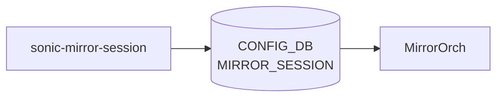

# sonic-mirror-session YANG

## 概要

- module: `sonic-mirror-session`
- namespace: `http://github.com/sonic-net/sonic-mirror-session`
- revision: `2021-06-15`
- import: `ietf-inet-types`, `sonic-port`, `sonic-policer`
- top container: `sonic-mirror-session`

[SONiC](../../reference/glossary.md#term-sonic) Mirror session yang model[^1]

<!-- yang-mermaid -->
### データフロー (自動生成)



!!! note "凡例"
    YANG モジュールから CONFIG_DB テーブル経由で subscribe する daemon/orch までを `docs/reference/config-db-orch-map.md` から機械生成したミニ図。詳細・例外は本ページ本文を参照。
<!-- /yang-mermaid -->

## 関連ページ

<!-- yang-xref -->

本 YANG モジュールに対応する CONFIG_DB / CLI / HLD / Topics への相互リンク。`inject_yang_xref.py` により自動生成されます。

### 対応 CONFIG_DB

- [`MIRROR_SESSION`](../config-db/mirror-session.md)

### 関連 HLD

- [POLICER テーブル](../../reference/config-db/policer.md)

<!-- /yang-xref -->

## ツリー

```text
module: sonic-mirror-session
  +--rw sonic-mirror-session
     +--rw MIRROR_SESSION
        +--rw MIRROR_SESSION_LIST* [name]
           +--rw name         string
           +--rw type?        session_type
           +--rw src_ip?      inet:ip-address
           +--rw dst_ip?      inet:ip-address
           +--rw gre_type?    string
           +--rw dscp?        uint8
           +--rw ttl?         uint8
           +--rw queue?       uint8
           +--rw dst_port?    union
           +--rw src_port?    string
           +--rw direction?   session_direction
           +--rw policer?     -> /policer:sonic-policer/POLICER/POLICER_LIST/name
```

## leaf 一覧

| leaf | パス | 型 | 必須 | デフォルト | enum / 範囲 / leafref | 説明 |
|------|------|----|------|-----------|----------------------|------|
| `name` | `sonic-mirror-session/MIRROR_SESSION/MIRROR_SESSION_LIST/name` | `string` | yes |  | pattern `[a-zA-Z0-9]{1}([-a-zA-Z0-9_]{0,31})` | Mirror session name. |
| `type` | `sonic-mirror-session/MIRROR_SESSION/MIRROR_SESSION_LIST/type` | `session_type` |  | ERSPAN |  | Mirror session type. |
| `src_ip` | `sonic-mirror-session/MIRROR_SESSION/MIRROR_SESSION_LIST/src_ip` | `inet:ip-address` |  |  |  | ERSPAN source ip. This IP will be set as source ip in outer header of mirrored frame |
| `dst_ip` | `sonic-mirror-session/MIRROR_SESSION/MIRROR_SESSION_LIST/dst_ip` | `inet:ip-address` |  |  |  | ERSPAN destination ip. Mirrored frames will be routed to this destination. This IP will be set as destination ip in outer header of mirrored frame |
| `gre_type` | `sonic-mirror-session/MIRROR_SESSION/MIRROR_SESSION_LIST/gre_type` | `string` |  | 0x88be | pattern `0[xX][0-9a-fA-F]*|([0-9]|[1-5]?[0-9]{2,4}|6[1-4][0-9]{3}|...` | ERSPAN outer header GRE type. |
| `dscp` | `sonic-mirror-session/MIRROR_SESSION/MIRROR_SESSION_LIST/dscp` | `uint8` |  |  | range 0..63 | ERSPAN outer header [DSCP](../../reference/glossary.md#term-dscp) value. Mirrored frames will be sent with configured [DSCP](../../reference/glossary.md#term-dscp) value |
| `ttl` | `sonic-mirror-session/MIRROR_SESSION/MIRROR_SESSION_LIST/ttl` | `uint8` |  |  | range 0..255 | ERSPAN outer header TTL value. Mirrored frames will be sent with configured TTL value |
| `queue` | `sonic-mirror-session/MIRROR_SESSION/MIRROR_SESSION_LIST/queue` | `uint8` |  |  |  | ERSPAN Queue. Mirrored frames will be sent to this queue |
| `dst_port` | `sonic-mirror-session/MIRROR_SESSION/MIRROR_SESSION_LIST/dst_port` | `union` |  |  | union(leafref, string) | Destination port configuration for port mirroring(SPAN). |
| `src_port` | `sonic-mirror-session/MIRROR_SESSION/MIRROR_SESSION_LIST/src_port` | `string` |  |  | length 1..2048 | Source port configuration for mirroring. Can be configured for both SPAN/ERSPAN. Supports both port and port-channel as arguments |
| `direction` | `sonic-mirror-session/MIRROR_SESSION/MIRROR_SESSION_LIST/direction` | `session_direction` |  | BOTH |  | Direction configuration for mirroring. Can be configured for both SPAN/ERSPAN. Supports rx/tx/both as direction config.   RX: Captures frames ingressing on source port.   TX: Captures frames egress... |
| `policer` | `sonic-mirror-session/MIRROR_SESSION/MIRROR_SESSION_LIST/policer` | `leafref` |  |  | /policer:sonic-policer/policer:POLICER/policer:POLICER_LIST/policer:name | [Policer](../../reference/glossary.md#term-policer) to be applied for the mirrored traffic. |

## leafref / 依存

- `sonic-mirror-session/MIRROR_SESSION/MIRROR_SESSION_LIST/policer` → `/policer:sonic-policer/policer:POLICER/policer:POLICER_LIST/policer:name`

## augment / deviation

- なし

## 関連 CONFIG_DB / CLI

- [CONFIG_DB](../../reference/glossary.md#term-config_db): `MIRROR_SESSION`
- CLI: `config mirror_session`

<!-- yang-sibling -->
### 関連 YANG モジュール

意味的に関連する SONiC YANG モジュール (slug prefix / curated group / frontmatter `related.yang` から自動抽出):

- [`sonic-port`](sonic-port.md)
- [`sonic-copp`](sonic-copp.md)
- [`sonic-debug-counter`](sonic-debug-counter.md)
- [`sonic-pbh`](sonic-pbh.md)
<!-- /yang-sibling -->

<!-- ref-triangle:start -->

## 関連リファレンス

- [CONFIG_DB](../../reference/glossary.md#term-config_db): [`MIRROR_SESSION`](../config-db/mirror-session.md)
- CLI: [`config mirror_session`](../cli/config-mirror-session.md)

<!-- ref-triangle:end -->

<!-- ops-hint -->
## 運用ヒント

### 典型的なデプロイ位置

- ERSPAN / SPAN ミラーセッション。`MIRROR_SESSION|<name>` を mirrororch が [SAI](../../reference/glossary.md#term-sai) mirror session に反映。

### よくある落とし穴

- `dst_ip` leafref に loopback IP を入れる構成で、loopback 削除 → mirror session が orphan 化して route lookup 失敗を起こす。

### 関連する config / show コマンド

```bash
sonic-db-cli CONFIG_DB keys 'MIRROR_SESSION|*'
show mirror_session
```
<!-- /ops-hint -->

## 引用元

[^1]: `sonic-net/sonic-buildimage` `src/sonic-yang-models/yang-models/sonic-mirror-session.yang` @ `9ea932ec2e18f35e58268ec2e4456b1d4afd65cd`


<!-- topics-back-ref -->
## 関連 Topics

- [Topics: ACL / CoPP / Mirror / Packet Action](../../topics/07-acl-copp-mirror/index.md)

<!-- /topics-back-ref -->

<!-- glossary-links-injected: 8ba32e5aa69d -->
