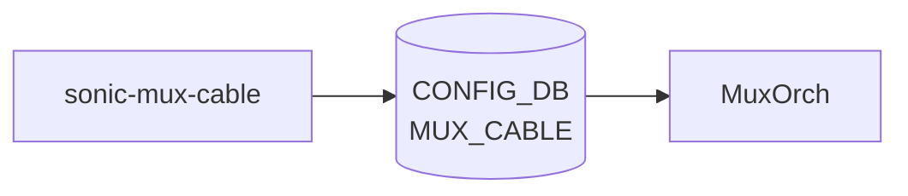

# sonic-mux-cable YANG

## 概要

- module: `sonic-mux-cable`
- namespace: `http://github.com/sonic-net/sonic-mux-cable`
- revision: `2022-08-19`
- import: `ietf-inet-types`, `sonic-port`
- top container: `sonic-mux-cable`

DualToR 構成における [MUX](../../reference/glossary.md#term-mux) cable のポート別状態（cable type, prober, neighbor, server/SoC IP, [MUX](../../reference/glossary.md#term-mux) state）を保持する[^1]。

<!-- yang-mermaid -->
### データフロー (自動生成)



!!! note "凡例"
    YANG モジュールから CONFIG_DB テーブル経由で subscribe する daemon/orch までを `docs/reference/config-db-orch-map.md` から機械生成したミニ図。詳細・例外は本ページ本文を参照。
<!-- /yang-mermaid -->

## 関連ページ

<!-- yang-xref -->

本 YANG モジュールに対応する CONFIG_DB / CLI / HLD / Topics への相互リンク。`inject_yang_xref.py` により自動生成されます。

### 対応 CONFIG_DB

- [`MUX_CABLE`](../config-db/mux-cable.md)

### 関連 HLD

- [gRPC client（active-active DualToR / ycabled ↔ SoC 連携）](../../management/design-doc.md)

<!-- /yang-xref -->

## ツリー

```text
module: sonic-mux-cable
  +--rw sonic-mux-cable
     +--rw MUX_CABLE
        +--rw MUX_CABLE_LIST* [ifname]
           +--rw ifname           -> /prt:sonic-port/PORT/PORT_LIST/name
           +--rw cable_type?      enumeration
           +--rw prober_type?     enumeration
           +--rw neighbor_mode?   enumeration
           +--rw server_ipv4?     inet:ipv4-prefix
           +--rw server_ipv6?     inet:ipv6-prefix
           +--rw soc_ipv4?        inet:ipv4-prefix
           +--rw soc_ipv6?        inet:ipv6-prefix
           +--rw state?           enumeration
```

## leaf 一覧

| leaf | パス | 型 | 必須 | デフォルト | enum / 範囲 / leafref | 説明 |
|------|------|----|------|-----------|----------------------|------|
| `ifname` | `sonic-mux-cable/MUX_CABLE/MUX_CABLE_LIST/ifname` | `leafref` | yes |  | /prt:sonic-port/prt:PORT/prt:PORT_LIST/prt:name | Port on which [MUX](../../reference/glossary.md#term-mux) cable is configured |
| `cable_type` | `sonic-mux-cable/MUX_CABLE/MUX_CABLE_LIST/cable_type` | `enumeration` |  |  | active-active, active-standby | [SONiC](../../reference/glossary.md#term-sonic) DualToR interface cable type |
| `prober_type` | `sonic-mux-cable/MUX_CABLE/MUX_CABLE_LIST/prober_type` | `enumeration` |  |  | active, passive | DualToR LinkMgrd ICMP prober mode |
| `neighbor_mode` | `sonic-mux-cable/MUX_CABLE/MUX_CABLE_LIST/neighbor_mode` | `enumeration` |  |  |  | DualToR MUX neighbor mode |
| `server_ipv4` | `sonic-mux-cable/MUX_CABLE/MUX_CABLE_LIST/server_ipv4` | `inet:ipv4-prefix` |  |  |  | Server IPv4 address |
| `server_ipv6` | `sonic-mux-cable/MUX_CABLE/MUX_CABLE_LIST/server_ipv6` | `inet:ipv6-prefix` |  |  |  | Server IPv6 address |
| `soc_ipv4` | `sonic-mux-cable/MUX_CABLE/MUX_CABLE_LIST/soc_ipv4` | `inet:ipv4-prefix` |  |  |  | SoC IPv4 address (active-active only) |
| `soc_ipv6` | `sonic-mux-cable/MUX_CABLE/MUX_CABLE_LIST/soc_ipv6` | `inet:ipv6-prefix` |  |  |  | SoC IPv6 address (active-active only) |
| `state` | `sonic-mux-cable/MUX_CABLE/MUX_CABLE_LIST/state` | `enumeration` |  |  | active, standby, auto, manual | MUX mode determining if auto failover is enabled |

## leafref / 依存

- `sonic-mux-cable/MUX_CABLE/MUX_CABLE_LIST/ifname` → `/prt:sonic-port/prt:PORT/prt:PORT_LIST/prt:name`

## augment / deviation

- なし

## 関連 CONFIG_DB / CLI

- [CONFIG_DB](../../reference/glossary.md#term-config_db): `MUX_CABLE`
- CLI: `config mux`, `show mux`

<!-- yang-sibling -->
### 関連 YANG モジュール

意味的に関連する SONiC YANG モジュール (slug prefix / curated group / frontmatter `related.yang` から自動抽出):

- [`sonic-port`](sonic-port.md)
- [`sonic-tunnel`](sonic-tunnel.md)
- [`sonic-nvgre-tunnel`](sonic-nvgre-tunnel.md)
- [`sonic-srv6`](sonic-srv6.md)
- [`sonic-vnet`](sonic-vnet.md)
<!-- /yang-sibling -->

<!-- ref-triangle:start -->

## 関連リファレンス

- [CONFIG_DB](../../reference/glossary.md#term-config_db): [`MUX_CABLE`](../config-db/mux-cable.md)
- CLI: `config mux` / `show mux`

<!-- ref-triangle:end -->

## 引用元

[^1]: `sonic-net/sonic-buildimage` `src/sonic-yang-models/yang-models/sonic-mux-cable.yang` @ `9ea932ec2e18f35e58268ec2e4456b1d4afd65cd`

<!-- glossary-links-injected: 8ba32e5aa69d -->
