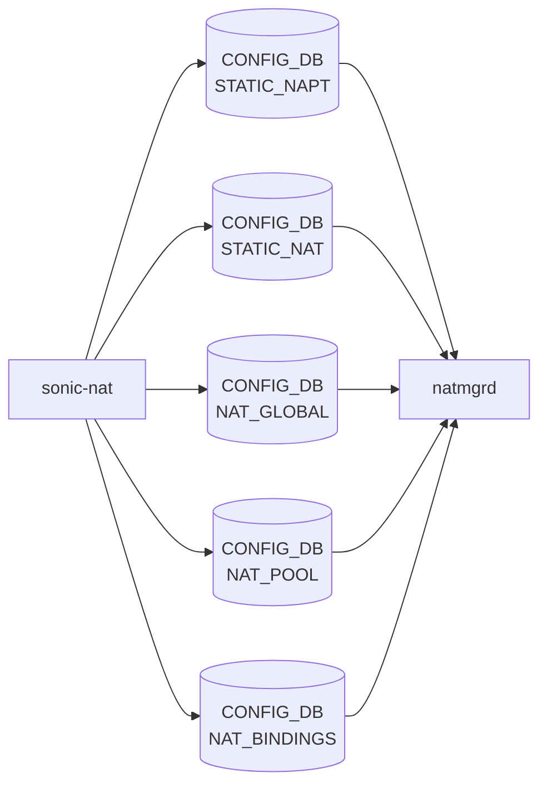

# sonic-nat YANG

## 概要

- module: `sonic-nat`
- namespace: `http://github.com/sonic-net/sonic-nat`
- revision: `2021-03-14`
- import: `ietf-inet-types`, `sonic-types`
- top container: `sonic-nat`

SONiC [NAT](../../reference/glossary.md#term-nat) yang model[^1]

<!-- yang-mermaid -->
### データフロー (自動生成)



!!! note "凡例"
    YANG モジュールから CONFIG_DB テーブル経由で subscribe する daemon/orch までを `docs/reference/config-db-orch-map.md` から機械生成したミニ図。詳細・例外は本ページ本文を参照。
<!-- /yang-mermaid -->

## 関連ページ

<!-- yang-xref -->

本 YANG モジュールに対応する CONFIG_DB / CLI / HLD / Topics への相互リンク。`inject_yang_xref.py` により自動生成されます。

### 対応 CONFIG_DB

- [`NAT_POOL`](../config-db/nat-pool.md)
- [`NAT_BINDINGS`](../config-db/nat-bindings.md)

### 関連 CLI

- [`config nat`](../cli/config-nat.md)

<!-- /yang-xref -->

## ツリー

```text
module: sonic-nat
  +--rw sonic-nat
     +--rw STATIC_NAPT
     |  +--rw STATIC_NAPT_LIST* [global_ip ip_protocol global_l4_port]
     |     +--rw global_ip         inet:ipv4-address
     |     +--rw ip_protocol       stypes:ip-protocol-type
     |     +--rw global_l4_port    inet:port-number
     |     +--rw local_ip          inet:ipv4-address
     |     +--rw local_port        inet:port-number
     |     +--rw nat_type?         nat-type
     |     +--rw twice_nat_id?     uint16
     +--rw STATIC_NAT
     |  +--rw STATIC_NAT_LIST* [global_ip]
     |     +--rw global_ip       inet:ipv4-address
     |     +--rw local_ip        inet:ipv4-address
     |     +--rw nat_type?       nat-type
     |     +--rw twice_nat_id?   uint16
     +--rw NAT_GLOBAL
     |  +--rw Values
     |     +--rw admin_mode?        stypes:admin_mode
     |     +--rw nat_timeout?       uint32
     |     +--rw nat_tcp_timeout?   uint32
     |     +--rw nat_udp_timeout?   uint16
     +--rw NAT_POOL
     |  +--rw NAT_POOL_LIST* [name]
     |     +--rw name        string
     |     +--rw nat_ip      ip-address-range
     |     +--rw nat_port?   string
     +--rw NAT_BINDINGS
        +--rw NAT_BINDINGS_LIST* [name]
           +--rw name            string
           +--rw nat_pool        -> ../../../NAT_POOL/NAT_POOL_LIST/name
           +--rw nat_type?       nat-type
           +--rw twice_nat_id?   uint16
```

## container / list 一覧

| 種別 | パス | key | 説明 |
|------|------|-----|------|
| `container` | `sonic-nat` |  |  |
| `container` | `sonic-nat/STATIC_NAPT` |  | Static NAPT entries mapping global IP/port to local IP/port |
| `list` | `sonic-nat/STATIC_NAPT/STATIC_NAPT_LIST` | `global_ip ip_protocol global_l4_port` |  |
| `container` | `sonic-nat/STATIC_NAT` |  | Static [NAT](../../reference/glossary.md#term-nat) entries mapping global IP to local IP |
| `list` | `sonic-nat/STATIC_NAT/STATIC_NAT_LIST` | `global_ip` |  |
| `container` | `sonic-nat/NAT_GLOBAL` |  | Global [NAT](../../reference/glossary.md#term-nat) settings including admin mode and timeouts |
| `container` | `sonic-nat/NAT_GLOBAL/Values` |  | Global NAT parameter values |
| `container` | `sonic-nat/NAT_POOL` |  | NAT address pools defining IP and port ranges for dynamic NAT |
| `list` | `sonic-nat/NAT_POOL/NAT_POOL_LIST` | `name` |  |
| `container` | `sonic-nat/NAT_BINDINGS` |  | NAT bindings associating ACLs with NAT pools for dynamic translation |
| `list` | `sonic-nat/NAT_BINDINGS/NAT_BINDINGS_LIST` | `name` |  |

## leaf 一覧

| leaf | パス | 型 | 必須 | デフォルト | enum / 範囲 / leafref | 説明 |
|------|------|----|------|-----------|----------------------|------|
| `global_ip` | `sonic-nat/STATIC_NAPT/STATIC_NAPT_LIST/global_ip` | `inet:ipv4-address` | yes |  |  | Global ip for the Static NAPT entry. |
| `ip_protocol` | `sonic-nat/STATIC_NAPT/STATIC_NAPT_LIST/ip_protocol` | `stypes:ip-protocol-type` | yes |  |  | IP Protocol (tcp or udp) for the Static NAPT entry. |
| `global_l4_port` | `sonic-nat/STATIC_NAPT/STATIC_NAPT_LIST/global_l4_port` | `inet:port-number` | yes |  |  | Global L4 port for the Static NAPT entry. |
| `local_ip` | `sonic-nat/STATIC_NAPT/STATIC_NAPT_LIST/local_ip` | `inet:ipv4-address` | yes |  |  | Local ip for the Static NAPT entry. |
| `local_port` | `sonic-nat/STATIC_NAPT/STATIC_NAPT_LIST/local_port` | `inet:port-number` | yes |  |  | Local port for the Static NAPT entry. |
| `nat_type` | `sonic-nat/STATIC_NAPT/STATIC_NAPT_LIST/nat_type` | `nat-type` |  | dnat |  | Nat type for the static napt entry - snat or dnat |
| `twice_nat_id` | `sonic-nat/STATIC_NAPT/STATIC_NAPT_LIST/twice_nat_id` | `uint16` |  |  | range `1..9999` | Twice nat id for the static napt to achieve the twice napt |
| `global_ip` | `sonic-nat/STATIC_NAT/STATIC_NAT_LIST/global_ip` | `inet:ipv4-address` | yes |  |  | Global ip for the Static NAT entry. |
| `local_ip` | `sonic-nat/STATIC_NAT/STATIC_NAT_LIST/local_ip` | `inet:ipv4-address` | yes |  |  | Local ip for the Static NAT entry. |
| `nat_type` | `sonic-nat/STATIC_NAT/STATIC_NAT_LIST/nat_type` | `nat-type` |  | dnat |  | Nat type for the static nat entry - snat or dnat |
| `twice_nat_id` | `sonic-nat/STATIC_NAT/STATIC_NAT_LIST/twice_nat_id` | `uint16` |  |  | range `1..9999` | Twice nat id for the static nat to achieve the twice nat |
| `admin_mode` | `sonic-nat/NAT_GLOBAL/Values/admin_mode` | `stypes:admin_mode` |  | disabled |  | Admin mode of the NAT feature. |
| `nat_timeout` | `sonic-nat/NAT_GLOBAL/Values/nat_timeout` | `uint32` |  | 600 | range `300..432000` | Timeout for the nat entries within the range of 300 sec to 432000 secs. |
| `nat_tcp_timeout` | `sonic-nat/NAT_GLOBAL/Values/nat_tcp_timeout` | `uint32` |  | 86400 | range `300..432000` | Timeout for the nat tcp entries within the range of 300 sec to 432000 secs. |
| `nat_udp_timeout` | `sonic-nat/NAT_GLOBAL/Values/nat_udp_timeout` | `uint16` |  | 300 | range `120..600` | Timeout for the nat udp entries within the range of 120 sec to 600 secs. |
| `name` | `sonic-nat/NAT_POOL/NAT_POOL_LIST/name` | `string` | yes |  | length `1..32`; pattern `[a-zA-Z0-9]{1}([-a-zA-Z0-9_]{0,31})` | Key - Name of the NAT Pool |
| `nat_ip` | `sonic-nat/NAT_POOL/NAT_POOL_LIST/nat_ip` | `ip-address-range` | yes |  |  | Single IP address or a range of addresses for a NAT pool. |
| `nat_port` | `sonic-nat/NAT_POOL/NAT_POOL_LIST/nat_port` | `string` |  |  | pattern `(([0-9]{1,4}\|[1-5][0-9]{4}\|6[0-4][0-9]{3}\|65[0-4][0-9]{2}\|655[0-2][0-9]\|6553[0-4])(-)([0-9]{1,4}\|[1-5][0-9]{4}\|6[0-4][0-9]{3}\|65[0-4][0-9]{2}\|655[0-2][0-9]\|65... | Range of port values for a NAT pool. |
| `name` | `sonic-nat/NAT_BINDINGS/NAT_BINDINGS_LIST/name` | `string` | yes |  | length `1..32`; pattern `[a-zA-Z0-9]{1}([-a-zA-Z0-9_]{0,31})` | Key - Name of the NAT Binding |
| `nat_pool` | `sonic-nat/NAT_BINDINGS/NAT_BINDINGS_LIST/nat_pool` | `leafref` | yes |  | ../../../NAT_POOL/NAT_POOL_LIST/name | NAT Pool name mapping for the binding |
| `nat_type` | `sonic-nat/NAT_BINDINGS/NAT_BINDINGS_LIST/nat_type` | `nat-type` |  | snat |  | Nat type for the binding - snat or dnat |
| `twice_nat_id` | `sonic-nat/NAT_BINDINGS/NAT_BINDINGS_LIST/twice_nat_id` | `uint16` |  |  | range `1..9999` | Twice nat id for the binding to achieve the Dynamic twice nat |

## leafref / 依存

- `sonic-nat/NAT_BINDINGS/NAT_BINDINGS_LIST/nat_pool` → `../../../NAT_POOL/NAT_POOL_LIST/name`

## augment / deviation

- なし

## 関連 CONFIG_DB / CLI

- [CONFIG_DB](../../reference/glossary.md#term-config_db): `STATIC_NAPT`
- [CONFIG_DB](../../reference/glossary.md#term-config_db): `STATIC_NAT`
- [CONFIG_DB](../../reference/glossary.md#term-config_db): `NAT_GLOBAL`
- CONFIG_DB: `NAT_POOL`
- CONFIG_DB: `NAT_BINDINGS`
- CLI: `config nat`

<!-- yang-sibling -->
### 関連 YANG モジュール

意味的に関連する SONiC YANG モジュール (slug prefix / curated group / frontmatter `related.yang` から自動抽出):

- [`sonic-vrf`](sonic-vrf.md)
- [`sonic-interface`](sonic-interface.md)
- [`sonic-dhcp-server`](sonic-dhcp-server.md)
- [`sonic-dns`](sonic-dns.md)
- [`sonic-neigh`](sonic-neigh.md)
<!-- /yang-sibling -->

<!-- ref-triangle:start -->

## 関連リファレンス

- CONFIG_DB: `STATIC_NAPT` / `STATIC_NAT` / [`NAT_GLOBAL`](../config-db/nat.md) / [`NAT_POOL`](../config-db/nat.md) / [`NAT_BINDINGS`](../config-db/nat.md)
- CLI: [`config nat`](../cli/config-nat.md)

<!-- ref-triangle:end -->

<!-- ops-hint -->
## 運用ヒント

### 典型的なデプロイ位置

- NAT (static / dynamic) 設定。`STATIC_NAT` / `STATIC_NAPT` / `NAT_POOL` 等を [natmgrd](../../reference/glossary.md#term-natmgrd-natsyncd) / natorch が処理。

### よくある落とし穴

- `nat_type` の `snat` / `dnat` 取り違えと、`twice_nat_id` leaf-list の双方向整合が頻出落とし穴。

### 関連する config / show コマンド

```bash
sonic-db-cli CONFIG_DB keys 'STATIC_NAT*'
show nat translations
```
<!-- /ops-hint -->

## 引用元

[^1]: `sonic-net/sonic-buildimage` `src/sonic-yang-models/yang-models/sonic-nat.yang` @ `9ea932ec2e18f35e58268ec2e4456b1d4afd65cd`

<!-- topics-back-ref -->
## 関連 Topics

- [Topics: NAT / DHCP Relay / Time-DNS Services](../../topics/16-nat-dhcp-dns/index.md)

<!-- /topics-back-ref -->

<!-- glossary-links-injected: 26ca9e81c971 -->
