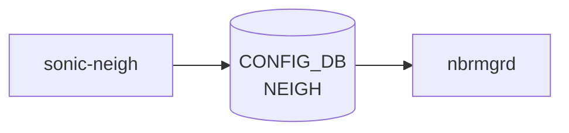

# sonic-neigh YANG

## 概要

- module: `sonic-neigh`
- namespace: `http://github.com/sonic-net/sonic-neigh`
- revision: `2023-03-31`
- import: `ietf-inet-types`, `ietf-yang-types`, `sonic-portchannel`, `sonic-port`
- top container: `sonic-neigh`

静的な隣接 (neighbor) エントリを [CONFIG_DB](../../reference/glossary.md#term-config_db) に書き込むための [YANG](../../reference/glossary.md#term-yang) モジュール[^1]。`(port, neighbor_ip) -> MAC, family` のマッピング。Vlan インタフェースは `string` パターン（sonic-vlan import が TODO 状態）として受け入れている。

<!-- yang-mermaid -->
### データフロー (自動生成)



!!! note "凡例"
    YANG モジュールから CONFIG_DB テーブル経由で subscribe する daemon/orch までを `docs/reference/config-db-orch-map.md` から機械生成したミニ図。詳細・例外は本ページ本文を参照。
<!-- /yang-mermaid -->

## 関連ページ

<!-- yang-xref -->

本 YANG モジュールに対応する CONFIG_DB / CLI / HLD / Topics への相互リンク。`inject_yang_xref.py` により自動生成されます。

### 対応 CONFIG_DB

- [`NEIGH`](../config-db/neigh.md)

<!-- /yang-xref -->

## ツリー

```text
module: sonic-neigh
  +--rw sonic-neigh
     +--rw NEIGH
        +--rw NEIGH_LIST* [port neighbor]
           +--rw port       union(leafref PORTCHANNEL, leafref PORT, string "Vlan[0-9]+")
           +--rw neighbor   inet:ip-address
           +--rw neigh?     yang:mac-address
           +--rw family?    string (IPv4|IPV4|IPv6|IPV6)
```

## leaf 一覧

| leaf | パス | 型 | 必須 | デフォルト | enum / 範囲 / leafref | 説明 |
|------|------|----|------|-----------|----------------------|------|
| `port` | `sonic-neigh/NEIGH/NEIGH_LIST/port` | `union` | yes |  | leafref PORTCHANNEL / leafref PORT / `Vlan[0-9]+` | ネイバーが見えるインタフェース |
| `neighbor` | `sonic-neigh/NEIGH/NEIGH_LIST/neighbor` | `inet:ip-address` | yes |  |  | ネイバー IP アドレス |
| `neigh` | `sonic-neigh/NEIGH/NEIGH_LIST/neigh` | `yang:mac-address` |  |  |  | ネイバー MAC アドレス |
| `family` | `sonic-neigh/NEIGH/NEIGH_LIST/family` | `string` |  |  | `IPv4` / `IPV4` / `IPv6` / `IPV6` | アドレスファミリ |

## leafref / 依存

- `NEIGH_LIST/port` の union 内
  - `/lag:sonic-portchannel/PORTCHANNEL/PORTCHANNEL_LIST/name`
  - `/port:sonic-port/PORT/PORT_LIST/name`
  - 加えて `Vlan[0-9]+` の string パターン（sonic-vlan のインポートはコメントアウト）

## augment / deviation

- なし

## 関連 CONFIG_DB / CLI

- [CONFIG_DB](../../reference/glossary.md#term-config_db): `NEIGH|<port>|<neighbor>`
- CLI: なし（[CONFIG_DB](../../reference/glossary.md#term-config_db) 直接設定 / minigraph）

<!-- yang-sibling -->
### 関連 YANG モジュール

意味的に関連する SONiC YANG モジュール (slug prefix / curated group / frontmatter `related.yang` から自動抽出):

- [`sonic-port`](sonic-port.md)
- [`sonic-portchannel`](sonic-portchannel.md)
- [`sonic-vlan`](sonic-vlan.md)
- [`sonic-dhcp-server`](sonic-dhcp-server.md)
- [`sonic-dns`](sonic-dns.md)
<!-- /yang-sibling -->

<!-- ref-triangle:start -->

## 関連リファレンス

- CONFIG_DB: `NEIGH`

<!-- ref-triangle:end -->

## 引用元

[^1]: `sonic-net/sonic-buildimage` `src/sonic-yang-models/yang-models/sonic-neigh.yang` @ `9ea932ec2e18f35e58268ec2e4456b1d4afd65cd`

<!-- glossary-links-injected: a35f1b1cdfa7 -->
