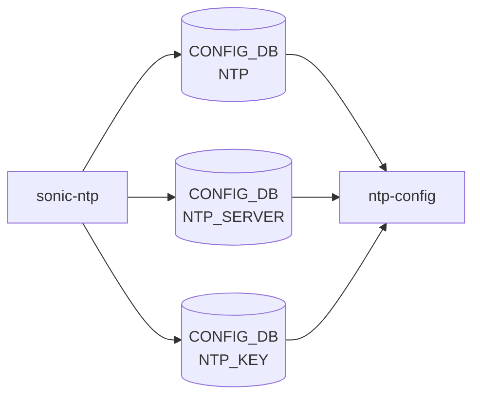

# sonic-ntp YANG

## 概要

- module: `sonic-ntp`
- namespace: `http://github.com/sonic-net/sonic-system-ntp`
- revision: `2021-04-07` (First revision), `2023-03-20` (Add extended configuration options), `2025-07-21` (Corrected NTP_KEY_LIST list name)[^revs]
- import: `ietf-inet-types`, `sonic-port`, `sonic-mgmt_vrf`, `sonic-portchannel`, `sonic-loopback-interface`, `sonic-mgmt_port`, `sonic-types`
- top container: `sonic-ntp`

Network Time Protocol (NTP) client configuration [YANG](../../reference/glossary.md#term-yang) module for [SONiC](../../reference/glossary.md#term-sonic) OS.[^1]

<!-- yang-mermaid -->
### データフロー (自動生成)



!!! note "凡例"
    YANG モジュールから CONFIG_DB テーブル経由で subscribe する daemon/orch までを `docs/reference/config-db-orch-map.md` から機械生成したミニ図。詳細・例外は本ページ本文を参照。
<!-- /yang-mermaid -->

## 関連ページ

<!-- yang-xref -->

本 YANG モジュールに対応する CONFIG_DB / CLI / HLD / Topics への相互リンク。`inject_yang_xref.py` により自動生成されます。

### 対応 CONFIG_DB

- [`NTP`](../config-db/ntp.md)
- [`NTP_SERVER`](../config-db/ntp-server.md)
- [`NTP_KEY`](../config-db/ntp-key.md)

### 関連 CLI

- [`config ntp`](../cli/config-ntp.md)

### 関連 HLD

- [ntpd → chrony 移行（slew 専念 / kernel time discipline 維持）](../../system/sonic-migration-to-chrony.md)

<!-- /yang-xref -->

## ツリー

```text
module: sonic-ntp
  +--rw sonic-ntp
     +--rw NTP
     |  +--rw global
     |     +--rw src_intf*         union
     |     +--rw vrf?              string
     |     +--rw authentication?   stypes:admin_mode
     |     +--rw dhcp?             stypes:admin_mode
     |     +--rw server_role?      stypes:admin_mode
     |     +--rw admin_state?      stypes:admin_mode
     +--rw NTP_SERVER
     |  +--rw NTP_SERVER_LIST* [server_address]
     |     +--rw server_address      inet:host
     |     +--rw association_type?   association-type
     |     +--rw iburst?             stypes:on-off
     |     +--rw key?                -> /sonic-ntp/NTP_KEY/NTP_KEY_LIST/id
     |     +--rw resolve_as?         inet:host
     |     +--rw admin_state?        stypes:admin_mode
     |     +--rw trusted?            stypes:yes-no
     |     +--rw version?            uint8
     +--rw NTP_KEY
        +--rw NTP_KEY_LIST* [id]
           +--rw id         key-id
           +--rw trusted?   stypes:yes-no
           +--rw value?     string
           +--rw type?      key-type
```

## leaf 一覧

| leaf | パス | 型 | 必須 | デフォルト | enum / 範囲 / leafref | 説明 |
|------|------|----|------|-----------|----------------------|------|
| `src_intf` | `sonic-ntp/NTP/global/src_intf` | `union` |  |  | union(leafref, leafref, leafref, leafref, string) | This is the interface whose IP address is used as the source IP address for generating NTP traffic. User is required to make sure that the NTP server is reachable via this IP address and the same I... |
| `vrf` | `sonic-ntp/NTP/global/vrf` | `string` |  |  | pattern `mgmt|default` | NTP can be enabled only in one [VRF](../../reference/glossary.md#term-vrf) at a time. In this revision, it is either default [VRF](../../reference/glossary.md#term-vrf) or Management [VRF](../../reference/glossary.md#term-vrf). |
| `authentication` | `sonic-ntp/NTP/global/authentication` | `stypes:admin_mode` |  | disabled |  | NTP authentication state |
| `dhcp` | `sonic-ntp/NTP/global/dhcp` | `stypes:admin_mode` |  | enabled |  | Use NTP servers distributed by DHCP |
| `server_role` | `sonic-ntp/NTP/global/server_role` | `stypes:admin_mode` |  | enabled |  | NTP server functionality state |
| `admin_state` | `sonic-ntp/NTP/global/admin_state` | `stypes:admin_mode` |  | enabled |  | NTP feature state |
| `server_address` | `sonic-ntp/NTP_SERVER/NTP_SERVER_LIST/server_address` | `inet:host` | yes |  |  | Hostname or IP address of the NTP server or pool. |
| `association_type` | `sonic-ntp/NTP_SERVER/NTP_SERVER_LIST/association_type` | `association-type` |  | server |  | NTP remote association type: server or pool. |
| `iburst` | `sonic-ntp/NTP_SERVER/NTP_SERVER_LIST/iburst` | `stypes:on-off` |  | on |  | NTP aggressive polling |
| `key` | `sonic-ntp/NTP_SERVER/NTP_SERVER_LIST/key` | `leafref` |  |  | /ntp:sonic-ntp/ntp:NTP_KEY/ntp:NTP_KEY_LIST/ntp:id | NTP server key ID |
| `resolve_as` | `sonic-ntp/NTP_SERVER/NTP_SERVER_LIST/resolve_as` | `inet:host` |  |  |  | Server resolved IP address |
| `admin_state` | `sonic-ntp/NTP_SERVER/NTP_SERVER_LIST/admin_state` | `stypes:admin_mode` |  | enabled |  | NTP server state |
| `trusted` | `sonic-ntp/NTP_SERVER/NTP_SERVER_LIST/trusted` | `stypes:yes-no` |  | no |  | Trust this server. It will force time synchronization only to this server when authentication is enabled |
| `version` | `sonic-ntp/NTP_SERVER/NTP_SERVER_LIST/version` | `uint8` |  | 4 | range 3..4 | NTP proto version to communicate with NTP server |
| `id` | `sonic-ntp/NTP_KEY/NTP_KEY_LIST/id` | `key-id` | yes |  |  | NTP key ID |
| `trusted` | `sonic-ntp/NTP_KEY/NTP_KEY_LIST/trusted` | `stypes:yes-no` |  | no |  | Trust this NTP key |
| `value` | `sonic-ntp/NTP_KEY/NTP_KEY_LIST/value` | `string` |  |  | length 1..64 | NTP encrypted authentication key |
| `type` | `sonic-ntp/NTP_KEY/NTP_KEY_LIST/type` | `key-type` |  | md5 |  | NTP authentication key type |

## leafref / 依存

- `sonic-ntp/NTP_SERVER/NTP_SERVER_LIST/key` → `/ntp:sonic-ntp/ntp:NTP_KEY/ntp:NTP_KEY_LIST/ntp:id`

## augment / deviation

- なし

## 関連 CONFIG_DB / CLI

- [CONFIG_DB](../../reference/glossary.md#term-config_db): `NTP`
- [CONFIG_DB](../../reference/glossary.md#term-config_db): `NTP_SERVER`
- [CONFIG_DB](../../reference/glossary.md#term-config_db): `NTP_KEY`
- CLI: `config ntp`

<!-- yang-sibling -->
### 関連 YANG モジュール

意味的に関連する SONiC YANG モジュール (slug prefix / curated group / frontmatter `related.yang` から自動抽出):

- [`sonic-system-aaa`](sonic-system-aaa.md)
- [`sonic-mgmt_vrf`](sonic-mgmt_vrf.md)
- [`sonic-banner`](sonic-banner.md)
- [`sonic-device_metadata`](sonic-device_metadata.md)
- [`sonic-feature`](sonic-feature.md)
<!-- /yang-sibling -->

<!-- ref-triangle:start -->

## 関連リファレンス

- CONFIG_DB: `NTP` / [`NTP_SERVER`](../config-db/ntp-server.md) / [`NTP_KEY`](../config-db/ntp-key.md)
- CLI: [`config ntp`](../cli/config-ntp.md)

<!-- ref-triangle:end -->

<!-- ops-hint -->
## 運用ヒント

### 典型的なデプロイ位置

- NTP / chrony 設定。`NTP_SERVER|<host>` / `NTP|global` を [hostcfgd](../../reference/glossary.md#term-hostcfgd) が chrony.conf に反映。

### よくある落とし穴

- VRF 配下に NTP server を置く場合、`NTP|global` の `vrf` leaf 設定漏れで mgmt-vrf 内パケットが通らない。

### 関連する config / show コマンド

```bash
sonic-db-cli CONFIG_DB keys 'NTP*'
show ntp
```
<!-- /ops-hint -->

## 引用元

[^1]: `sonic-net/sonic-buildimage` `src/sonic-yang-models/yang-models/sonic-ntp.yang` @ `9ea932ec2e18f35e58268ec2e4456b1d4afd65cd`
[^revs]: `sonic-net/sonic-buildimage` `src/sonic-yang-models/yang-models/sonic-ntp.yang` L43-L56 @ `9ea932ec2e18f35e58268ec2e4456b1d4afd65cd` (revision 2021-04-07 / 2023-03-20 / 2025-07-21)


<!-- topics-back-ref -->
## 関連 Topics

- [Topics: NAT / DHCP Relay / Time-DNS Services](../../topics/16-nat-dhcp-dns/index.md)

<!-- /topics-back-ref -->

<!-- glossary-links-injected: 8ba32e5aa69d -->
