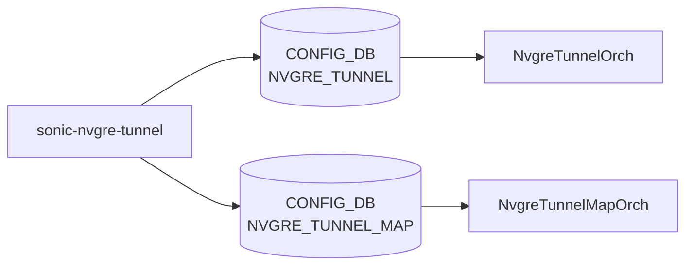

# sonic-nvgre-tunnel YANG

## 概要

- module: `sonic-nvgre-tunnel`
- namespace: `http://github.com/sonic-net/sonic-nvgre-tunnel`
- revision: `2021-10-31`
- import: `ietf-inet-types`
- top container: `sonic-nvgre-tunnel`

NVGRE トンネルとそれに紐付く [VLAN](../../reference/glossary.md#term-vlan)-VSID マッピングを定義する [YANG](../../reference/glossary.md#term-yang) モジュール[^1]。

<!-- yang-mermaid -->
### データフロー (自動生成)



!!! note "凡例"
    YANG モジュールから CONFIG_DB テーブル経由で subscribe する daemon/orch までを `docs/reference/config-db-orch-map.md` から機械生成したミニ図。詳細・例外は本ページ本文を参照。
<!-- /yang-mermaid -->

## 関連ページ

<!-- yang-xref -->

本 YANG モジュールに対応する CONFIG_DB / CLI / HLD / Topics への相互リンク。`inject_yang_xref.py` により自動生成されます。

### 対応 CONFIG_DB

- [`NVGRE_TUNNEL`](../config-db/nvgre-tunnel.md)
- [`NVGRE_TUNNEL_MAP`](../config-db/nvgre-tunnel.md)

<!-- /yang-xref -->

## ツリー

```text
module: sonic-nvgre-tunnel
  +--rw sonic-nvgre-tunnel
     +--rw NVGRE_TUNNEL
     |  +--rw NVGRE_TUNNEL_LIST* [tunnel_name]
     |     +--rw tunnel_name   string
     |     +--rw src_ip        inet:ip-address
     +--rw NVGRE_TUNNEL_MAP
        +--rw NVGRE_TUNNEL_MAP_LIST* [tunnel_name tunnel_map_name]
           +--rw tunnel_name       -> /nvgre:sonic-nvgre-tunnel/NVGRE_TUNNEL/NVGRE_TUNNEL_LIST/tunnel_name
           +--rw tunnel_map_name   string
           +--rw vlan_id           uint16
           +--rw vsid              uint32
```

## leaf 一覧

| leaf | パス | 型 | 必須 | デフォルト | enum / 範囲 / leafref | 説明 |
|------|------|----|------|-----------|----------------------|------|
| `tunnel_name` | `sonic-nvgre-tunnel/NVGRE_TUNNEL/NVGRE_TUNNEL_LIST/tunnel_name` | `string` | yes |  | length 1..255 | NVGRE トンネル名 |
| `src_ip` | `sonic-nvgre-tunnel/NVGRE_TUNNEL/NVGRE_TUNNEL_LIST/src_ip` | `inet:ip-address` | yes |  |  | トンネル送信元 IP |
| `tunnel_name` | `sonic-nvgre-tunnel/NVGRE_TUNNEL_MAP/NVGRE_TUNNEL_MAP_LIST/tunnel_name` | `leafref` | yes |  | NVGRE_TUNNEL_LIST/tunnel_name | 紐付けるトンネル名 |
| `tunnel_map_name` | `.../tunnel_map_name` | `string` | yes |  | length 1..255 | マップ名 |
| `vlan_id` | `.../vlan_id` | `uint16` | yes |  | range 1..4094 | 対応する [VLAN](../../reference/glossary.md#term-vlan) ID |
| `vsid` | `.../vsid` | `uint32` | yes |  | range 0..16777214 | Virtual Subnet Identifier |

## leafref / 依存

- `NVGRE_TUNNEL_MAP_LIST/tunnel_name` → `NVGRE_TUNNEL_LIST/tunnel_name`

## augment / deviation

- なし

## 関連 CONFIG_DB / CLI

- [CONFIG_DB](../../reference/glossary.md#term-config_db): `NVGRE_TUNNEL`, `NVGRE_TUNNEL_MAP`
- CLI: `config nvgre-tunnel {add,delete}` / `config nvgre-tunnel-map {add,delete}` / `show nvgre-tunnel` / `show nvgre-tunnel-map` ([sonic-utilities](../../reference/glossary.md#term-sonic-utilities) `config/plugins/nvgre_tunnel.py` および `show/plugins/nvgre_tunnel.py` で click plugin として実装)[^2]

<!-- yang-sibling -->
### 関連 YANG モジュール

意味的に関連する SONiC YANG モジュール (slug prefix / curated group / frontmatter `related.yang` から自動抽出):

- [`sonic-vxlan`](sonic-vxlan.md)
- [`sonic-vnet`](sonic-vnet.md)
- [`sonic-mux-cable`](sonic-mux-cable.md)
- [`sonic-srv6`](sonic-srv6.md)
- [`sonic-tunnel`](sonic-tunnel.md)
<!-- /yang-sibling -->

<!-- ref-triangle:start -->

## 関連リファレンス

- [CONFIG_DB](../../reference/glossary.md#term-config_db): [`NVGRE_TUNNEL`](../config-db/nvgre-tunnel.md) / [`NVGRE_TUNNEL_MAP`](../config-db/nvgre-tunnel.md)

<!-- ref-triangle:end -->

<!-- ops-hint -->
## 運用ヒント

### 典型的なデプロイ位置

- NVGRE トンネル + マッピング。`NVGRE_TUNNEL` / `NVGRE_TUNNEL_MAP` を tunnel decap orch が処理。

### よくある落とし穴

- VxLAN-VNI と NVGRE-VSID の同時運用は [SAI](../../reference/glossary.md#term-sai) が排他なプラットフォームが多い。

### 関連する config / show コマンド

```bash
sonic-db-cli CONFIG_DB keys 'NVGRE_TUNNEL*'
show nvgre-tunnel
show nvgre-tunnel-map
```
<!-- /ops-hint -->

## 引用元

[^1]: `sonic-net/sonic-buildimage` `src/sonic-yang-models/yang-models/sonic-nvgre-tunnel.yang` @ `9ea932ec2e18f35e58268ec2e4456b1d4afd65cd`
[^2]: `sonic-net/sonic-utilities` `config/plugins/nvgre_tunnel.py` L207-L349 (`nvgre-tunnel` / `nvgre-tunnel-map` click groups, `add` / `delete` subcommands) と `show/plugins/nvgre_tunnel.py` L46-L149 (`show nvgre-tunnel` / `show nvgre-tunnel-map`) で click plugin として登録。`doc/Command-Reference.md` の "NVGRE" 章に CLI 仕様あり。

<!-- glossary-links-injected: f960e6599a3c -->
