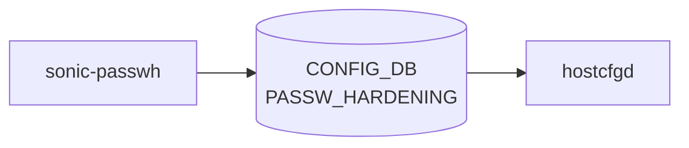

# sonic-passwh YANG

## 概要

- module: `sonic-passwh`
- namespace: `http://github.com/sonic-net/sonic-passwh`
- revision: `2022-05-03`
- import: なし
- top container: `sonic-passwh`

Password hardening policy [YANG](../../reference/glossary.md#term-yang) module for SONiC OS. ローカルユーザーパスワードの複雑さ・有効期限・履歴ポリシーを定義する。[^1]

<!-- yang-mermaid -->
### データフロー (自動生成)



!!! note "凡例"
    YANG モジュールから CONFIG_DB テーブル経由で subscribe する daemon/orch までを `docs/reference/config-db-orch-map.md` から機械生成したミニ図。詳細・例外は本ページ本文を参照。
<!-- /yang-mermaid -->

## ツリー

```text
module: sonic-passwh
  +--rw sonic-passwh
     +--rw PASSW_HARDENING
        +--rw POLICIES
           +--rw state?                     feature_state
           +--rw expiration?                int16
           +--rw expiration_warning?        int8
           +--rw history_cnt?               uint8
           +--rw len_min?                   uint8
           +--rw reject_user_passw_match?   boolean
           +--rw lower_class?               boolean
           +--rw upper_class?               boolean
           +--rw digits_class?              boolean
           +--rw special_class?             boolean
```

## leaf 一覧

| leaf | パス | 型 | 必須 | デフォルト | enum / 範囲 / leafref | 説明 |
|------|------|----|------|-----------|----------------------|------|
| `state` | `sonic-passwh/PASSW_HARDENING/POLICIES/state` | `feature_state` |  | `disabled` | `enabled`, `disabled` | Enable or disable password hardening enforcement. |
| `expiration` | `sonic-passwh/PASSW_HARDENING/POLICIES/expiration` | `int16` |  |  | range -1..365 | Password expiration period in days; -1 disables expiration. |
| `expiration_warning` | `sonic-passwh/PASSW_HARDENING/POLICIES/expiration_warning` | `int8` |  |  | range -1..30 | Number of days before expiration to warn the user; -1 disables the warning. |
| `history_cnt` | `sonic-passwh/PASSW_HARDENING/POLICIES/history_cnt` | `uint8` |  |  | range 1..100 | Number of previous passwords remembered to prevent reuse. |
| `len_min` | `sonic-passwh/PASSW_HARDENING/POLICIES/len_min` | `uint8` |  |  | range 1..32 | Minimum required password length in characters. |
| `reject_user_passw_match` | `sonic-passwh/PASSW_HARDENING/POLICIES/reject_user_passw_match` | `boolean` |  |  |  | When true, reject passwords that match the username. |
| `lower_class` | `sonic-passwh/PASSW_HARDENING/POLICIES/lower_class` | `boolean` |  |  |  | When true, require at least one lowercase letter (a-z). |
| `upper_class` | `sonic-passwh/PASSW_HARDENING/POLICIES/upper_class` | `boolean` |  |  |  | When true, require at least one uppercase letter (A-Z). |
| `digits_class` | `sonic-passwh/PASSW_HARDENING/POLICIES/digits_class` | `boolean` |  |  |  | When true, require at least one digit (0-9). |
| `special_class` | `sonic-passwh/PASSW_HARDENING/POLICIES/special_class` | `boolean` |  |  |  | When true, require at least one special character. |

## leafref / 依存

- なし

## augment / deviation

- なし

## 関連 CONFIG_DB / CLI

- [CONFIG_DB](../../reference/glossary.md#term-config_db): `PASSW_HARDENING|POLICIES`
- CLI: `config passwd-hardening`

<!-- yang-sibling -->
### 関連 YANG モジュール

意味的に関連する SONiC YANG モジュール (slug prefix / curated group / frontmatter `related.yang` から自動抽出):

- [`sonic-system-aaa`](sonic-system-aaa.md)
- [`sonic-ssh-server`](sonic-ssh-server.md)
- [`sonic-banner`](sonic-banner.md)
- [`sonic-device_metadata`](sonic-device_metadata.md)
- [`sonic-feature`](sonic-feature.md)
<!-- /yang-sibling -->

<!-- ref-triangle:start -->

## 関連リファレンス

- [CONFIG_DB](../../reference/glossary.md#term-config_db): `PASSW_HARDENING`
- CLI: `config passwd-hardening`

<!-- ref-triangle:end -->

<!-- ops-hint -->
## 運用ヒント

### 典型的なデプロイ位置

- ローカルアカウントのパスワード強度ポリシ。`PASSW_HARDENING|POLICIES` を [hostcfgd](../../reference/glossary.md#term-hostcfgd) が PAM に反映。

### よくある落とし穴

- `expiration` を有効化すると admin ユーザの古い hash がいきなり無効化されるリスク。事前にローテーション計画を立てる。

### 関連する config / show コマンド

```bash
sonic-db-cli CONFIG_DB hgetall 'PASSW_HARDENING|POLICIES'
show passw-hardening policies
```
<!-- /ops-hint -->

## 引用元

[^1]: `sonic-net/sonic-buildimage` `src/sonic-yang-models/yang-models/sonic-passwh.yang` @ `9ea932ec2e18f35e58268ec2e4456b1d4afd65cd`

<!-- glossary-links-injected: 896d391185a9 -->
