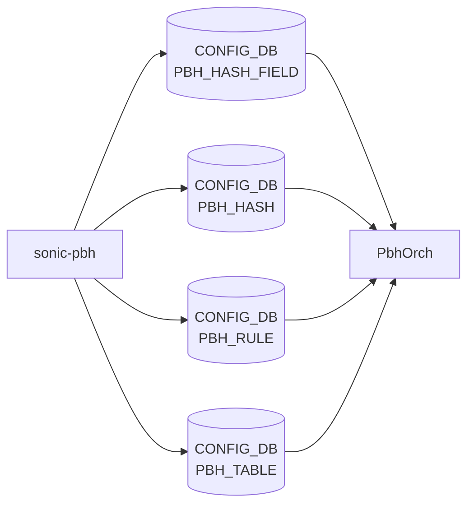

# sonic-pbh YANG

## 概要

- module: `sonic-pbh`
- namespace: `http://github.com/sonic-net/sonic-pbh`
- revision: `2021-04-23`
- import: `ietf-inet-types`, `sonic-types`, `sonic-port`, `sonic-portchannel`
- top container: `sonic-pbh`

PBH [YANG](../../reference/glossary.md#term-yang) Module for [SONiC](../../reference/glossary.md#term-sonic) OS: hashing for NVGRE & VxLAN with IPv4/IPv6 inner 5-tuple[^1]

<!-- yang-mermaid -->
### データフロー (自動生成)



!!! note "凡例"
    YANG モジュールから CONFIG_DB テーブル経由で subscribe する daemon/orch までを `docs/reference/config-db-orch-map.md` から機械生成したミニ図。詳細・例外は本ページ本文を参照。
<!-- /yang-mermaid -->

## 関連ページ

<!-- yang-xref -->

本 YANG モジュールに対応する CONFIG_DB / CLI / HLD / Topics への相互リンク。`inject_yang_xref.py` により自動生成されます。

### 対応 CONFIG_DB

- [`PBH_RULE`](../config-db/pbh-rule.md)
- [`PBH_TABLE`](../config-db/pbh-table.md)

<!-- /yang-xref -->

## ツリー

```text
module: sonic-pbh
  +--rw sonic-pbh
     +--rw PBH_HASH_FIELD
     |  +--rw PBH_HASH_FIELD_LIST* [hash_field_name]
     |     +--rw hash_field_name    string
     |     +--rw hash_field         pbh:hash-field
     |     +--rw ip_mask            inet:ip-address-no-zone
     |     +--rw sequence_id        uint32
     +--rw PBH_HASH
     |  +--rw PBH_HASH_LIST* [hash_name]
     |     +--rw hash_name          string
     |     +--rw hash_field_list*   -> /sonic-pbh/PBH_HASH_FIELD/PBH_HASH_FIELD_LIST/hash_field_name
     +--rw PBH_RULE
     |  +--rw PBH_RULE_LIST* [table_name rule_name]
     |     +--rw table_name          -> /sonic-pbh/PBH_TABLE/PBH_TABLE_LIST/table_name
     |     +--rw rule_name           string
     |     +--rw priority            uint32
     |     +--rw gre_key?            string
     |     +--rw ether_type?         string
     |     +--rw ip_protocol?        string
     |     +--rw ipv6_next_header?   string
     |     +--rw l4_dst_port?        string
     |     +--rw inner_ether_type?   string
     |     +--rw hash                -> /sonic-pbh/PBH_HASH/PBH_HASH_LIST/hash_name
     |     +--rw packet_action?      pbh:packet-action
     |     +--rw flow_counter?       pbh:flow-counter
     +--rw PBH_TABLE
        +--rw PBH_TABLE_LIST* [table_name]
           +--rw table_name        string
           +--rw interface_list*   union
           +--rw description       string
```

## container / list 一覧

| 種別 | パス | key | 説明 |
|------|------|-----|------|
| `container` | `sonic-pbh` |  |  |
| `container` | `sonic-pbh/PBH_HASH_FIELD` |  | Policy-based hash field definitions for inner packet tuple extraction |
| `list` | `sonic-pbh/PBH_HASH_FIELD/PBH_HASH_FIELD_LIST` | `hash_field_name` |  |
| `container` | `sonic-pbh/PBH_HASH` |  | Policy-based hash definitions combining hash fields |
| `list` | `sonic-pbh/PBH_HASH/PBH_HASH_LIST` | `hash_name` |  |
| `container` | `sonic-pbh/PBH_RULE` |  | Policy-based hashing rules matching packets and applying hash profiles |
| `list` | `sonic-pbh/PBH_RULE/PBH_RULE_LIST` | `table_name rule_name` |  |
| `container` | `sonic-pbh/PBH_TABLE` |  | Policy-based hashing tables binding rules to interfaces |
| `list` | `sonic-pbh/PBH_TABLE/PBH_TABLE_LIST` | `table_name` |  |

## leaf 一覧

| leaf | パス | 型 | 必須 | デフォルト | enum / 範囲 / leafref | 説明 |
|------|------|----|------|-----------|----------------------|------|
| `hash_field_name` | `sonic-pbh/PBH_HASH_FIELD/PBH_HASH_FIELD_LIST/hash_field_name` | `string` | yes |  | length `1..255` | The name of this hash field |
| `hash_field` | `sonic-pbh/PBH_HASH_FIELD/PBH_HASH_FIELD_LIST/hash_field` | `pbh:hash-field` | yes |  |  | Configures native hash field for this hash field |
| `ip_mask` | `sonic-pbh/PBH_HASH_FIELD/PBH_HASH_FIELD_LIST/ip_mask` | `inet:ip-address-no-zone` | yes |  |  | Configures IPv4/IPv6 address mask for this hash field |
| `sequence_id` | `sonic-pbh/PBH_HASH_FIELD/PBH_HASH_FIELD_LIST/sequence_id` | `uint32` | yes |  |  | Configures in which order the fields are hashed and defines which fields should be associative |
| `hash_name` | `sonic-pbh/PBH_HASH/PBH_HASH_LIST/hash_name` | `string` | yes |  | length `1..255` | The name of this hash |
| `hash_field_list[]` | `sonic-pbh/PBH_HASH/PBH_HASH_LIST/hash_field_list` | `leafref` |  |  | /pbh:sonic-pbh/pbh:PBH_HASH_FIELD/pbh:PBH_HASH_FIELD_LIST/pbh:hash_field_name | The list of hash fields to apply with this hash |
| `table_name` | `sonic-pbh/PBH_RULE/PBH_RULE_LIST/table_name` | `leafref` | yes |  | /pbh:sonic-pbh/pbh:PBH_TABLE/pbh:PBH_TABLE_LIST/pbh:table_name | The name of table which holds this rule |
| `rule_name` | `sonic-pbh/PBH_RULE/PBH_RULE_LIST/rule_name` | `string` | yes |  | length `1..255` | The name of this rule |
| `priority` | `sonic-pbh/PBH_RULE/PBH_RULE_LIST/priority` | `uint32` | yes |  |  | Configures priority for this rule |
| `gre_key` | `sonic-pbh/PBH_RULE/PBH_RULE_LIST/gre_key` | `string` |  |  | pattern `(0x){1}[a-fA-F0-9]{1,8}/(0x){1}[a-fA-F0-9]{1,8}` | Configures packet match for this rule: GRE key (value/mask) |
| `ether_type` | `sonic-pbh/PBH_RULE/PBH_RULE_LIST/ether_type` | `string` |  |  | pattern `(0x){1}[a-fA-F0-9]{1,4}` | Configures packet match for this rule: EtherType (IANA Ethertypes) |
| `ip_protocol` | `sonic-pbh/PBH_RULE/PBH_RULE_LIST/ip_protocol` | `string` |  |  | pattern `(0x){1}[a-fA-F0-9]{1,2}` | Configures packet match for this rule: IP protocol (IANA Protocol Numbers) |
| `ipv6_next_header` | `sonic-pbh/PBH_RULE/PBH_RULE_LIST/ipv6_next_header` | `string` |  |  | pattern `(0x){1}[a-fA-F0-9]{1,2}` | Configures packet match for this rule: IPv6 Next header (IANA Protocol Numbers) |
| `l4_dst_port` | `sonic-pbh/PBH_RULE/PBH_RULE_LIST/l4_dst_port` | `string` |  |  | pattern `(0x){1}[a-fA-F0-9]{1,4}` | Configures packet match for this rule: L4 destination port |
| `inner_ether_type` | `sonic-pbh/PBH_RULE/PBH_RULE_LIST/inner_ether_type` | `string` |  |  | pattern `(0x){1}[a-fA-F0-9]{1,4}` | Configures packet match for this rule: inner EtherType (IANA Ethertypes) |
| `hash` | `sonic-pbh/PBH_RULE/PBH_RULE_LIST/hash` | `leafref` | yes |  | /pbh:sonic-pbh/pbh:PBH_HASH/pbh:PBH_HASH_LIST/pbh:hash_name | The hash to apply with this rule |
| `packet_action` | `sonic-pbh/PBH_RULE/PBH_RULE_LIST/packet_action` | `pbh:packet-action` |  | SET_ECMP_HASH |  | Configures packet action for this rule |
| `flow_counter` | `sonic-pbh/PBH_RULE/PBH_RULE_LIST/flow_counter` | `pbh:flow-counter` |  | DISABLED |  | Enables/Disables packet/byte counter for this rule |
| `table_name` | `sonic-pbh/PBH_TABLE/PBH_TABLE_LIST/table_name` | `string` | yes |  | length `1..255` | The name of this table |
| `interface_list[]` | `sonic-pbh/PBH_TABLE/PBH_TABLE_LIST/interface_list` | `union` |  |  | union(leafref: /port:sonic-port/port:PORT/port:PORT_LIST/port:name, leafref: /lag:sonic-portchannel/lag:PORTCHANNEL/lag:PORTCHANNEL_LIST/lag:name) | Interfaces to which this table is applied |
| `description` | `sonic-pbh/PBH_TABLE/PBH_TABLE_LIST/description` | `string` | yes |  | length `1..255` | The description of this table |

## leafref / 依存

- `sonic-pbh/PBH_HASH/PBH_HASH_LIST/hash_field_list` → `/pbh:sonic-pbh/pbh:PBH_HASH_FIELD/pbh:PBH_HASH_FIELD_LIST/pbh:hash_field_name`
- `sonic-pbh/PBH_RULE/PBH_RULE_LIST/table_name` → `/pbh:sonic-pbh/pbh:PBH_TABLE/pbh:PBH_TABLE_LIST/pbh:table_name`
- `sonic-pbh/PBH_RULE/PBH_RULE_LIST/hash` → `/pbh:sonic-pbh/pbh:PBH_HASH/pbh:PBH_HASH_LIST/pbh:hash_name`

## augment / deviation

- なし

## 関連 CONFIG_DB / CLI

- [CONFIG_DB](../../reference/glossary.md#term-config_db): `PBH_HASH_FIELD`
- [CONFIG_DB](../../reference/glossary.md#term-config_db): `PBH_HASH`
- [CONFIG_DB](../../reference/glossary.md#term-config_db): `PBH_RULE`
- [CONFIG_DB](../../reference/glossary.md#term-config_db): `PBH_TABLE`
- CLI: なし

<!-- yang-sibling -->
### 関連 YANG モジュール

意味的に関連する SONiC YANG モジュール (slug prefix / curated group / frontmatter `related.yang` から自動抽出):

- [`sonic-port`](sonic-port.md)
- [`sonic-portchannel`](sonic-portchannel.md)
- [`sonic-copp`](sonic-copp.md)
- [`sonic-debug-counter`](sonic-debug-counter.md)
- [`sonic-mirror-session`](sonic-mirror-session.md)
<!-- /yang-sibling -->

<!-- ref-triangle:start -->

## 関連リファレンス

- CONFIG_DB: [`PBH_HASH_FIELD`](../config-db/pbh.md) / [`PBH_HASH`](../config-db/pbh.md) / [`PBH_RULE`](../config-db/pbh.md) / [`PBH_TABLE`](../config-db/pbh.md)

<!-- ref-triangle:end -->

<!-- ops-hint -->
## 運用ヒント

### 典型的なデプロイ位置

- Policy Based Hashing。`PBH_TABLE` / `PBH_RULE` / `PBH_HASH` / `PBH_HASH_FIELD` を pbhorch が [SAI](../../reference/glossary.md#term-sai) に反映。

### よくある落とし穴

- `hash_field_list` leafref の順序が異なると別エントリ扱いになり、[SAI](../../reference/glossary.md#term-sai) 側で hash 計算結果が変わる。

### 関連する config / show コマンド

```bash
sonic-db-cli CONFIG_DB keys 'PBH_*'
show pbh statistics
```
<!-- /ops-hint -->

## 引用元

[^1]: `sonic-net/sonic-buildimage` `src/sonic-yang-models/yang-models/sonic-pbh.yang` @ `9ea932ec2e18f35e58268ec2e4456b1d4afd65cd`

<!-- glossary-links-injected: 8ba32e5aa69d -->
