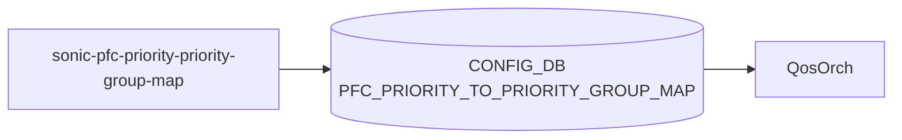

# sonic-pfc-priority-priority-group-map YANG

## 概要

- module: `sonic-pfc-priority-priority-group-map`
- namespace: `http://github.com/sonic-net/sonic-pfc-priority-priority-group-map`
- revision: `2021-04-15`
- import: なし
- top container: `sonic-pfc-priority-priority-group-map`

PFC_PRIORITY_TO_PRIORITY_GROUP_MAP yang Module for [SONiC](../../reference/glossary.md#term-sonic) OS. [PFC](../../reference/glossary.md#term-pfc) 優先度 (0-7) を ingress priority group にマップしロスレス転送を制御する。[^1]

<!-- yang-mermaid -->
### データフロー (自動生成)



!!! note "凡例"
    YANG モジュールから CONFIG_DB テーブル経由で subscribe する daemon/orch までを `docs/reference/config-db-orch-map.md` から機械生成したミニ図。詳細・例外は本ページ本文を参照。
<!-- /yang-mermaid -->

## 関連ページ

<!-- yang-xref -->

本 YANG モジュールに対応する CONFIG_DB / CLI / HLD / Topics への相互リンク。`inject_yang_xref.py` により自動生成されます。

### 対応 CONFIG_DB

- [`PFC_PRIORITY_TO_PRIORITY_GROUP_MAP`](../config-db/pfc-priority-to-priority-group-map.md)

<!-- /yang-xref -->

## ツリー

```text
module: sonic-pfc-priority-priority-group-map
  +--rw sonic-pfc-priority-priority-group-map
     +--rw PFC_PRIORITY_TO_PRIORITY_GROUP_MAP
        +--rw PFC_PRIORITY_TO_PRIORITY_GROUP_MAP_LIST* [name]
           +--rw name    string
           +--rw PFC_PRIORITY_TO_PRIORITY_GROUP_MAP* [pfc_priority]
              +--rw pfc_priority    string
              +--rw pg?             string
```

## leaf 一覧

| leaf | パス | 型 | 必須 | デフォルト | enum / 範囲 / leafref | 説明 |
|------|------|----|------|-----------|----------------------|------|
| `name` | `sonic-pfc-priority-priority-group-map/PFC_PRIORITY_TO_PRIORITY_GROUP_MAP/PFC_PRIORITY_TO_PRIORITY_GROUP_MAP_LIST/name` | `string` | yes |  | pattern `[a-zA-Z0-9]{1}([-a-zA-Z0-9_]{0,31})`, length 1..32 | Name of the [PFC](../../reference/glossary.md#term-pfc) priority to priority group map. |
| `pfc_priority` | `.../PFC_PRIORITY_TO_PRIORITY_GROUP_MAP/pfc_priority` | `string` | yes |  | pattern `[0-7]?` | [PFC](../../reference/glossary.md#term-pfc) priority value (0-7). |
| `pg` | `.../PFC_PRIORITY_TO_PRIORITY_GROUP_MAP/pg` | `string` |  |  | pattern `[0-7]?` | Target ingress priority group (0-7). |

## leafref / 依存

- なし

## augment / deviation

- なし

## 関連 CONFIG_DB / CLI

- [CONFIG_DB](../../reference/glossary.md#term-config_db): `PFC_PRIORITY_TO_PRIORITY_GROUP_MAP|<name>`、`PORT_QOS_MAP|<port>/pfc_to_pg_map` から参照

<!-- yang-sibling -->
### 関連 YANG モジュール

意味的に関連する SONiC YANG モジュール (slug prefix / curated group / frontmatter `related.yang` から自動抽出):

- [`sonic-port-qos-map`](sonic-port-qos-map.md)
- [`sonic-buffer-pg`](sonic-buffer-pg.md)
- [`sonic-buffer-pool`](sonic-buffer-pool.md)
- [`sonic-buffer-profile`](sonic-buffer-profile.md)
- [`sonic-buffer-queue`](sonic-buffer-queue.md)
<!-- /yang-sibling -->

<!-- ref-triangle:start -->

## 関連リファレンス

- [CONFIG_DB](../../reference/glossary.md#term-config_db): [`PFC_PRIORITY_TO_PRIORITY_GROUP_MAP`](../config-db/pfc-priority-to-priority-group-map.md)

<!-- ref-triangle:end -->

## 引用元

[^1]: `sonic-net/sonic-buildimage` `src/sonic-yang-models/yang-models/sonic-pfc-priority-priority-group-map.yang` @ `9ea932ec2e18f35e58268ec2e4456b1d4afd65cd`

<!-- glossary-links-injected: 8ba32e5aa69d -->
